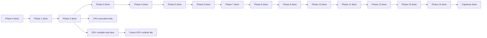

# MAX Serve Internals: End-to-End Learning Plan

This is a source-guided plan for learning MAX and Mojo through one concrete
LLM-serving path:

```text
external Python application
  -> OpenAI-compatible HTTP/SSE API
  -> MAX Serve request pipeline
  -> model-worker IPC
  -> continuous batching scheduler
  -> MAX text-generation pipeline
  -> model graph and compiled engine model
  -> Python graph/custom operators
  -> Mojo kernel registration and dispatch
  -> CPU/GPU runtime and hardware
```

The plan is pinned to repository revision `d8bfe64874`. Paths and symbols may
move on later revisions, so record the new revision before continuing after a
large rebase.

This document is a plan, not an instruction to run every command immediately.
The first implementation pass should proceed phase by phase and preserve the
artifacts listed for each phase.

## Visual-First Execution Rule

```text
ASCII map -> Mermaid sequence/block/state view -> tiny source map -> evidence
```

- Minimal prose; diagrams carry the explanation.
- Every runtime claim is labeled `CPU-RUN`, `COMPILE-ONLY`, or `GPU-LAB`.
- This host executes the full CPU path.
- GPU learning uses source traces and supported cross-compilation locally;
  runtime profiling is packaged as a later GPU-host lab.
- Detailed presentation rules live in `murali_docs/AGENTS.md`.

## Execution Status

```text
[done] Phase 0  CPU environment + CUDA sm_80 virtual-device compile
[done] Phase 1  external Python -> JSON/SSE/error/disconnect contract
[done] Phase 2  CLI -> API/metrics/model processes -> graph compile -> ready
[done] Phase 3  OpenAI fields -> prompt -> tokens -> TextContext
[done] Phase 4  IPC -> backpressure -> cancellation
[done] Phase 5  continuous batching and scheduler iterations
[done] Phase 6  ragged buffers -> model -> sampler -> host token
[done] Phase 7  HF config -> registry -> weights -> Llama implementation
[done] Phase 8  Graph API construction, compile/init, CUDA/HIP MEFs
[done] Phase 9  Graph API versus ModuleV3 authoring paths
[done] Phase 10 Python custom op -> Mojo dispatch -> hardware launch API
[done] Phase 11 paged KV cache and prefix caching
[done] Phase 12 benchmark, profile, and metrics
[done] Phase 13 single-node parallelism
[done] Phase 14 production service design
[done] Capstone integrated report; GPU runtime appendix remains GPU-LAB
```

Artifacts: [`murali_docs/README.md`](README.md).



## 1. Learning Objective

At the end, you should be able to explain and demonstrate all of the following:

1. How an OpenAI Python client request becomes a MAX internal request.
2. How streaming, cancellation, errors, and backpressure cross the API/model
   worker process boundary.
3. How MAX combines unrelated client requests into changing prefill/decode
   batches.
4. How token budgets, KV-cache capacity, chunked prefill, and preemption affect
   latency and throughput.
5. How a Hugging Face model identifier selects a MAX architecture, tokenizer,
   weight adapter, pipeline factory, and batch processor.
6. How the Llama graph is constructed, specialized, compiled, initialized with
   weights, cached, and executed.
7. How a Python attention operation resolves to a named custom operation,
   enters a Mojo registration, selects a hardware implementation, and launches
   work through a device context.
8. How tensor, data, and expert parallelism alter the execution topology.
9. How to benchmark and profile a server without confusing offered load,
   accepted load, queueing, model throughput, and end-user latency.
10. How to design a production deployment around MAX Serve, including the
    responsibilities that belong outside a single MAX process.

The standard for completion is not “I found the file.” It is “I can predict
the behavior, prove it with a trace or measurement, and explain which source
code caused it.”

## 2. Chosen Use Case

Use one API workload and two model configurations.

### Workload

An external Python application sends streaming chat-completion requests to:

```text
POST /v1/chat/completions
```

The workload should eventually contain a mix of:

- short and long prompts;
- short and long generation limits;
- shared prompt prefixes;
- client disconnects and explicit cancellation;
- bursts above server capacity;
- steady-state request-rate-controlled traffic.

This mixture exposes the important internals: tokenization, SSE, continuous
batching, prefill versus decode, KV allocation, prefix caching, fairness,
preemption, load shedding, and tail latency.

### Model A: mechanics baseline

```text
modularai/SmolLM-135M-Instruct-FP32
device: CPU
encoding: float32
```

Why use it first:

- It is the model used by `max/tests/integration/serve/test_max_serve_e2e.py`.
- It loads quickly enough for repeated startup and instrumentation work.
- It exercises the real server, tokenizer, worker, scheduler, pipeline, graph,
  and response path without requiring a large GPU.
- It is suitable for correctness and lifecycle experiments, not production
  performance conclusions.

### Model B: canonical deep dive

```text
meta-llama/Llama-3.1-8B-Instruct
device: NVIDIA or AMD GPU
architecture study target: max/pipelines/architectures/llama3
```

On this CPU-only host, Model B is a `SOURCE` + `COMPILE-ONLY` study target.
Execution and profiling remain `GPU-LAB` work on a matching accelerator host.

Why use it second:

- The architecture is familiar and the repository has explicit Llama 3 graph,
  batch-processing, weight-adaptation, KV-cache, and ModuleV3 implementations.
- It is large enough for GPU execution, memory planning, and serving tradeoffs
  to become visible.
- It provides a useful path into attention, RoPE, linear layers, sampling, and
  paged KV-cache kernels.

Model access, supported encoding, and exact device flags must be checked on the
machine used for the lab. Do not silently substitute a quantized GGUF build
while reasoning about BF16/FP16 kernel behavior; record every model and encoding
change in the experiment log.

## 3. Scope Boundaries

### In scope

- The normal `max serve` path, not only direct pipeline execution.
- OpenAI-compatible chat completions and SSE streaming.
- The API process and spawned model-worker process.
- Continuous batching and paged KV caching.
- The current Graph API Llama 3 implementation.
- A comparison with `llama3_modulev3` after the Graph API is understood.
- At least one complete custom-op-to-Mojo-to-hardware trace.
- Benchmarking, profiling, overload, and production topology.

### Deferred until the core path is understood

- Multimodal, diffusion, speech, and video pipelines.
- LoRA internals, speculative decoding, and structured-output grammar engines.
- Writing a new model architecture.
- Writing a new optimized kernel.
- Cascade and prefill/decode disaggregation as the first serving topology.

These are valuable extensions, but beginning with them hides the basic request,
batch, graph, and kernel lifecycle.

### Important observability boundary

The repository exposes the Python API and type surface of the engine in:

- `max/python/max/engine/api.py`
- `max/python/max/_core/engine.pyi`

Some compiler and runtime implementation is behind the native `max._core`
binding. The study must distinguish:

1. behavior directly visible in Python or Mojo source;
2. behavior visible through generated IR, MEF artifacts, logs, and profiles;
3. native implementation details that are not present as source in this
   checkout.

Do not fill this gap with guesses. Mark claims as source-proven,
experiment-proven, documentation-proven, or still unknown.

## 4. The Two End-to-End Maps

Keep startup and per-request execution separate. Compilation normally happens
at startup; it does not happen once per generated token.

### 4.1 Startup and model-load path

```text
max serve --model ...
  |
  v
max/python/max/_entrypoints/pipelines.py::cli_serve
  - parse CLI/config into PipelineArgs and Settings
  |
  v
serve_api_server_and_model_worker.py::serve_api_server_and_model_worker
  - import custom architectures
  - identify task and architecture
  - registry retrieves tokenizer, factory, and memory plan
  - build FastAPI app and Uvicorn server
  |
  v
api_server.py::lifespan
  - start telemetry
  - create bounded ZeroMQ worker interface
  - spawn model worker
  - install TokenGeneratorPipeline in app state
  |
  v
model_worker.py::ModelWorker.run
  - create devices/session/pipeline/KV manager
  - load weights
  - construct graph/module
  - compile and initialize executable model
  - perform warmup/graph-capture preparation where enabled
  - freeze long-lived GC heap
  - enter scheduler loop
  |
  v
Uvicorn accepts traffic only after serving setup succeeds
```

### 4.2 One streaming request

```text
OpenAI Python client
  |
  | HTTP POST /v1/chat/completions, stream=True
  v
FastAPI route in serve/router/openai_routes.py
  - validate OpenAI schema
  - create TextGenerationRequest(s)
  - choose TokenGeneratorPipeline
  |
  v
serve/pipelines/llm.py::TokenGeneratorPipeline.next_token
  - apply chat template/tokenize via tokenizer.new_context()
  - attach sampling/stop/tool/reasoning state
  - submit before committing streaming headers
  |
  v
ZmqModelWorkerProxy.stream
  - put context into bounded request queue
  - remember response stream by request id
  - raise RequestQueueFull if admission fails
  |
  | ZeroMQ IPC
  v
TokenGenerationScheduler._retrieve_pending_requests
  - move accepted contexts into TextBatchConstructor
  |
  v
TextBatchConstructor.construct_batch
  - account for per-step token budget
  - allocate/reuse KV blocks
  - select prefill and decode requests
  - chunk prefill or preempt when needed
  - place work across data-parallel replicas
  |
  v
TokenGenerationScheduler._schedule
  |
  v
TextGenerationPipeline.execute
  - prepare model buffers through architecture batch processor
  - execute compiled model graph
  - execute sampling graph / choose next token
  - update request and KV state
  - copy required token data to host
  |
  v
response ZeroMQ queue
  |
  v
TokenGeneratorPipeline
  - detokenize incrementally
  - enforce stop semantics and assemble usage/logprobs
  |
  v
OpenAI response generator
  - serialize SSE chunks and [DONE]
  |
  v
external Python async iterator
```

Cancellation follows a second IPC channel from the proxy to the scheduler.
Overload follows a different branch: a full bounded admission queue is mapped
to HTTP 429 before streaming response headers are committed.

## 5. Repository Source Map

Use this as an index, not as the reading order. The phases below provide the
reading order.

| Layer              | Primary source locations                                                               | What to identify                                                |
|--------------------|----------------------------------------------------------------------------------------|-----------------------------------------------------------------|
| CLI                | `max/python/max/_entrypoints/pipelines.py`                                             | `cli_serve`, option-to-config conversion                        |
| Startup            | `max/python/max/_entrypoints/cli/serve/serve_api_and_model_worker.py`                  | registry lookup, app creation, lifespan, shutdown               |
| HTTP server        | `max/python/max/serve/api_server.py`                                                   | app state, worker lifecycle, 429 handler, health and metrics    |
| OpenAI routes      | `max/python/max/serve/router/openai_routes.py`                                         | chat request conversion, stream/non-stream response generators  |
| API pipeline       | `max/python/max/serve/pipelines/llm.py`                                                | context creation, submission, detokenization, stop handling     |
| IPC                | `max/python/max/serve/worker_interface/zmq_interface.py`                               | proxy, request/response/cancel queues, stream ownership         |
| Worker             | `max/python/max/serve/pipelines/model_worker.py`                                       | process entry, pipeline/KV setup, warmup, scheduler loop        |
| Scheduler          | `max/python/max/serve/scheduler/text_generation_scheduler.py`                          | queue drain, batch construction, execute, response publication  |
| Batch policy       | `max/python/max/serve/scheduler/batch_constructor/text_batch_constructor.py`           | CE/TG queues, token budget, admission, preemption, DP placement |
| Scheduler config   | `max/python/max/serve/scheduler/config.py`                                             | batch and token constraints                                     |
| Pipeline registry  | `max/python/max/pipelines/lib/registry.py`                                             | architecture, tokenizer, context, factory selection             |
| Text pipeline      | `max/python/max/pipelines/lib/pipeline_variants/text_generation.py`                    | execute path, model run, sampling, output mapping               |
| Model interface    | `max/python/max/pipelines/lib/interfaces/pipeline_model.py`                            | Graph API and ModuleV3 load/execute contracts                   |
| Llama Graph API    | `max/python/max/pipelines/architectures/llama3/`                                       | config, weights, graph, execution inputs/outputs                |
| Llama ModuleV3     | `max/python/max/pipelines/architectures/llama3_modulev3/`                              | lazy module construction and `compile()`                        |
| Engine             | `max/python/max/engine/api.py`                                                         | compile/init/load, MEF reuse, executable model                  |
| Native API edge    | `max/python/max/_core/engine.pyi`                                                      | native engine contracts and visible metadata                    |
| Attention layer    | `max/python/max/nn/attention/attention_with_rope.py`                                   | graph-level attention composition                               |
| Python custom ops  | `max/python/max/nn/kernels.py`                                                         | custom op name and arguments                                    |
| Mojo registration  | `max/kernels/src/graph_compiler/builtin_kernels/attention.mojo`                        | `@extensibility.register` entry point                           |
| Attention dispatch | `max/kernels/src/nn/kv_cache_ragged.mojo`, `max/kernels/src/nn/attention/gpu/mha.mojo` | CPU/GPU and architecture-specific dispatch                      |
| Matmul kernels     | `max/kernels/src/linalg/matmul/`                                                       | tiled/vendor/hardware implementations                           |
| Device runtime     | `max/mojo/max/gpu/`                                                                    | `DeviceContext`, buffers, launch mechanisms                     |
| KV planning        | `max/python/max/pipelines/kv_cache/memory_planner.py`                                  | memory budget and cache sizing                                  |
| Paged KV           | `max/python/max/pipelines/kv_cache/paged_kv_cache/`                                    | block management, prefix reuse, cache lifecycle                 |
| Metrics/tracing    | `max/python/max/serve/telemetry/`                                                      | request, batch, queue, KV, and latency signals                  |
| Reference tests    | `max/tests/integration/serve/`                                                         | expected E2E behavior and lifecycle contracts                   |

Terminology used by the scheduler:

- **CE**: context encoding, usually called prefill.
- **TG**: token generation, usually called decode.
- **Ragged batch**: multiple sequences represented without padding every
  sequence to the longest one.
- **Paged KV cache**: KV data allocated in reusable blocks/pages, with lookup
  metadata connecting logical sequence positions to physical storage.

## 6. Study Method

Every phase uses the same loop:

1. **Read:** identify ownership, inputs, outputs, and invariants.
2. **Predict:** write what should happen before running the experiment.
3. **Trace:** follow one request id or one batch through the relevant layer.
4. **Measure:** collect a log, test result, metric, trace, graph dump, or
   profile.
5. **Explain:** reconcile the observation with source.
6. **Preserve:** save a small artifact under `murali_docs/artifacts/`.

For each claim in notes, use one evidence tag:

- `[SOURCE]` directly established by repository code.
- `[TEST]` established by an existing repository test.
- `[CPU-RUN]` observed on this host's CPU execution path.
- `[COMPILE-ONLY]` compiled for a virtual accelerator without execution.
- `[GPU-LAB]` reserved for a later measurement on physical GPU hardware.
- `[DOC]` stated by repository documentation.
- `[INFERENCE]` reasoned but not yet verified.
- `[BOUNDARY]` hidden behind native or external implementation.

Do not begin with random print statements throughout the code. First follow
existing logs, OpenTelemetry spans, metrics, and profiler support. Add narrowly
scoped instrumentation only after identifying the unanswered question.

## 7. Curriculum

The phases are ordered. Later phases assume the artifacts and vocabulary from
earlier ones.

### Phase 0: establish a reproducible lab

**Purpose:** make every later observation attributable to a known repository,
package, model, device, and command.

**Questions**

- Is the `max` executable using this source tree, a Bazel-built artifact, a
  Pixi environment, or an unrelated installed wheel?
- Which CPU/GPU devices and driver/runtime versions are visible?
- Where will model weights and compilation caches be stored?
- Which environment variables change logs, metrics, or compiler output?

**Read**

- Root `AGENTS.md`, `max/AGENTS.md`, and `max/kernels/AGENTS.md`.
- Relevant `pixi.toml` files and Bazel targets before choosing a launch method.
- `docs/max/get-started.mdx`.
- `docs/max/environment-variables.mdx`.
- `max/python/max/_entrypoints/pipelines.py`.

**Lab**

Create `murali_docs/artifacts/00_environment.md` containing:

- repository revision and dirty-state summary;
- OS, CPU, RAM, accelerator, driver, and accelerator memory;
- `max --version`, Mojo version, Python version, and package resolution;
- exact model IDs, revisions, encodings, and local cache locations;
- exact launch commands to be used for Model A and Model B.

Verify the source/package relationship by printing the installed `max` module
path. If it does not resolve to the intended build, fix that before tracing.

**Completion gate**

You can start from a fresh shell and reproduce the same executable, model,
device selection, and cache behavior without relying on undocumented state.

### Phase 1: prove the external contract

**Purpose:** understand what the client observes before studying internals.

**Questions**

- Which OpenAI request fields does MAX accept and validate?
- What differs between streaming and non-streaming responses?
- When are HTTP status headers committed?
- How are usage, finish reasons, errors, and `[DONE]` represented?

**Read**

- `max/tests/integration/serve/test_max_serve_e2e.py`.
- `max/tests/integration/serve/test_tinyllama_serving_cpu.py`.
- `max/python/max/serve/schemas/openai.py`.
- Route declarations and request conversion in
  `max/python/max/serve/router/openai_routes.py`.

**Lab**

Start Model A using the same essential configuration as the E2E test:
`DeviceSpec.cpu()` and `float32`. Build a small external Python client using
the OpenAI SDK, plus an `httpx` version that exposes raw SSE frames.

Capture:

- one non-streaming chat response;
- one streaming response with chunk timestamps;
- `/health`, `/v1/models`, and the metrics endpoint;
- one validation error;
- one client disconnect during generation.

Keep the external client in a later `labs/client/` directory; for this planning
stage, only record its intended behavior.

**Artifact**

`01_external_contract.md`: request JSON, response JSON, raw SSE frames, and a
timeline from request send to final token.

**Completion gate**

You can describe which behavior is HTTP/OpenAI compatibility and which behavior
already reflects MAX scheduling or generation.

### Phase 2: trace CLI configuration and startup topology

**Purpose:** explain what `max serve` creates before the first request arrives.

**Questions**

- How do CLI arguments become `PipelineArgs`, `PipelineConfig`, and `Settings`?
- How is the task inferred from the model architecture?
- What does the registry return before the model worker starts?
- Which objects live in the API process versus the model-worker process?
- What causes readiness, startup failure, and graceful shutdown?

**Read in call order**

1. `max/python/max/_entrypoints/pipelines.py::cli_serve`.
2. `max/python/max/_entrypoints/cli/serve/serve_api_and_model_worker.py::serve_api_server_and_model_worker`.
3. `max/python/max/serve/api_server.py::fastapi_app`.
4. `max/python/max/serve/api_server.py::lifespan`.
5. `max/python/max/serve/pipelines/model_worker.py::ModelWorker.__call__` and
   `ModelWorker.run`.

**Lab**

Build a startup timeline from process creation to ready health status. Use
existing startup spans/logs first. Record the process tree, listening sockets,
ZeroMQ endpoints, threads, resident memory, and accelerator memory at these
points:

1. before launch;
2. API process created;
3. worker spawned;
4. weights loaded;
5. graph compiled/initialized;
6. warmup complete and health ready.

Send SIGTERM during an active stream and compare the result with the graceful
drain contract in the E2E test.

**Artifact**

`02_startup_topology.md` with a process diagram and timestamped startup table.

**Completion gate**

You can name the owner and lifecycle of the tokenizer, FastAPI app, worker
proxy, pipeline factory, compiled model, scheduler, and KV manager.

### Phase 3: follow HTTP input into a generation context

**Purpose:** trace semantic conversion before IPC and batching.

**Questions**

- How do chat messages become a formatted prompt and token IDs?
- Where are sampling parameters, stop sequences, logprob options, and request
  identity stored?
- When can the server still return a normal HTTP error rather than an in-stream
  error event?
- Which state stays in the API process for incremental detokenization?

**Read**

- Chat/completion handler functions in
  `max/python/max/serve/router/openai_routes.py`.
- `OpenAIResponseGenerator` and `OpenAIChatResponseGenerator`.
- `max/python/max/serve/pipelines/llm.py::TokenGeneratorPipeline.next_token`.
- Tokenizer and context interfaces under `max/python/max/pipelines/`.
- `TextGenerationRequest` and `TextContext` definitions.

**Lab**

Choose one request id and capture each representation:

```text
OpenAI request -> rendered prompt -> token IDs -> TextGenerationRequest
-> TextContext -> first scheduler-visible context
```

Repeat with one stop sequence, `temperature=0`, and a client disconnect.
Document ownership and mutation of each field.

**Artifact**

`03_request_object_trace.md` with a field-mapping table and object-lifetime
diagram.

**Completion gate**

Given an OpenAI request field, you can locate where it is validated, converted,
stored, consumed, and returned or discarded.

### Phase 4: understand IPC, backpressure, and cancellation

**Purpose:** study the isolation boundary between network handling and model
execution.

**Questions**

- Why are the API and model execution separated into processes?
- What crosses ZeroMQ, and what remains process-local?
- How are responses associated with the correct async client stream?
- What happens if a client disconnects while work is queued or running?
- How do `max_queue_size` and `max_pending_requests` bound different backlogs?

**Read**

- `max/python/max/serve/worker_interface/zmq_interface.py`:
  `ZmqModelWorkerProxy`, `stream`, `_drain_responses`, `cancel`, and
  `ZmqModelWorkerInterface`.
- `max/python/max/serve/api_server.py::_request_queue_full_exception_handler`.
- Queue setup in `api_server.py::lifespan`.
- Pending-queue cap logic in
  `text_generation_scheduler.py::_retrieve_pending_requests`.

**Lab**

Run four controlled cases:

1. normal request and response;
2. cancellation before admission to a batch;
3. cancellation during decode;
4. deliberately tiny bounded queues with a burst that produces HTTP 429.

Correlate client results, request ids, queue-depth metrics, scheduler state, and
worker liveness. Verify that overload is rejected before an SSE 200 response is
committed.

**Artifact**

`04_ipc_backpressure.md` containing a queue diagram, overload timeline, and a
table distinguishing admission, pending, active, and completed requests.

**Completion gate**

You can explain why accepting unlimited HTTP connections is not the same as
admitting unlimited inference work, and where MAX applies bounded load shedding.

### Phase 5: derive continuous batching behavior

**Purpose:** understand the core serving algorithm before looking at model math.

**Questions**

- Why are prefill and decode scheduled differently?
- What is the per-iteration token budget?
- How can new prefill work join already-decoding requests?
- When is a long prompt chunked?
- What makes a request wait, become active, get preempted, or terminate?
- How are data-parallel replicas selected and padded?

**Read in this order**

1. `max/python/max/serve/scheduler/config.py`.
2. `TokenGenerationScheduler.__init__`.
3. `TokenGenerationScheduler._retrieve_pending_requests`.
4. `TextBatchConstructor.enqueue_new_request` and `_admit_request`.
5. `_create_new_token_budget`, `_add_ce_requests`, and `_add_tg_requests`.
6. `_plan_ce_step`, `_construct_replica_batch`, and `construct_batch`.
7. `_preempt_request` and request-release methods.
8. `TokenGenerationScheduler.run_iteration` and `_schedule`.

**Lab**

Create deterministic request mixtures where prompt and output lengths are
known. For each scheduler iteration, record:

- CE requests selected and tokens consumed;
- TG requests selected and tokens consumed;
- total batch tokens and batch size;
- pending and active counts;
- KV blocks allocated/freed;
- preemption or chunking decisions;
- per-request progress.

Use a hand-worked simulation for the first five iterations, then compare it
with logs or temporary narrow instrumentation.

**Artifact**

`05_scheduler_trace.md` with a Gantt-style request timeline and an iteration
table.

**Completion gate**

Given a queue of prompts, token limits, KV capacity, and scheduler limits, you
can approximately predict the next batch and explain any difference observed.

### Phase 6: follow one batch through pipeline execution and sampling

**Purpose:** connect scheduler-level contexts to model buffers and next tokens.

**Questions**

- How does `TextGenerationInputs` represent several replicas and sequences?
- How does an architecture-specific batch processor create ragged token,
  row-offset, and KV metadata buffers?
- Which graph returns logits, and which graph or operation samples tokens?
- Which data stays on device and which data must cross to the host each step?
- Where are request state, EOS, max-token limits, and log probabilities updated?

**Read**

- `max/python/max/pipelines/lib/pipeline_variants/text_generation.py`, focusing
  on `TextGenerationPipeline.execute` and its model/sampling calls.
- `max/python/max/pipelines/lib/interfaces/pipeline_model.py`.
- `max/python/max/pipelines/architectures/llama3/batch_processor.py`.
- `max/python/max/pipelines/architectures/llama3/model.py::execute`.
- Sampling modules under `max/python/max/pipelines/` and `max/python/max/nn/` as
  reached from the execute call.

**Lab**

For a batch containing one prefill request and two decode requests, draw every
input buffer with dtype, shape, device, producer, and consumer. Repeat for the
outputs. Confirm which synchronization or device-to-host transfer makes the
sampled token visible to Python.

**Artifact**

`06_batch_to_token.md` with input/output tensor tables and one sequence diagram.

**Completion gate**

You can start at `pipeline.execute(inputs)` and trace one returned token to the
specific model output and sampling decision that produced it.

### Phase 7: resolve the model registry, configuration, and weights

**Purpose:** explain why a Hugging Face identifier instantiates this MAX model.

**Questions**

- How is `architectures` from the Hugging Face config used?
- What does `PIPELINE_REGISTRY.retrieve_factory` return?
- How are tokenizer, task, context type, model factory, encoding, and memory
  plan selected?
- How are checkpoint names transformed into MAX graph weight names?
- Which model properties determine dtype, head counts, RoPE, and KV geometry?

**Read**

- `max/python/max/pipelines/lib/registry.py`.
- `max/python/max/pipelines/architectures/llama3/arch.py`.
- `max/python/max/pipelines/architectures/llama3/model_config.py`.
- `max/python/max/pipelines/architectures/llama3/weight_adapters.py`.
- `max/python/max/pipelines/architectures/llama3/model.py`.
- Pipeline configuration and weight-loading helpers reached from these files.

**Lab**

Produce a resolution table for both Model A and Model B:

```text
HF model/config architecture
-> registry architecture entry
-> pipeline task
-> tokenizer
-> context type
-> pipeline model class
-> weight format/adapter
-> selected dtype/encoding
-> device topology
-> KV parameters
```

Pick five checkpoint weights and trace each name through adaptation to its graph
or module parameter.

**Artifact**

`07_model_resolution.md` with the resolution table and weight-name examples.

**Completion gate**

You can explain the selected implementation without treating model loading as
a black-box factory call.

### Phase 8: construct and compile the Graph API Llama model

**Purpose:** understand the complete graph lifecycle used by the current
Graph-API architecture.

**Questions**

- Which dimensions are symbolic and which values specialize compilation?
- How are tokens, row offsets, return-logit controls, and KV-cache inputs typed?
- Where are embedding, transformer blocks, attention, MLP, normalization, and
  output projection composed?
- How are graph weights represented separately from graph structure?
- What is the difference between compile and initialization?
- How do MEF import/export and process-wide compile serialization affect
  startup?

**Read in call order**

1. `GraphPipelineModelWithKVCache.load_model` in
   `max/python/max/pipelines/lib/interfaces/pipeline_model.py`.
2. Llama hooks in `max/python/max/pipelines/architectures/llama3/model.py`.
3. `Llama3.input_types` and forward construction in
   `max/python/max/pipelines/architectures/llama3/llama3.py`.
4. The graph-building APIs under `max/python/max/graph/`.
5. `max/python/max/engine/api.py::InferenceSession.load`.
6. `InferenceSession.compile_reusing_mefs`, `compile`, `compile_async`, `init`,
   and `init_all`.
7. The visible native contract in `max/python/max/_core/engine.pyi`.

**Lab**

Capture or export, where supported:

- graph input/output signatures;
- graph/module textual representation;
- compiler IR using the documented debug setting;
- compile timing versus weight initialization timing;
- cold-cache and warm-cache startup timing;
- one MEF export/reuse experiment.

Annotate the Llama graph with symbolic shapes and the origin of each value used
to specialize it. Explicitly note where Python calls into native compilation.

**Artifact**

`08_graph_compilation.md`, plus graph/IR/MEF metadata under
`artifacts/08_graph/`. Do not commit large binaries or model weights.

**Completion gate**

You can explain the difference among graph construction, compilation, compiled
artifact, weight initialization, executable model, and per-batch execution.

### Phase 9: compare ModuleV3 without relearning serving

**Purpose:** separate serving concepts from the newer model-authoring API.

**Questions**

- What does `F.lazy()` defer?
- How does a `Module` become a compiled callable?
- How do module state-dict names and explicit Graph API weight registries
  differ?
- Where are compile input types produced?
- Which serving, scheduler, KV-cache, and batch-processing layers remain the
  same?

**Read**

- `ModuleV3PipelineModelWithKVCache.load_model` in
  `max/python/max/pipelines/lib/interfaces/pipeline_model.py`.
- `max/python/max/experimental/nn/module.py::Module.compile`.
- `max/python/max/experimental/compilation.py`.
- `max/python/max/pipelines/architectures/llama3_modulev3/model.py`.
- `llama3_modulev3/llama3.py`, `model_config.py`, `batch_processor.py`, and
  `arch.py`.

**Lab**

Build a side-by-side table:

| Concern            | Llama Graph API       | Llama ModuleV3                          |
|--------------------|-----------------------|-----------------------------------------|
| model construction | explicit graph values | Python modules under `F.lazy()`         |
| input contract     | graph input types     | batch-processor symbolic input types    |
| weights            | explicit registry     | module state dict passed to `compile()` |
| compilation entry  | `session.load(...)`   | `nn_model.compile(...)`                 |
| execution return   | engine buffers        | compiled tensor wrapper to buffers      |

Add exact source links and fill the table with observed details rather than only
these headings.

**Artifact**

`09_graph_api_vs_modulev3.md`.

**Completion gate**

You can explain ModuleV3 as an alternate graph-authoring path while preserving
the same outer server request and scheduling model.

### Phase 10: trace attention from Python to a hardware launch

**Purpose:** complete one vertical trace all the way into Mojo and the device
runtime.

Use the paged ragged attention path as the canonical trace:

```text
AttentionWithRope
-> max.nn.kernels.flash_attention_ragged
-> ops.inplace_custom("mo.mha.ragged.paged", ...)
-> @extensibility.register("mo.mha.ragged.paged")
-> paged/ragged attention dispatch
-> CPU or GPU dispatch
-> NVIDIA/AMD/Apple-specific implementation
-> DeviceContext launch/enqueue
-> hardware execution
```

**Questions**

- Which graph-level tensors and compile-time parameters cross the custom-op
  boundary?
- How does the registered Mojo signature match Python `values`, `out_types`,
  and `parameters`?
- Which decisions are compile time versus runtime?
- How are prefill and decode kernels selected?
- How do target, dtype, head dimension, mask, sequence geometry, and GPU
  architecture affect dispatch?
- Where does `DeviceContext` enqueue a kernel, allocate scratch space, or invoke
  vendor functionality?

**Read in strict order**

1. `max/python/max/nn/attention/attention_with_rope.py`.
2. `flash_attention_ragged` in `max/python/max/nn/kernels.py`.
3. The `mo.mha.ragged.paged` registration in
   `max/kernels/src/graph_compiler/builtin_kernels/attention.mojo`.
4. The called implementation in `max/kernels/src/nn/kv_cache_ragged.mojo`.
5. GPU selection in `max/kernels/src/nn/attention/gpu/mha.mojo`.
6. Reached NVIDIA or AMD subdirectory for the actual machine.
7. `max/mojo/max/gpu/` for device context, buffers, and launches.

**Lab**

```text
LOCAL: SOURCE -> parameter passport -> dispatch tree -> CUDA/HIP compile
GPU:   execute -> profile -> measure -> optimize -> re-profile -> gate
```

**Local `SOURCE` + `COMPILE-ONLY` lane**

1. Create a parameter passport for one attention invocation: Python argument,
   Mojo parameter, dtype, rank, layout/shape, device, and role.
2. Draw the compile-time dispatch tree for target, dtype, head dimension,
   sequence geometry, tile size, and vendor path.
3. Cross-compile the graph for `cuda:sm_80` and `hip:gfx942`; preserve only
   commands, signatures, hashes, and small text dumps.
4. Build the optimization ladder without speed claims:

```text
baseline -> coalesced access -> tiled/shared memory -> vectorized loads
         -> warp cooperation -> tensor cores/vendor path -> autotuned choice
```

**Later `GPU-LAB` lane**

1. Capture a GPU systems profile for one prefill and one decode step.
2. Match launch name and NVTX range to the source dispatch branch.
3. Measure duration, occupancy, memory throughput, launch gaps, and variance.
4. Change one parameter at a time; re-run correctness before performance.

Repeat the source trace for one linear/matmul operation, beginning in
`max/python/max/nn/linear.py` and ending under
`max/kernels/src/linalg/matmul/`. This second trail distinguishes graph-native
operators from explicit named custom operations.

**Artifact**

`10_python_to_mojo_to_hardware.md`, a local compile-only manifest, and later a
small annotated GPU profiler capture.

**Completion gate**

Local gate: point to the Python call, custom-op name, Mojo registration,
dispatch function, launch API, and compiled accelerator target. GPU gate:
identify and measure the corresponding hardware kernel on a real device.

### Phase 11: master paged KV cache and prefix caching

**Purpose:** understand the state that makes autoregressive serving efficient
and constrains concurrency.

**Questions**

- How is KV memory budgeted from device memory and model geometry?
- What is stored per layer, token, head, and page?
- How are logical request positions mapped to physical blocks?
- When are blocks allocated, shared, copied, reclaimed, or evicted?
- How does prefix caching detect reusable content?
- How does KV pressure cause waiting or preemption?
- How do cache dtype and sequence length change capacity?

**Read**

- `max/python/max/pipelines/kv_cache/memory_planner.py`.
- `max/python/max/pipelines/kv_cache/paged_kv_cache/`.
- KV-related interfaces in `pipeline_model.py`.
- KV allocation calls reached from `TextBatchConstructor`.
- `max/kernels/src/nn/kv_cache_ragged.mojo`.
- `docs/max/serve/prefix-caching.mdx`.

**Lab**

First derive an approximate KV-memory equation from Llama dimensions, layers,
dtype, page size, and sequence capacity. Compare the estimate with the memory
plan and runtime metrics.

Then run:

1. unique prompts with no shared prefix;
2. many prompts sharing a long system prefix;
3. prefix caching disabled;
4. enough long-lived requests to create KV pressure.

Measure cache utilization, reused tokens/blocks, TTFT, throughput, and
preemptions. Explain why prefix caching improves one workload more than another.

**Artifact**

`11_kv_cache.md` with the capacity calculation, page lifecycle diagram, and
comparison table.

**Completion gate**

Given model dimensions, dtype, memory budget, and expected sequence lengths,
you can estimate whether concurrency is compute-bound, memory-bandwidth-bound,
or KV-capacity-bound.

### Phase 12: benchmark, profile, and connect metrics to internals

**Purpose:** form a defensible performance model instead of reporting a single
tokens-per-second number.

**Questions**

- What are TTFT, TPOT, inter-token latency, end-to-end latency, and throughput?
- Which quantities are per request, per output token, per batch, or global?
- How do prompt length, output length, concurrency, and request rate change the
  bottleneck?
- When is the GPU idle because the server, scheduler, or workload cannot feed
  it?
- Which kernel families dominate prefill versus decode?

**Read**

- `docs/max/serve/benchmark.mdx`.
- `docs/max/serve/metrics.mdx`.
- `docs/max/gpu-system-profiling.mdx`.
- `max/python/max/serve/telemetry/`.
- Scheduler metric emission in
  `max/python/max/serve/scheduler/text_generation_scheduler.py` and its logger.

**Lab sequence**

1. `CPU-RUN`: correctness, API/scheduler metrics, overload, and queueing labs.
2. `COMPILE-ONLY`: verify target-specific graphs and MEF signatures.
3. `GPU-LAB`: warmup until compilation and initialization are excluded.
4. `GPU-LAB`: concurrency and request-rate sweeps.
5. `GPU-LAB`: prompt-length and output-length sweeps.
6. `GPU-LAB`: prefix-reuse versus unique-prefix comparison.
7. `GPU-LAB`: utilization, then kernel profile, then one-kernel deep dive.

For every run record both offered and successfully completed load. Separate
HTTP 429, client timeout, cancellation, and server error counts.

**Artifact**

`12_performance_report.md` plus machine-readable benchmark output. Include
plots for throughput versus concurrency, p50/p95/p99 TTFT, p50/p95/p99 TPOT,
queue depth, KV utilization, and GPU utilization.

**Completion gate**

You can explain each curve using a scheduler, KV, graph-execution,
data-transfer, or kernel observation, and can identify the saturation point
without hiding rejected or timed-out requests.

### Phase 13: study single-node production scaling

**Purpose:** connect parallelism settings to model placement, communication,
capacity, and failure domains.

**Questions**

- When should the model use tensor parallelism rather than data parallelism?
- What does expert parallelism change for MoE architectures?
- What state is replicated and what is sharded?
- How does each strategy affect KV capacity, batch formation, communication,
  and latency?
- Why is pipeline parallelism not part of the currently supported standard
  single-node path?

**Read**

- `docs/max/serve/parallelism.mdx`.
- Device and parallelism configuration under
  `max/python/max/pipelines/lib/config/`.
- Data-parallel placement and padding reached from `TextBatchConstructor`.
- Llama sharding paths reached from its model/config classes.
- Distributed Mojo kernels reached from the selected configuration.

**Lab**

On suitable hardware, compare:

- one GPU;
- tensor parallel across two or more GPUs;
- data parallel across the same GPUs;
- a hybrid only if the model and available hardware justify it.

Use identical workload distributions and memory limits. Record aggregate
throughput, per-request tail latency, per-device memory, per-device utilization,
interconnect traffic, and failure behavior.

**Artifact**

`13_parallelism.md` with topology diagrams and a decision table based on model
fit, latency SLO, throughput target, and hardware.

**Completion gate**

You can choose a topology from workload and hardware constraints, not merely
from which command produces the highest average throughput.

### Phase 14: design a production service for heavy traffic

**Purpose:** distinguish MAX Serve internals from the surrounding distributed
system required to serve many clients reliably.

#### Responsibilities inside one MAX Serve instance

- OpenAI-compatible validation and streaming.
- Tokenization and detokenization.
- Bounded worker admission and HTTP 429 load shedding.
- Continuous batching and request cancellation.
- Model execution, sampling, and paged KV management.
- In-process/device parallelism configured for that instance.
- Health, metrics, traces, and graceful shutdown behavior.

#### Responsibilities outside one MAX Serve instance

- Authentication, authorization, quotas, and tenant isolation.
- TLS termination and request-size limits.
- Global rate limiting and admission control.
- Load balancing and routing by model, adapter, region, and capability.
- Retry policy that understands whether a streaming response has started.
- Autoscaling based on queueing and latency, not CPU utilization alone.
- Model rollout, cache warming, canaries, rollback, and version pinning.
- Capacity reservation, failure-domain spread, and accelerator scheduling.
- Durable billing/accounting and fleet-wide observability.
- Abuse controls and prompt/data governance.

**Reference topology**

```text
clients
  -> edge/API gateway
  -> authentication + quota + global admission
  -> model-aware load balancer
  -> deployment pool for model/version/encoding
       -> MAX Serve replica A -> local model worker -> GPU set
       -> MAX Serve replica B -> local model worker -> GPU set
       -> MAX Serve replica C -> local model worker -> GPU set
  -> metrics/logs/traces collector
  -> autoscaler and rollout controller
```

Sticky routing may improve prefix-cache reuse but can create hotspots. Treat it
as a measured tradeoff, not a default assumption.

**Production experiments**

1. Determine the sustainable load below the latency SLO.
2. Determine the queue depth and KV utilization that predict SLO failure.
3. Verify overload produces bounded 429 responses rather than unbounded memory
   growth and timeouts.
4. Kill an idle replica, an active API process, and an active model worker.
5. Drain a replica with active SSE streams.
6. Roll from a cold replica to a warmed replica and measure readiness time.
7. Test client retry behavior before and after the first streamed byte.
8. Test skewed prompt lengths and tenants, not only uniform synthetic traffic.
9. Verify dashboards and alerts detect compile failure, worker death, queue
   saturation, KV pressure, latency regression, and low accelerator utilization.

**Advanced extension: disaggregated inference**

After the standard instance is understood, study
`docs/max/serve/prefill-decode-disaggregation.mdx`. Trace the experimental
prefill/decode roles and NIXL KV transfer. Compare it against co-located serving
for a workload that actually has a reason to separate prefill and decode.

**Artifact**

`14_production_design.md` containing:

- SLOs and overload policy;
- capacity and autoscaling model;
- instance and fleet topology;
- readiness, liveness, drain, and shutdown contracts;
- rollout and rollback strategy;
- retry and idempotency rules;
- dashboards and alerts;
- failure-mode table;
- security and multi-tenancy boundary.

**Completion gate**

You can defend how the service behaves at normal load, saturation, partial
failure, rollout, and full recovery, and can state whether each mechanism is
implemented by MAX Serve or by surrounding infrastructure.

## 8. Production Load Progression

Do not jump directly to thousands of clients. Increase load in stages so each
new effect has a clear cause.

| Stage | Workload                  | Main question                            | Required evidence                       |
|-------|---------------------------|------------------------------------------|-----------------------------------------|
| 1     | one non-streaming request | Is the contract correct?                 | response and request trace              |
| 2     | one streaming request     | Where does each token wait?              | SSE/token timeline                      |
| 3     | two overlapping requests  | Does continuous batching occur?          | per-iteration batch composition         |
| 4     | mixed prompt/output sizes | How are prefill and decode balanced?     | CE/TG scheduler trace                   |
| 5     | concurrency sweep         | Where does useful batching saturate?     | latency/throughput curves               |
| 6     | request-rate sweep        | When does queueing become unstable?      | offered/accepted load and queue depth   |
| 7     | tiny queue overload       | Is load shedding bounded and early?      | 429 rate and memory stability           |
| 8     | shared prefixes           | Is prefix caching effective?             | cache-hit/reused-token metrics and TTFT |
| 9     | KV pressure               | How does preemption affect tails?        | KV utilization and preemption trace     |
| 10    | multi-GPU                 | Which parallelism meets the target?      | per-device profile and SLO comparison   |
| 11    | multiple replicas         | How should routing/autoscaling work?     | fleet-level capacity model              |
| 12    | failures and rollout      | Does service degrade and recover safely? | failure-injection report                |

For request-rate tests, use open-loop arrival control where possible. A pure
closed-loop concurrency test can hide overload because slow responses reduce
the rate at which clients submit new requests.

## 9. Metrics and Capacity Model

Track at least these four planes together.

### Client plane

- offered request rate;
- accepted and completed request rate;
- status codes and disconnects;
- end-to-end p50/p95/p99 latency;
- TTFT and inter-token arrival times.

### API/queue plane

- open connections and active streams;
- request admission queue depth;
- scheduler pending requests;
- HTTP 429 count;
- cancellation and timeout count.

### scheduler/model plane

- CE and TG batch sizes;
- tokens per batch and batch execution time;
- prompt and generated token throughput;
- preemption count;
- KV allocation/utilization and prefix-cache effectiveness.

### hardware plane

- accelerator utilization;
- memory allocated/used;
- memory bandwidth and compute utilization where available;
- host CPU and memory;
- host-to-device/device-to-host transfers;
- inter-GPU link traffic;
- dominant kernels and launch gaps.

Build a simple capacity model using:

```text
arrival rate
prompt-token distribution
output-token distribution
prefill token throughput
decode token throughput
KV bytes per live token
available KV memory
latency SLO
acceptable rejection rate
```

Use Little's Law only after defining the population and service boundary. A
request can wait in HTTP handling, IPC admission, scheduler pending state, or
active generation; combining them without labels produces misleading capacity
numbers.

## 10. Capstone

The capstone has two checkpoints: a CPU/source/compile-only report on this host,
then a GPU runtime appendix produced on a matching accelerator system.

Status: [integrated report complete](artifacts/15_capstone.md); the GPU runtime
appendix remains an explicit `GPU-LAB` because this host has no accelerator.

### Scenario

Serve an OpenAI-compatible chat model under a realistic mix of:

- 70% short interactive prompts;
- 20% long-document prompts;
- 10% requests sharing a large reusable system prefix;
- varied output lengths;
- a defined cancellation rate;
- a burst above steady-state capacity.

Adjust the exact distribution to the intended production workload, but freeze
it before comparing configurations.

### Required deliverables

1. **Architecture diagram:** client through API, worker, scheduler, graph,
   kernels, hardware, and external production infrastructure.
2. **Startup trace:** config resolution, weight load, graph construction,
   compile/init, warmup, and readiness.
3. **One-request trace:** object and buffer transformations from JSON to SSE.
4. **Scheduler trace:** mixed prefill/decode batch decisions for several
   concurrent requests.
5. **Graph report:** input signatures, major Llama subgraphs, compilation and
   MEF behavior, and native-code boundary.
6. **Kernel trace:** Python attention call through Mojo dispatch to an observed
   hardware kernel.
7. **KV report:** memory equation, block lifecycle, prefix reuse, and pressure
   behavior.
8. **Benchmark report:** latency/throughput curves with accepted/rejected load.
9. **Capacity model:** replicas and GPU topology required for a stated SLO.
10. **Production blueprint:** routing, admission, autoscaling, rollout,
    observability, and failure handling.

### Final oral test

Without opening the source, explain this event:

> A long-prompt request arrives while many short requests are decoding, the KV
> cache is nearly full, the admission queue begins filling, GPU utilization is
> high, TTFT rises, and some later clients receive HTTP 429.

A complete explanation must connect the API queue, scheduler pending cap, CE/TG
token budget, chunked prefill, KV allocation/preemption, model execution,
metrics, and external load-balancer behavior. Then verify each part in source or
measurement.

## 11. Suggested Study Schedule

The schedule assumes focused part-time study. Move faster only when the
completion gate is satisfied.

| Week | Phases   | Outcome                                                    |
|------|----------|------------------------------------------------------------|
| 1    | 0-2      | reproducible baseline and startup/process model            |
| 2    | 3-4      | request conversion, streaming, IPC, cancellation, overload |
| 3    | 5        | continuous batching and scheduler model                    |
| 4    | 6-7      | batch buffers, sampling, registry, config, and weights     |
| 5    | 8        | Graph API construction, compilation, initialization, MEF   |
| 6    | 9-10     | ModuleV3 comparison and Python-to-Mojo kernel trace        |
| 7    | 11-12    | KV cache, benchmarking, profiling, and metrics             |
| 8    | 13-14    | multi-GPU and production deployment design                 |
| 9    | capstone | integrated report and review                               |

## 12. Artifact Layout

Final learning artifacts:

```text
murali_docs/
├── README.md
├── artifacts/
│   ├── 00_environment.md
│   ├── 01_external_contract.md
│   ├── 02_startup_topology.md
│   ├── 03_request_object_trace.md
│   ├── 04_ipc_backpressure.md
│   ├── 05_scheduler_trace.md
│   ├── 06_batch_to_token.md
│   ├── 07_model_resolution.md
│   ├── 08_graph_compilation.md
│   ├── 08_graph/
│   ├── 09_graph_api_vs_modulev3.md
│   ├── 10_python_to_mojo_to_hardware.md
│   ├── 11_kv_cache.md
│   ├── 12_cpu_benchmark_summary.json
│   ├── 12_performance_report.md
│   ├── 13_parallelism.md
│   ├── 14_production_design.md
│   └── 15_capstone.md
├── labs/
│   ├── client/
│   ├── tracing/
│   ├── scheduler/
│   ├── graph/
│   ├── kv_cache/
│   └── performance/
└── results/
    └── <date>-<revision>-<model>-<hardware>/
```

Large model files, MEFs, raw profiler databases, and bulky benchmark outputs
should remain outside Git. Store a manifest, command, checksum, and summarized
result in the documentation.

## 13. Rules for the Execution Phase

1. Keep one canonical request id visible across logs and diagrams.
2. Record exact commands and environment variables for every experiment.
3. Change one independent variable per benchmark comparison.
4. Warm the server before steady-state measurements, but measure cold startup
   separately.
5. Never report throughput without latency percentiles and error/rejection rate.
6. Never report client concurrency as if it were model batch size.
7. Separate prompt tokens, generated tokens, and total tokens.
8. Separate API queueing, scheduler queueing, prefill, and decode time.
9. Confirm GPU synchronization points before assigning CPU timing to a kernel.
10. Prefer existing tests and telemetry over broad source modifications.
11. Keep instrumentation patches small and reversible; do not alter scheduling
    semantics in a tracing experiment.
12. Compare Graph API and ModuleV3 only after holding model, workload, encoding,
    and device behavior as constant as possible.
13. Treat production scale as a queueing and memory problem as well as a compute
    problem.
14. Mark native implementation boundaries honestly.

## 14. First Execution Milestone

After this plan is accepted, the first milestone should cover only Phases 0-2:

1. establish the exact build/environment;
2. launch Model A using the repository E2E test configuration;
3. send one external Python streaming request;
4. capture raw SSE and a startup timeline;
5. draw the API-process/model-worker topology;
6. review the evidence before adding scheduler instrumentation.

This milestone creates a dependable skeleton for all deeper graph, Mojo, and
hardware work. It also catches environment or package-resolution errors before
they contaminate later conclusions.
