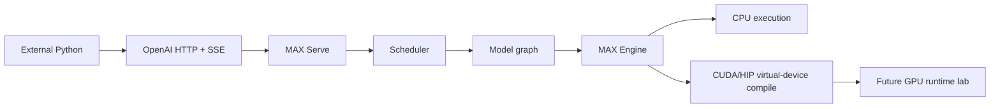

# MAX Internals Learning Lab

```text
external Python
      |
      v
OpenAI HTTP/SSE -> MAX Serve -> scheduler -> model graph -> MAX Engine
                                                       |
                          +----------------------------+------------------+
                          |                                               |
                          v                                               v
                    CPU execution                                GPU compilation
                    [CPU-RUN]                                    [COMPILE-ONLY]
                                                                        |
                                                                        v
                                                               GPU measurement
                                                                  [GPU-LAB]
```



## Progress

| Phase | Artifact | Evidence |
|---|---|---|
| 0 | [Environment](artifacts/00_environment.md) | `CPU-RUN`, `COMPILE-ONLY`, `SOURCE` |
| 1 | [External contract](artifacts/01_external_contract.md) | `CPU-RUN`, `SOURCE` |
| 2 | [Startup topology](artifacts/02_startup_topology.md) | `CPU-RUN`, `SOURCE`, `BOUNDARY` |
| 3 | [Request object trace](artifacts/03_request_object_trace.md) | `CPU-RUN`, `SOURCE`, `TEST` |
| 4-14 | [Master plan](Plan_max_internals_learning.md) | queued |

## Reproduce

```bash
# Terminal 1: source-built server
HF_HOME=/local/mnt/workspace/.murali_hf \
MAX_SERVE_METRICS_ENDPOINT_PORT=18001 \
./bazelw --output_user_root=/local/mnt/workspace/.murali_bazel/user run \
  --config=prebuilt-mojo \
  --disk_cache=/local/mnt/workspace/.murali_bazel/disk \
  --repository_cache=/local/mnt/workspace/.murali_bazel/repo \
  //max/python/max/_entrypoints:pipelines -- \
  serve --model modularai/SmolLM-135M-Instruct-FP32 \
  --devices cpu --quantization-encoding float32 \
  --max-length 256 --max-batch-size 4 \
  --host 127.0.0.1 --port 18000 --allow-cold-interpreter-cache

# Terminal 2: dependency-free external client
python3 murali_docs/labs/client/max_serve_client.py --mode all

# Route -> prompt -> tokens -> context -> local ZMQ round trip
murali_docs/labs/tracing/run_request_object_trace.sh
```

Evidence was captured through repository revision `8d8b1b3e40` on 2026-10-04.
