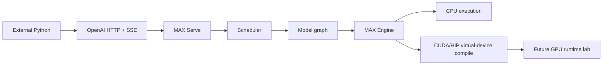

# MAX Internals Learning Lab

```text
external Python
      |
      v
OpenAI HTTP/SSE -> MAX Serve -> scheduler -> model graph -> MAX Engine
                                                       |
                          +----------------------------+------------------+
                          |                                               |
                          v                                               v
                    CPU execution                                GPU compilation
                    [CPU-RUN]                                    [COMPILE-ONLY]
                                                                        |
                                                                        v
                                                               GPU measurement
                                                                  [GPU-LAB]
```



## Progress

| Phase | Artifact                                                                 | Evidence                                |
|-------|--------------------------------------------------------------------------|-----------------------------------------|
| 0     | [Environment](artifacts/00_environment.md)                               | `CPU-RUN`, `COMPILE-ONLY`, `SOURCE`     |
| 1     | [External contract](artifacts/01_external_contract.md)                   | `CPU-RUN`, `SOURCE`                     |
| 2     | [Startup topology](artifacts/02_startup_topology.md)                     | `CPU-RUN`, `SOURCE`, `BOUNDARY`         |
| 3     | [Request object trace](artifacts/03_request_object_trace.md)             | `CPU-RUN`, `SOURCE`, `TEST`             |
| 4     | [IPC and backpressure](artifacts/04_ipc_backpressure.md)                 | `CPU-RUN`, `SOURCE`, `TEST`             |
| 5     | [Scheduler trace](artifacts/05_scheduler_trace.md)                       | `CPU-RUN`, `SOURCE`, `TEST`             |
| 6     | [Batch to token](artifacts/06_batch_to_token.md)                         | `CPU-RUN`, `SOURCE`, `COMPILE-ONLY`     |
| 7     | [Model resolution](artifacts/07_model_resolution.md)                     | `CPU-RUN`, `SOURCE`, `BOUNDARY`         |
| 8     | [Graph compilation](artifacts/08_graph_compilation.md)                   | `SOURCE`, `COMPILE-ONLY`, `BOUNDARY`    |
| 9     | [Graph API vs ModuleV3](artifacts/09_graph_api_vs_modulev3.md)           | `SOURCE`                                |
| 10    | [Python to Mojo to hardware](artifacts/10_python_to_mojo_to_hardware.md) | `SOURCE`, `COMPILE-ONLY`, `GPU-LAB`     |
| 11    | [Paged KV cache](artifacts/11_kv_cache.md)                               | `CPU-RUN`, `SOURCE`, `TEST`             |
| 12    | [Performance report](artifacts/12_performance_report.md)                 | `CPU-RUN`, `SOURCE`, `GPU-LAB`          |
| 13    | [Single-node parallelism](artifacts/13_parallelism.md)                   | `SOURCE`, `COMPILE-ONLY`, `GPU-LAB`     |
| 14    | [Production design](artifacts/14_production_design.md)                   | `SOURCE`, `BOUNDARY`, `GPU-LAB`         |
| Final | [Capstone](artifacts/15_capstone.md)                                     | complete; GPU runtime remains `GPU-LAB` |
| Q&A   | [Component flow explainer](artifacts/000_component_flow_explainer.md)    | `SOURCE`, `BOUNDARY`                    |

## Reproduce

```bash
# Terminal 1: source-built server
HF_HOME=/local/mnt/workspace/.murali_hf \
MAX_SERVE_METRICS_ENDPOINT_PORT=18001 \
./bazelw --output_user_root=/local/mnt/workspace/.murali_bazel/user run \
  --config=prebuilt-mojo \
  --disk_cache=/local/mnt/workspace/.murali_bazel/disk \
  --repository_cache=/local/mnt/workspace/.murali_bazel/repo \
  //max/python/max/_entrypoints:pipelines -- \
  serve --model modularai/SmolLM-135M-Instruct-FP32 \
  --devices cpu --quantization-encoding float32 \
  --max-length 256 --max-batch-size 4 \
  --host 127.0.0.1 --port 18000 --allow-cold-interpreter-cache

# Terminal 2: dependency-free external client
python3 murali_docs/labs/client/max_serve_client.py --mode all

# Route -> prompt -> tokens -> context -> local ZMQ round trip
murali_docs/labs/tracing/run_request_object_trace.sh

# IPC framing -> response routing -> caps -> cancellation
murali_docs/labs/tracing/run_ipc_backpressure_trace.sh

# Continuous batching, chunking, preemption, and DP placement
murali_docs/labs/scheduler/run_scheduler_trace.sh

# CE/TG contexts -> ragged token and row-offset buffers
murali_docs/labs/graph/run_ragged_batch_probe.sh

# HF config -> registry components + adapted weight names
murali_docs/labs/graph/run_model_resolution_probe.sh

# Hash and inspect exported graph artifacts without executing them
murali_docs/labs/graph/inspect_mef_manifest.py \
  /tmp/murali_smollm_cuda_sm80_mefs

# Block lifecycle, hash chain, contiguous lookup, and prefix reuse
murali_docs/labs/kv_cache/run_kv_cache_trace.sh --compact

# Live CPU prefix-cache comparison (run with enabled, then disabled server)
python3 murali_docs/labs/kv_cache/http_prefix_cache_probe.py --mode enabled

# CPU benchmark semantics + Prometheus correlation (server must be running)
murali_docs/labs/performance/run_cpu_benchmark.sh
```

Evidence was re-verified through repository revision `4820070fe7` on
2026-10-04.
