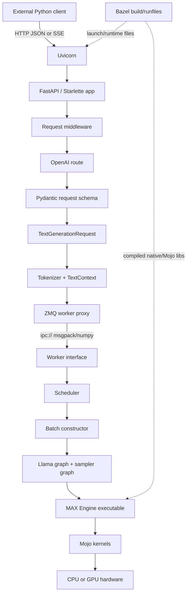
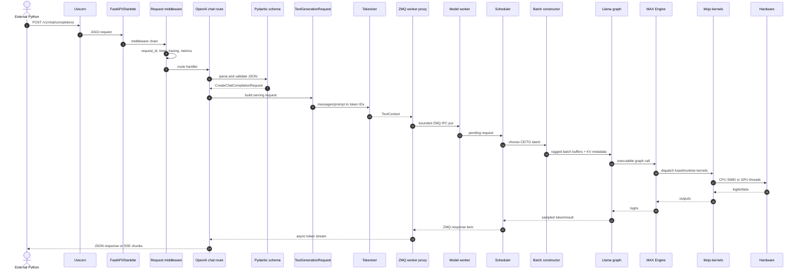
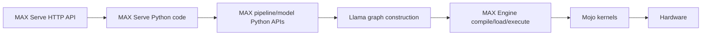
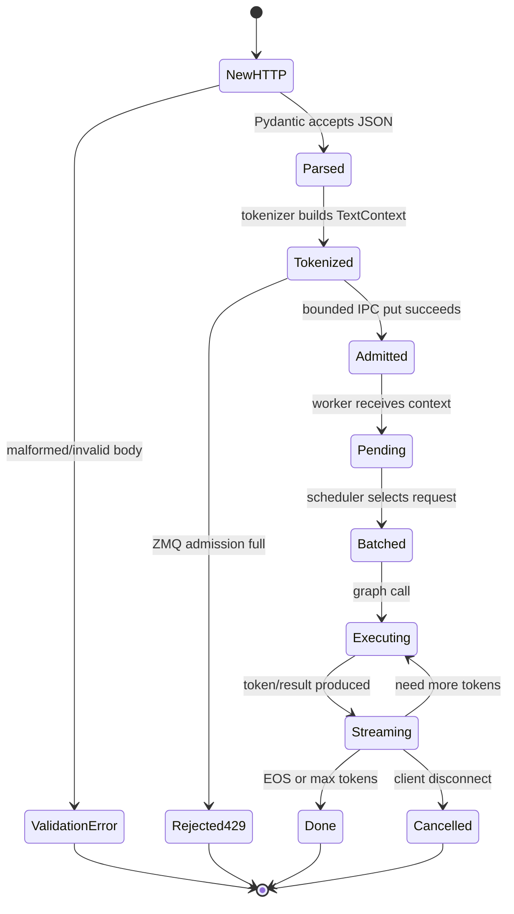
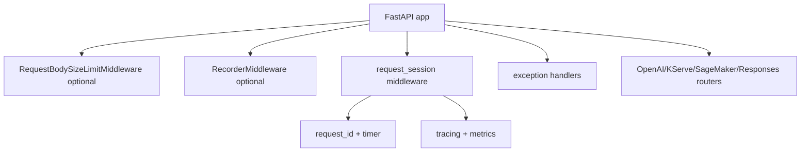
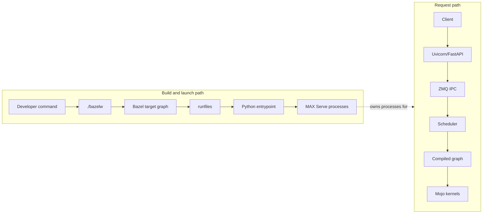

# Component Flow Explainer

## One Picture

`SOURCE`

```text
External Python client
        |
        | OpenAI-compatible HTTP JSON or SSE
        v
+------------------------- API process -------------------------+
| Uvicorn                                                       |
|   ASGI server: sockets, keepalive, event loop, shutdown       |
|      |                                                        |
|      v                                                        |
| FastAPI / Starlette                                           |
|   routes, dependency state, middleware, exception handlers     |
|      |                                                        |
|      v                                                        |
| OpenAI route + Pydantic schema                                |
|   JSON -> CreateChatCompletionRequest -> TextGenerationRequest|
|      |                                                        |
|      v                                                        |
| TokenGeneratorPipeline + tokenizer                            |
|   text/messages -> prompt token IDs -> TextContext            |
|      |                                                        |
|      v                                                        |
| ZMQ worker proxy                                              |
|   bounded local IPC handoff, response stream, cancellation    |
+------|---------------------------------------------------------+
       |
       | ipc:// msgpack/numpy objects
       v
+------------------------ worker process -----------------------+
| ZMQ worker interface -> scheduler -> batch constructor         |
|      |                                                        |
|      v                                                        |
| TextGenerationPipeline                                        |
|      |                                                        |
|      v                                                        |
| Llama graph model + sampler graph                             |
|      |                                                        |
|      v                                                        |
| MAX Engine executable -> Mojo kernels -> CPU/GPU hardware      |
+----------------------------------------------------------------+

Bazel is outside this request path:
source tree -> Bazel build/runfiles -> Python entrypoint + Mojo/native libs
```



## Actor Sequence

`SOURCE`

```text
client -> uvicorn -> FastAPI -> middleware -> route -> schema -> pipeline
       -> tokenizer -> ZMQ proxy -> worker -> scheduler -> graph -> engine
       -> kernels -> hardware -> response path reverses back to client
```



## API Names

`SOURCE`

```text
MAX Serve API       = external HTTP contract.
MAX Python API      = internal Python packages used to build/serve models.
Llama graph         = one model implementation built with MAX graph concepts.
MAX Engine API      = compile/load/execute boundary for graph artifacts.
Mojo kernel API     = low-level accelerator/runtime operations.
```



| Name | Meaning |
|---|---|
| MAX Serve API | HTTP API: `/health`, `/v1/models`, `/v1/chat/completions`, streaming SSE. |
| MAX Python APIs | Python modules for serving, tokenization, scheduler, pipelines, graph setup. |
| Llama graph | The computation graph for one Llama-family architecture. Not the same as HTTP API. |
| MAX Engine | Native compile/load/execute layer that turns graphs into executable model calls. |
| Mojo kernels | Low-level CPU/GPU kernels used underneath selected graph/runtime operations. |

## Request State

`SOURCE`

```text
new -> parsed -> tokenized -> admitted -> pending -> batched -> executing
    -> streaming -> done
                 \-> rejected 429
                 \-> cancelled
                 \-> validation error 4xx
```



## Middleware

`SOURCE`

```text
FastAPI app
  |
  +-- RequestBodySizeLimitMiddleware  optional body cap
  +-- RecorderMiddleware              optional record/replay
  +-- request_session middleware      request id, timer, tracing, metrics
  +-- exception handlers              OpenAI-shaped errors
  +-- routers                         OpenAI, KServe, SageMaker, Responses
```



## Why These Pieces?

`SOURCE` for repo usage. `BOUNDARY` for general tradeoff reasoning.

| Question | Short answer |
|---|---|
| Why FastAPI? | It gives Python async routes, Pydantic validation, OpenAPI-shaped request models, Starlette middleware, and SSE-friendly handlers with little serving glue. |
| Why Uvicorn? | Uvicorn is the ASGI HTTP server: socket accept, HTTP keepalive, uvloop event loop, and graceful shutdown in one process. |
| Why ZMQ for worker IPC? | It is a lightweight local process transport with PUSH/PULL sockets, high-water marks, multipart frames, and no external broker to operate. |
| Why not Kafka/Rabbit/SQS? | Those are durable/distributed queues; token streaming needs low-latency local handoff, cancellation, and backpressure, not durable replay. |
| Why not Python `asyncio.Queue` only? | API and model worker can be separate processes; `asyncio.Queue` is process-local. |
| Why not HTTP between API and worker? | It would add a second HTTP stack inside the node and weaker fit for typed multipart tensors/responses. |
| What is Llama graph? | A model-specific compute graph: embeddings, attention, MLP, KV cache reads/writes, logits, and sampler inputs. |
| Is Llama graph the same as MAX Serve API? | No. MAX Serve API is client-facing HTTP; Llama graph is internal model computation. |
| Is Llama graph the same as MAX API? | No. It is built using MAX Python/graph APIs and then compiled/executed by the engine. |
| Why Bazel? | This repo is polyglot and large: Bazel gives a queryable target graph, hermetic runfiles, caching, test orchestration, and source-built Python/Mojo/native artifacts. |
| Why not CMake? | CMake is strong for C/C++ build generation, but this repo needs broader hermetic Python/Mojo/test/runfile orchestration. |
| Why not SCons? | SCons is flexible Python scripting, but Bazel better matches large target graphs, cache reuse, queries, and remote-style execution workflows. |

## Bazel Position

`SOURCE`

```text
build/startup time:

developer command
  -> ./bazelw run //max/python/max/_entrypoints:pipelines -- serve ...
  -> Bazel target graph
  -> runfiles tree
  -> Python entrypoint
  -> MAX Serve API process + model worker

request time:

client HTTP request
  -> Uvicorn/FastAPI
  -> route/pipeline/ZMQ
  -> scheduler/graph/engine/kernels

Bazel is not a request-time router, queue, scheduler, or kernel runtime.
```



## Source Anchors

`SOURCE`

| Component | Source |
|---|---|
| FastAPI app, optional middleware, routes, Uvicorn config | `max/python/max/serve/api_server.py` |
| Request ID, timer, tracing, metrics middleware | `max/python/max/serve/request.py` |
| OpenAI `/chat/completions` route and `TextGenerationRequest` conversion | `max/python/max/serve/router/openai_routes.py` |
| ZMQ proxy, bounded admission, response drain, cancellation | `max/python/max/serve/worker_interface/zmq_interface.py` |
| Graph API vs ModuleV3 serving shell | `murali_docs/artifacts/09_graph_api_vs_modulev3.md` |
| Production queues and backpressure | `murali_docs/artifacts/14_production_design.md` |
