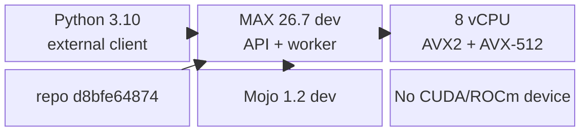
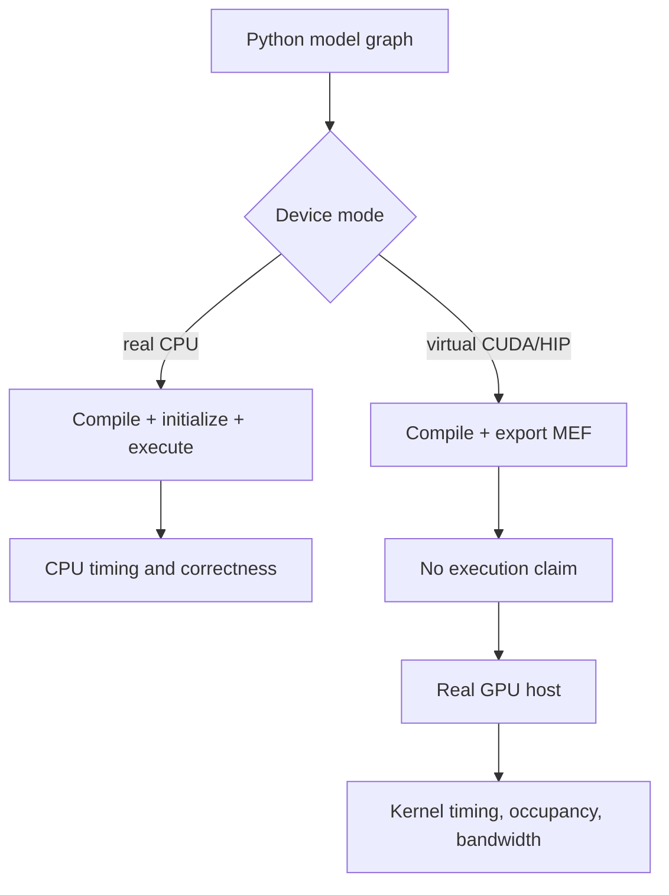
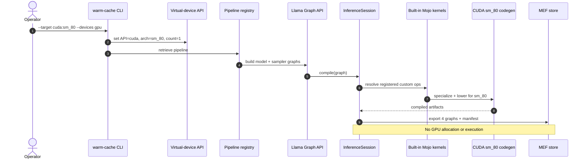
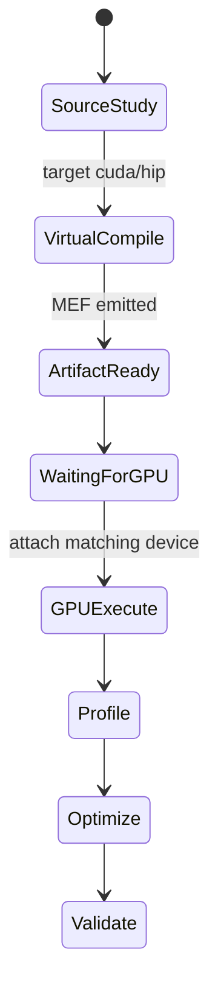
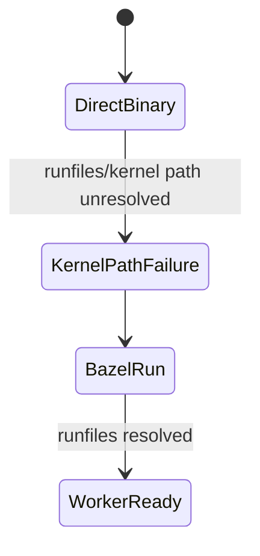

# Phase 0: Reproducible CPU + GPU-Learning Lab

## Machine Map

`CPU-RUN`

```text
+----------------------- host ------------------------+
| Ubuntu 22.04 / Linux 5.15 / x86_64                 |
| 8 vCPU: AMD EPYC 9555P                             |
| AVX2 + AVX-512 | RAM 31 GiB | no visible GPU       |
|                                                     |
| system Python 3.10 ----> external client            |
| Bazel Python 3.13 -----> MAX Serve + workers        |
| MAX 26.7 dev ----------> graph/compiler/runtime     |
| Mojo 1.2 dev ----------> CPU/GPU kernel source      |
+-----------------------------------------------------+
```



## Evidence Snapshot

| Item                   | Observed value                               | Tag       |
|------------------------|----------------------------------------------|-----------|
| Branch / revision      | `main` / `d8bfe64874`                        | `CPU-RUN` |
| Pre-commit dirty state | only `murali_docs/` learning files           | `CPU-RUN` |
| MAX                    | `26.7.0.dev2026100305`                       | `CPU-RUN` |
| Mojo                   | `1.2.0.dev2026100305 (4ad841b8)`             | `CPU-RUN` |
| Server Python          | `3.13.11`                                    | `CPU-RUN` |
| Client Python          | `3.10.12`                                    | `CPU-RUN` |
| CPU                    | `AMD EPYC 9555P`, 8 visible cores            | `CPU-RUN` |
| RAM / swap             | `31 GiB / 31 GiB`                            | `CPU-RUN` |
| Accelerator            | none; no `nvidia-smi` or `rocminfo`          | `CPU-RUN` |
| Model                  | `modularai/SmolLM-135M-Instruct-FP32`        | `CPU-RUN` |
| HF revision            | `1ade67aacf72511c94c55529056f7222c1c0b586`   | `CPU-RUN` |
| Weight                 | `model.safetensors`, 538 MB download         | `CPU-RUN` |
| Architecture           | `LlamaForCausalLM` -> `Llama3Model`          | `CPU-RUN` |
| Model shape            | 30 layers, hidden 576, 9 Q heads, 3 KV heads | `CPU-RUN` |
| Server ports           | API `18000`, metrics `18001`                 | `CPU-RUN` |
| HF cache               | `/local/mnt/workspace/.murali_hf`            | `CPU-RUN` |
| Bazel caches           | `/local/mnt/workspace/.murali_bazel`         | `CPU-RUN` |
| CLI source             | `//max/python/max/_entrypoints:pipelines`    | `CPU-RUN` |

## CPU Baseline Command

`CPU-RUN`

```bash
HF_HOME=/local/mnt/workspace/.murali_hf \
MAX_SERVE_METRICS_ENDPOINT_PORT=18001 \
MAX_SERVE_GRACEFUL_SHUTDOWN_TIMEOUT_S=120 \
./bazelw --output_user_root=/local/mnt/workspace/.murali_bazel/user run \
  --config=prebuilt-mojo \
  --disk_cache=/local/mnt/workspace/.murali_bazel/disk \
  --repository_cache=/local/mnt/workspace/.murali_bazel/repo \
  //max/python/max/_entrypoints:pipelines -- \
  --log-level DEBUG serve \
  --model modularai/SmolLM-135M-Instruct-FP32 \
  --devices cpu --quantization-encoding float32 \
  --max-length 256 --max-batch-size 4 \
  --host 127.0.0.1 --port 18000 \
  --allow-cold-interpreter-cache
```

## Execution Lanes

```text
                         SAME PYTHON MODEL GRAPH
                                  |
                 +----------------+----------------+
                 |                                 |
                 v                                 v
       real CPU device                       virtual GPU device
       compile + initialize                  compile + export MEF
       execute + measure                     cannot execute
       [CPU-RUN]                             [COMPILE-ONLY]
                 |                                 |
                 v                                 v
       CPU kernels / SIMD                 CUDA sm_80 code artifact
                                                   |
                                                   v
                                      copy to real A100-class host
                                      execute + profile [GPU-LAB]
```



## GPU-Less CUDA Proof

`COMPILE-ONLY`

```bash
HF_HOME=/local/mnt/workspace/.murali_hf \
./bazelw --output_user_root=/local/mnt/workspace/.murali_bazel/user run \
  --config=prebuilt-mojo \
  --disk_cache=/local/mnt/workspace/.murali_bazel/disk \
  --repository_cache=/local/mnt/workspace/.murali_bazel/repo \
  //max/python/max/_entrypoints:pipelines -- \
  warm-cache --target cuda:sm_80 \
  --model modularai/SmolLM-135M-Instruct-FP32 \
  --devices gpu --quantization-encoding float32 \
  --max-length 128 --max-batch-size 1 \
  --export-mefs /tmp/murali_smollm_cuda_sm80_mefs
```

```text
virtual target cuda:sm_80
  -> graph build             0.5 s
  -> model compile          53.6 s
  -> sampler compile        10.4 s
  -> future-token compile    8.0 s
  -> 4 MEFs + manifest       3.5 MiB
  -> execution               BLOCKED BY DESIGN
```



| Exported graph               | Key visible signature                              |
|------------------------------|----------------------------------------------------|
| `llama3`                     | ragged tokens -> `[rows, 49152]` logits on `gpu:0` |
| `top_k_sampler`              | logits/history/sampling params -> token on `gpu:0` |
| `ragged_logprobs`            | logits/token metadata -> probabilities on `gpu:0`  |
| `realize_future_token_graph` | overlap-scheduler token realization                |

MEFs stay in `/tmp`; they are not committed.

## Capability Boundary

```text
[SOURCE]       inspect Mojo dispatch, layouts, memory spaces, launch geometry
[COMPILE-ONLY] verify CUDA/HIP graph lowering and exported signatures
[CPU-RUN]      execute complete HTTP -> scheduler -> graph -> CPU path
[GPU-LAB]      measure kernel time, occupancy, bandwidth, tensor-core use
```



## Launcher State

`CPU-RUN`

```text
direct bazel-bin executable
        |
        v
worker cannot resolve built-in kernel package
        |
        v
use `bazel run` so runfiles/environment are installed
        |
        v
model graph compiles and server becomes ready
```



Source pins:

- Virtual devices:
  [`config.py`](../../max/python/max/_entrypoints/cli/config.py#L468)
- Target parsing: [`serve/config.py`](../../max/python/max/serve/config.py#L601)
- Compile-only refusal:
  [`engine/api.py`](../../max/python/max/engine/api.py#L456)
- CPU-to-GPU MEF workflow:
  [`precompile_pipeline.py`](../../max/tests/integration/tools/precompile_pipeline.py#L14)
