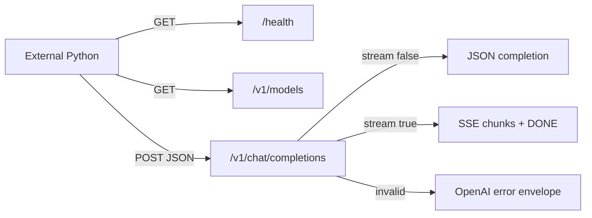
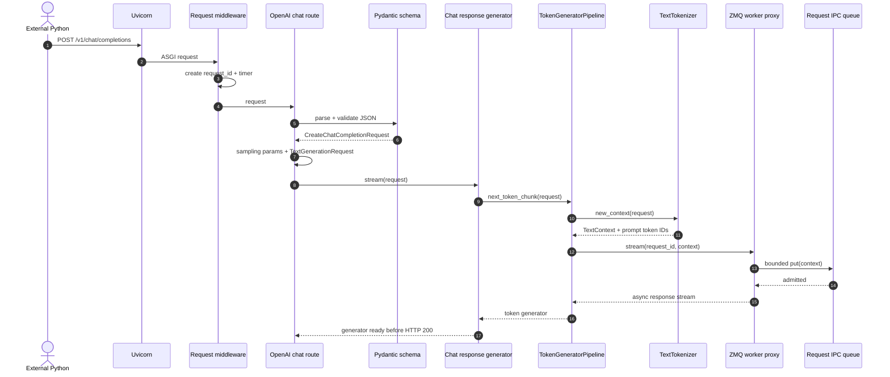
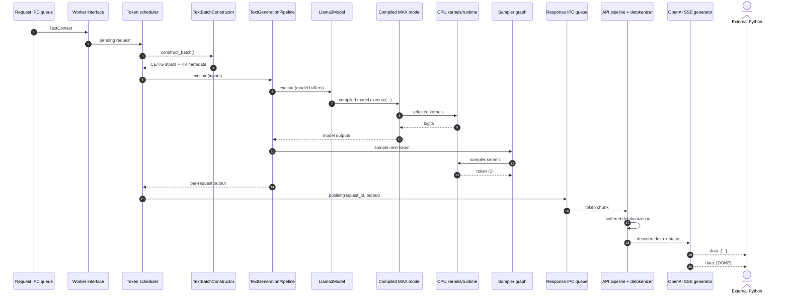
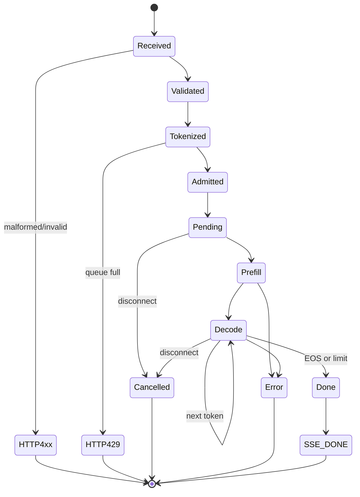

# Phase 1: External Python -> MAX Serve

## Contract Surface

`CPU-RUN`

```text
external Python 3.10
       |
       | GET /health, GET /v1/models
       | POST /v1/chat/completions
       v
+-------------------- MAX Serve :18000 --------------------+
| JSON validation -> request id -> generation -> response  |
+----------------------------------------------------------+
       |
       +--> JSON response
       +--> SSE: data:{chunk}\n\n ... data:[DONE]\n\n
       +--> OpenAI-shaped 4xx error
```



## Ingress + Admission Sequence

`SOURCE`, with endpoint behavior confirmed by `CPU-RUN`.

```text
Client -> Uvicorn -> request middleware -> OpenAI route -> Pydantic schema
                                                        |
                                                        v
                                              TextGenerationRequest
                                                        |
                                                        v
response generator -> TokenGeneratorPipeline -> tokenizer -> TextContext
                                                        |
                                                        v
                                             ZMQ worker proxy -> IPC
```



## Scheduler + Egress Sequence

`SOURCE`

```text
IPC -> worker interface -> scheduler -> batch constructor
                                      |
                                      v
                     TextGenerationPipeline.execute
                                      |
                         +------------+------------+
                         v                         v
                  compiled Llama graph          sampler
                         |                         |
                         +---------- CPU ----------+
                                      |
                                      v
response IPC -> detokenizer -> OpenAI chunk -> SSE -> client iterator
```



## Request State Machine

```text
RECEIVED -> VALIDATED -> TOKENIZED -> ADMITTED -> PENDING
    |           |                         |           |
    |           +--> 400                  +--> 429    v
    |                                             PREFILL
    |                                                |
    |                                                v
    +--------------------------------------------- DECODE
                                                     |
                         +---------------------------+----------------+
                         v                           v                v
                       DONE                      CANCELLED          ERROR
                         |
                         v
                    SSE [DONE]
```



## Observed Responses

`CPU-RUN`, warmed server, 2026-10-04.

| Call | Result |
|---|---|
| `GET /health` | `200`, empty body |
| `GET /v1/models` | `200`, model ID + `max_model_len: 256` |
| valid non-stream chat | `200`, 16 prompt + 8 completion tokens |
| invalid `messages` type | `400`, `invalid_request_error` |
| stream | first frame `22.31 ms`, `[DONE]` `117.73 ms` |
| disconnect | client closed after 2 data frames; server stayed healthy |

Compact non-stream result:

```json
{
  "finish_reason": "length",
  "content": "Here is a sample response:\n\n",
  "prompt_tokens": 16,
  "completion_tokens": 8,
  "total_tokens": 24
}
```

Raw SSE shape:

```text
 22.31 ms | data: {... "delta":{"content":"Here","role":"assistant"} ...}
 33.69 ms | data: {... "delta":{"content":" is","role":"assistant"} ...}
117.69 ms | data: {... "finish_reason":"length" ...}
117.73 ms | data: [DONE]
```

## Metrics Cross-Check

`CPU-RUN`, snapshot after two completed chats plus one disconnected stream.

```text
HTTP middleware -> request_count{path,code}
scheduler       -> CE/TG batch counters
pipeline        -> input/output token counters
streaming layer -> TTFT / ITL / request time
```

| Signal | Value |
|---|---:|
| chat `200` / `400` | `3 / 1` |
| CE batches / TG batches | `3 / 16` |
| input / output tokens | `49 / 18` |
| mean TTFT | `29.01 ms` |
| mean recorded ITL | `13.72 ms` |
| KV prefix hits / misses | `0 / 49 tokens` |

## Header Commit Boundary

`SOURCE`

```text
parse / tokenize / worker handoff / fetch first item
                       |
             +---------+----------+
             |                    |
             v                    v
          failure              success
       HTTP 4xx/5xx       commit SSE HTTP 200
                                  |
                                  v
                         later error is in-stream
```

The route awaits submission and the first stream item before returning
`EventSourceResponse`.

## Reusable Client

```bash
python3 murali_docs/labs/client/max_serve_client.py --mode all

python3 murali_docs/labs/client/max_serve_client.py \
  --mode stream --max-tokens 64 --disconnect-after 2
```

Source pins:

- Route and schema conversion: [`openai_routes.py`](../../max/python/max/serve/router/openai_routes.py#L2217)
- `TextGenerationRequest`: [`openai_routes.py`](../../max/python/max/serve/router/openai_routes.py#L2482)
- SSE commit boundary: [`openai_routes.py`](../../max/python/max/serve/router/openai_routes.py#L2508)
- Tokenize + submit: [`llm.py`](../../max/python/max/serve/pipelines/llm.py#L294)
- Worker handoff: [`llm.py`](../../max/python/max/serve/pipelines/llm.py#L431)
- ZMQ proxy: [`zmq_interface.py`](../../max/python/max/serve/worker_interface/zmq_interface.py#L52)
- Scheduler iteration: [`text_generation_scheduler.py`](../../max/python/max/serve/scheduler/text_generation_scheduler.py#L205)
- Batch construction: [`text_batch_constructor.py`](../../max/python/max/serve/scheduler/batch_constructor/text_batch_constructor.py#L1845)
- Model + sampling step: [`text_generation.py`](../../max/python/max/pipelines/lib/pipeline_variants/text_generation.py#L515)
