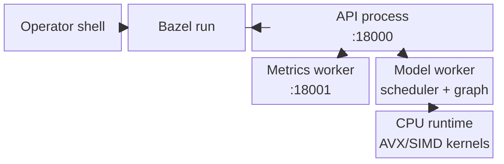
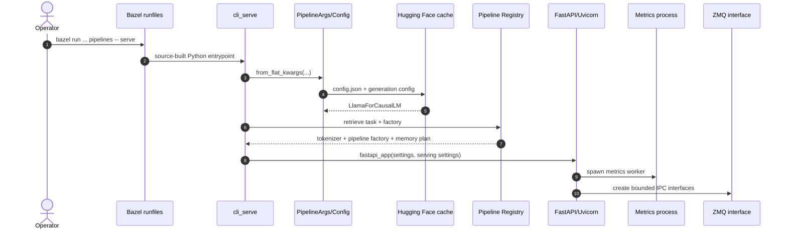
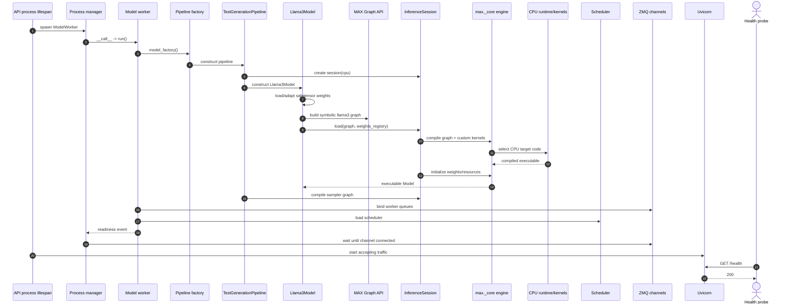
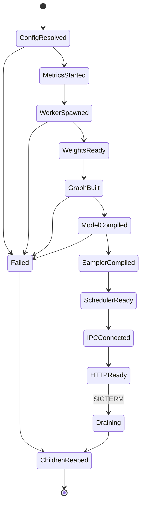
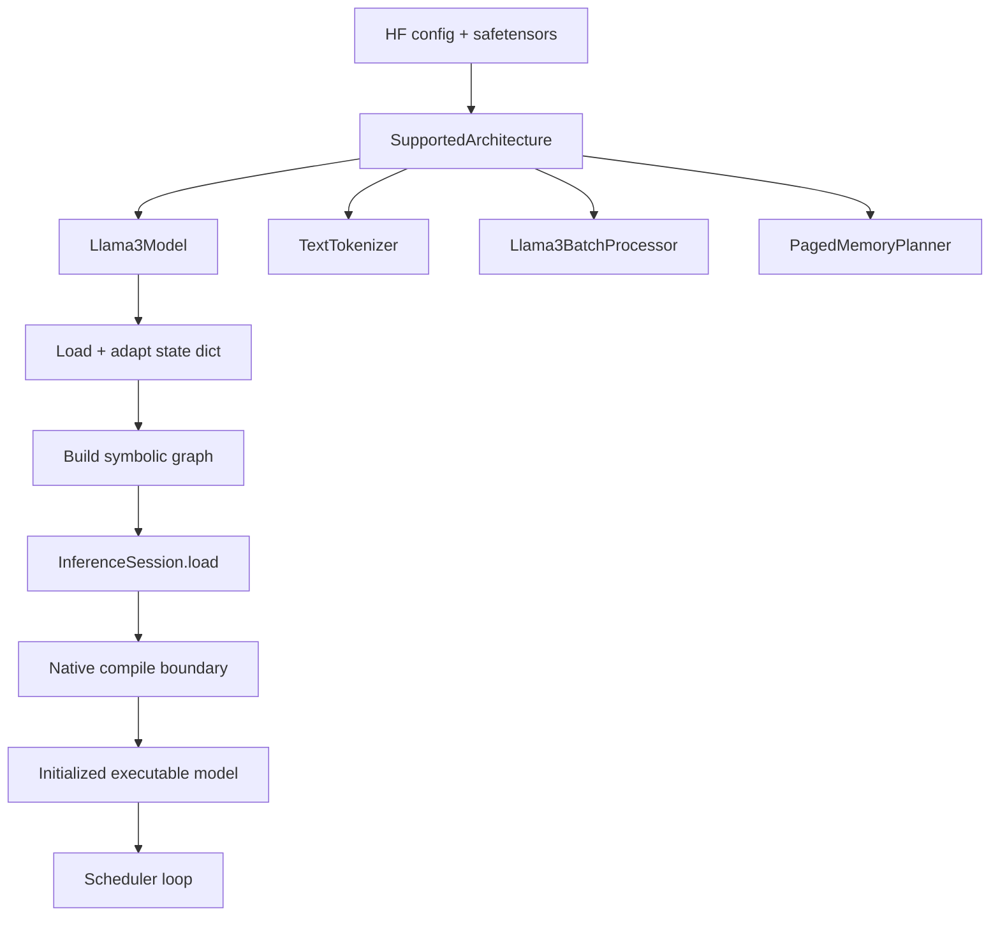
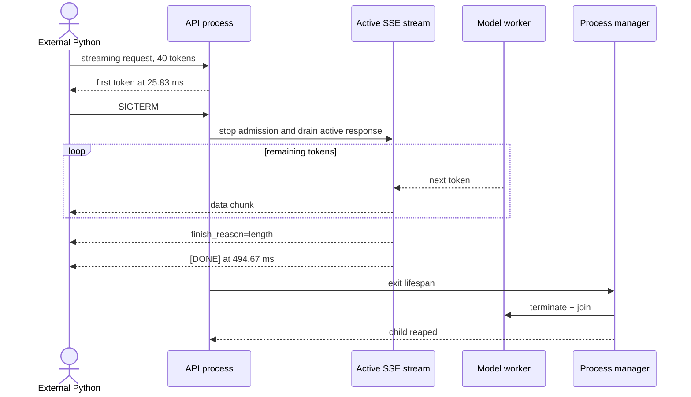

# Phase 2: MAX Serve Startup Topology

## Runtime Ownership

`CPU-RUN`

```text
operator shell
    |
    v
Bazel client (2366209) -> Bazel wrapper (2366218)
    |
    v
API process (2366224, 336 MiB RSS)
    |-- TCP :18000  Uvicorn / FastAPI / tokenizer / ZMQ proxy
    |-- resource tracker (2368002, 27 MiB)
    |-- metrics worker  (2368004, 168 MiB) -> TCP :18001
    `-- model worker    (2368039, 2.34 GiB)
          Llama pipeline / scheduler / KV cache / compiled model / CPU runtime
```

RSS is a one-time process snapshot; shared pages make the values non-additive.



## Startup Sequence: Control Plane

`SOURCE + CPU-RUN`

```text
Operator -> Bazel -> CLI -> PipelineArgs -> HF config -> Registry
                                                    |
                              +---------------------+------------------+
                              v                                        v
                        tokenizer/factory                         memory plan
                              |                                        |
                              +---------------------+------------------+
                                                    v
                                          FastAPI app + Uvicorn
                                                    |
                                      metrics process + ZMQ interface
```



## Startup Sequence: Model Plane

`SOURCE + CPU-RUN`; native compiler internals are `BOUNDARY`.

```text
API -> spawn model worker -> construct TextGenerationPipeline
                                  |
                                  v
                         load safetensor weights
                                  |
                                  v
                       build Llama Graph API graph
                                  |
                                  v
                    InferenceSession.load(graph, weights)
                           | compile | initialize
                           v         v
                    native MAX engine [BOUNDARY]
                                  |
                                  v
                   scheduler + IPC channel ready
                                  |
                                  v
                       Uvicorn accepts requests
```



## Readiness State Machine

```text
START
  -> CONFIG_RESOLVED
  -> METRICS_STARTED
  -> WORKER_SPAWNED
  -> WEIGHTS_READY
  -> GRAPH_BUILT
  -> MODEL_COMPILED
  -> SAMPLER_COMPILED
  -> SCHEDULER_READY
  -> IPC_CONNECTED
  -> HTTP_READY

Any failure before HTTP_READY -> unwind lifespan -> reap children -> EXIT
```



## Measured Startup Timeline

`CPU-RUN`, local time, warm model-download cache.

| Time           | Event                            |                Delta |
|----------------|----------------------------------|---------------------:|
| `08:54:05.226` | CLI re-exec with jemalloc        |                start |
| `08:54:11.282` | task resolved as text generation |              `+6.1s` |
| `08:54:13.958` | server lifespan + metrics start  |              `+8.7s` |
| `08:54:14.812` | model worker spawned             |              `+9.6s` |
| `08:54:18.417` | pipeline initialization begins   |             `+13.2s` |
| `08:54:25.928` | graph build/compile begins       |             `+20.7s` |
| `08:54:26.439` | model graph built                |         `0.5s build` |
| `08:54:54.546` | model compiled                   |      `28.1s compile` |
| `08:55:04.353` | sampler compiled                 |       `9.4s compile` |
| `08:55:04.466` | model worker ready               | `49.5s worker total` |
| `08:55:04.511` | API server ready                 | `59.3s from re-exec` |

Prometheus startup split:

```text
spawn          3,603.9 ms
graph build      911.7 ms
graph compile 44,386.9 ms
initialize        29.5 ms
graph capture      0.0 ms  (disabled on CPU)
worker total  49,541.6 ms
```

## Graph Setup Boundary

```text
HF config: LlamaForCausalLM
            |
            v
SupportedArchitecture
  pipeline_model = Llama3Model
  tokenizer      = TextTokenizer
  batching       = Llama3BatchProcessor
  memory_planner = PagedMemoryPlanner
            |
            v
GraphPipelineModelWithKVCache.load_model
  1. _load_state_dict()
  2. _create_model_config()
  3. _build_graph_for_compile()
  4. session.load(graph, weights_registry)
  5. wire batch processor
            |
            v
InferenceSession -> max._core native compiler/runtime [BOUNDARY]
```



## Graceful Shutdown Sequence

`CPU-RUN`



```text
SIGTERM after frame 1
  -> 39 more token frames delivered
  -> finish_reason=length
  -> [DONE]
  -> API exit 143
  -> no :18000 / :18001 listeners
  -> no API, metrics, resource-tracker, or model-worker processes
```

## Ownership Table

| Object                               | Owner process               | Lifetime                                |
|--------------------------------------|-----------------------------|-----------------------------------------|
| Uvicorn + FastAPI app                | API                         | server lifetime                         |
| tokenizer + response detokenizers    | API                         | tokenizer: server; detokenizer: request |
| ZMQ proxy + per-request output queue | API                         | server / request                        |
| metrics ASGI endpoint                | metrics worker              | server lifetime                         |
| model weights + executable model     | model worker                | worker lifetime                         |
| scheduler + batch constructor        | model worker                | worker lifetime                         |
| KV manager/pages                     | model worker                | worker / request reuse                  |
| CPU kernels/runtime resources        | model worker/native runtime | executable lifetime                     |

Source pins:

- CLI config creation:
  [`pipelines.py`](../../max/python/max/_entrypoints/pipelines.py#L434)
- Registry + app creation:
  [`serve_api_and_model_worker.py`](../../max/python/max/_entrypoints/cli/serve/serve_api_and_model_worker.py#L59)
- Lifespan worker startup:
  [`api_server.py`](../../max/python/max/serve/api_server.py#L110)
- Pipeline compile timing:
  [`model_worker.py`](../../max/python/max/serve/pipelines/model_worker.py#L319)
- Scheduler loop:
  [`model_worker.py`](../../max/python/max/serve/pipelines/model_worker.py#L527)
- Worker readiness + channel connect:
  [`model_worker.py`](../../max/python/max/serve/pipelines/model_worker.py#L612)
- Architecture registration:
  [`llama3/arch.py`](../../max/python/max/pipelines/architectures/llama3/arch.py#L28)
- Graph load template:
  [`pipeline_model.py`](../../max/python/max/pipelines/lib/interfaces/pipeline_model.py#L948)
- Compile/init API: [`engine/api.py`](../../max/python/max/engine/api.py#L1048)
- Child-process cleanup:
  [`process_control.py`](../../max/python/max/serve/process_control.py#L92)
