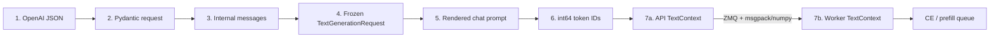
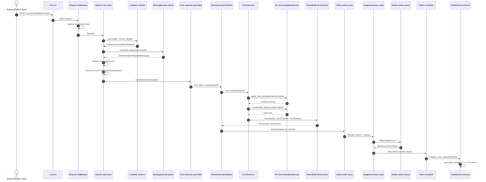
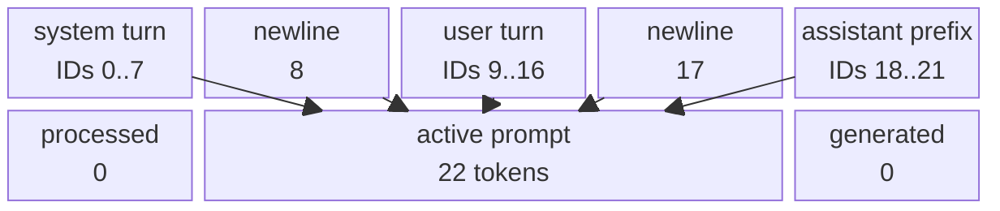
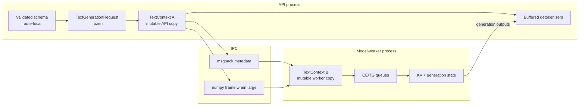
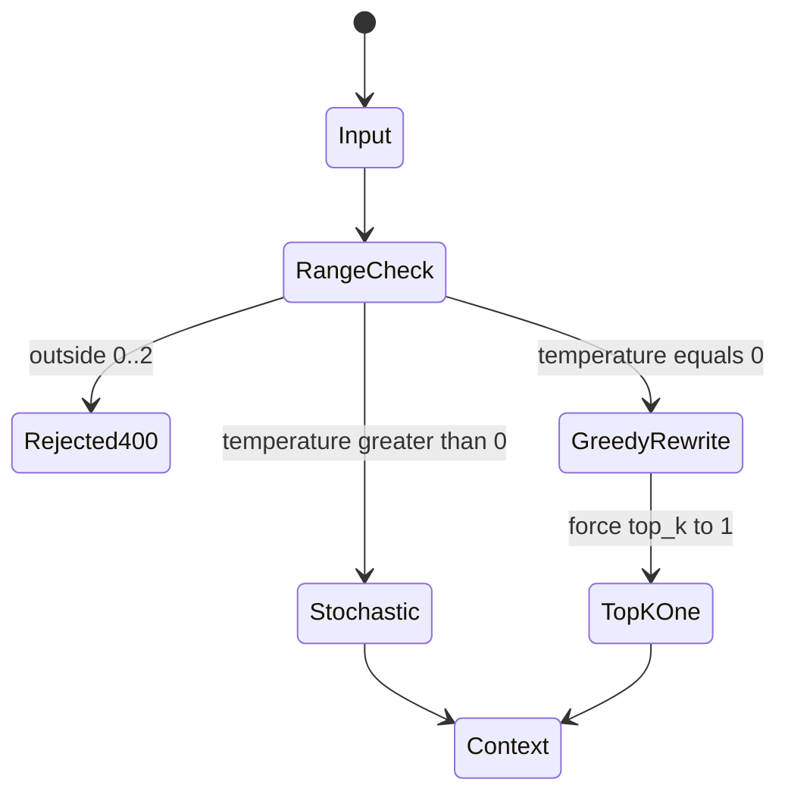
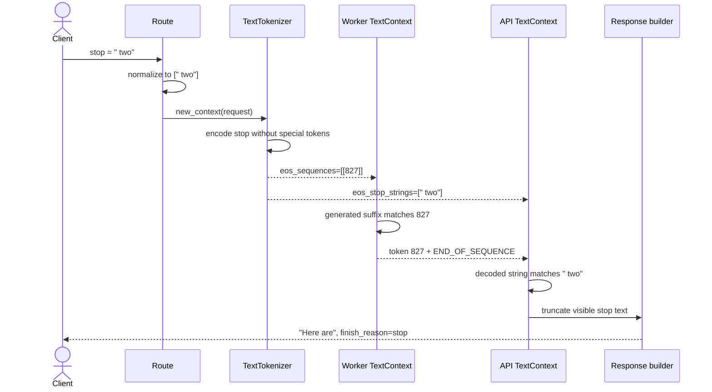
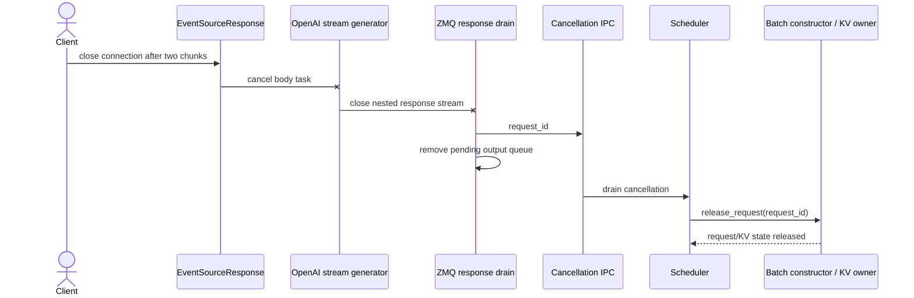
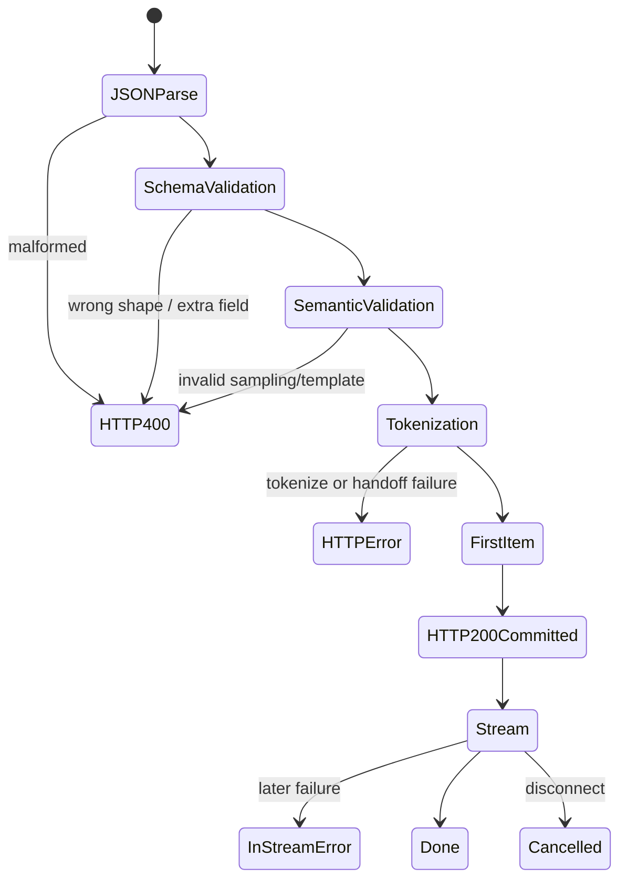

# Phase 3: OpenAI JSON to Scheduler Context

## Seven Representations

`SOURCE + CPU-RUN`

```text
1 wire JSON
   messages=[system,user]  temperature=0.7  top_k=50  max_tokens=4
        |
        v
2 CreateChatCompletionRequest             Pydantic, extra=forbid
        |
        v
3 TextGenerationRequestMessage[]          roles/content normalized
        |
        v
4 TextGenerationRequest                   frozen API object
        |
        v
5 rendered chat prompt                    str, 112 characters
        |
        v
6 TokenBuffer                             int64[22], active=[0:22]
        |
        v
7 TextContext -- ZMQ/msgpack copy --> TextContext -- scheduler CE queue
       API process                         model-worker process
```



## Actor-Complete Sequence

`SOURCE`; values were checked by `CPU-RUN`.

```text
Client  Uvicorn  Middleware  Route  Pydantic  Message parser  Response gen
  |        |         |         |       |            |              |
  | POST JSON ------>| request id       |            |              |
  |        |-------->|-------->| validate            |              |
  |        |         |         |<------ typed request|              |
  |        |         |         |------>| normalize messages         |
  |        |         |         | build frozen TextGenerationRequest|
  |        |         |         |-------------------->| submit       |

Response gen  Pipeline  TextTokenizer  HF template  TokenBuffer  ZMQ  Worker  Scheduler
     |           |           |             |             |        |      |        |
     |---------->| new_context             |             |        |      |        |
     |           |---------->| render ---->|             |        |      |        |
     |           |           | tokenize ---------------->|        |      |        |
     |           |<----------| mutable TextContext       |        |      |        |
     |           |-------------------------------------->| serialize       |        |
     |           |                                      |------->| copy |        |
     |           |                                      |        |----->| drain  |
     |           |                                      |        |      |------->| enqueue CE
```



## Exact Prompt Buffer

`CPU-RUN`

```text
rendered prompt
┌──────────────────────────────────────────────────────────────────────┐
│ <|im_start|>system\nYou are concise.<|im_end|>\n                    │
│ <|im_start|>user\nName two colors.<|im_end|>\n                     │
│ <|im_start|>assistant\n                                             │
└──────────────────────────────────────────────────────────────────────┘

token positions
  0 ........ 7  8  9 .............. 16  17  18 ........ 21
┌──────────────┬───┬──────────────────┬───┬────────────────┐
│ system turn  │ \n│    user turn     │ \n│ assistant head │
└──────────────┴───┴──────────────────┴───┴────────────────┘

IDs
[1,9690,198,2683,359,19484,30,2,198,1,4093,198,5820,827,
 4683,30,2,198,1,520,9531,198]

TextContext at admission
processed = 0 | active = 22 prompt tokens | pending = 0 | generated = 0
max_length = 22 prompt + 4 requested output = 26
```



## Ownership Split

`SOURCE + CPU-RUN`

```text
API PROCESS                                      MODEL-WORKER PROCESS

CreateChatCompletionRequest                     no copy
  route-local, validated                             X
        |
        v
TextGenerationRequest [frozen]                  no copy
  route + response generator                         X
        |
        v
TextContext A [mutable] -- serialize by value --> TextContext B [mutable]
  prompt IDs                          ZMQ          scheduler/batch owner
  API stop-string tracker                          token/KV state advances
  detokenizer seed prompt                          status mutates
        ^                                                |
        |          TextGenerationOutput                 |
        +---------------- response IPC ------------------+

Invariant measured: A is not B; token values equal; storage is not shared.
```



## Field Fate Map

`SOURCE`

| Wire field         | Validate / normalize                       | Stored                              | First consumer                     | Returned or discarded             |
|--------------------|--------------------------------------------|-------------------------------------|------------------------------------|-----------------------------------|
| `model`            | Pydantic `str`; served-model check         | request + context                   | route / scheduler metadata         | response `model`                  |
| `messages`         | non-empty list; roles/content normalized   | frozen request only                 | chat template                      | replaced by token IDs before IPC  |
| `prompt_tokens`    | optional `list[int]`                       | request `prompt`                    | tokenizer direct-ID path           | may return as `prompt_token_ids`  |
| `temperature`      | optional wire value; range `[0,2]`         | `SamplingParams` in request/context | sampler                            | not returned                      |
| `top_k`            | `0 -> -1`; `< -1` rejected                 | `SamplingParams`                    | sampler                            | not returned                      |
| `max_tokens`       | non-negative; `max_completion_tokens` wins | `max_new_tokens`                    | context length calculation         | `finish_reason=length` if reached |
| `stop`             | `str -> list[str]`                         | request sampling + context tracker  | token EOS check + API string check | stop text removed; reason=`stop`  |
| `seed`             | optional integer; absent/zero replaced     | `SamplingParams`                    | sampler RNG                        | not returned                      |
| `logprobs`         | bool + count validation                    | request/context                     | model output + route formatter     | optional response logprobs        |
| `stream`           | optional bool                              | route branch only                   | SSE/non-SSE selection              | discarded after branch            |
| `stream_options`   | OpenAI schema                              | response generator                  | final usage chunk                  | not sent to worker                |
| `return_token_ids` | MAX bool extension                         | response generator only             | response assembly                  | opt-in token IDs                  |

## Temperature Path

`SOURCE + CPU-RUN`

```text
temperature=0.7, top_k=50 -> SamplingParams -> (0.7, 50)

temperature=0.0, top_k=50 -> SamplingParams.__post_init__
                              temperature == 0
                                   |
                                   v
                              top_k forced to 1
                                   |
                                   v
                              greedy sampler path
```



Live CPU result, same prompt:

| Run      | Temperature | Output token IDs          | Text                    |
|----------|------------:|---------------------------|-------------------------|
| baseline |       `0.7` | `[1780, 253, 1109, 1962]` | `What a great question` |
| greedy 1 |       `0.0` | `[4590, 359, 827, 4683]`  | `Here are two colors`   |
| greedy 2 |       `0.0` | `[4590, 359, 827, 4683]`  | `Here are two colors`   |

## Stop-Sequence Path

`SOURCE + CPU-RUN`

```text
wire: "stop": " two"
          |
          v
route: [" two"]
          |
          v
tokenizer: eos_stop_strings=[" two"] + eos_sequences=[[827]]
                 |                              |
                 v                              v
API decoded-text matcher             worker token-suffix matcher
                 |                              |
                 +------------+-----------------+
                              v
                   END_OF_SEQUENCE + cancel
                              |
                              v
response: content="Here are", finish_reason="stop"
committed token_ids=[4590,359,827]  (stop token is accounted, text is hidden)
```



## Disconnect Path

`SOURCE + TEST + CPU-RUN`

```text
client closes SSE
      |
      v
Starlette cancels response task
      |
      v
response generator closes
      |
      v
ZmqModelWorkerProxy._drain_responses catches BaseException
      |
      +--> cancel_queue.put_nowait([request_id])
      +--> delete API pending output queue
      |
      v
scheduler drains cancel ID -> release request/KV state -> cancelled result
```



Measured checks:

| Probe                  | Result                                   |
|------------------------|------------------------------------------|
| proxy cancellation lab | cancel queue received `phase3-baseline`  |
| API pending-output map | request removed                          |
| live SSE disconnect    | closed after 2 frames at `39.95 ms`      |
| post-disconnect health | `200`                                    |
| regression test        | disconnect produces backend cancellation |

## Validation and HTTP Commit Boundary

`SOURCE + CPU-RUN`

```text
JSON bytes
   |
   +-- invalid JSON ------------------------------> HTTP 400
   |
   v
Pydantic schema
   +-- messages="not-a-list" --------------------> HTTP 400 / list_type
   +-- unknown "temperatur" ---------------------> HTTP 400 / extra_forbidden
   |
   v
semantic conversion
   +-- temperature=3 -----------------------------> HTTP 400 / Value error
   |
   v
tokenize -> IPC submit -> await first generator item
   +-- failure before first item -----------------> normal HTTP error
   |
   v
EventSourceResponse commits 200
   +-- later failure -----------------------------> in-stream error event
```



## Reproduce

`CPU-RUN`

```bash
murali_docs/labs/tracing/run_request_object_trace.sh \
  > /tmp/phase3_request_trace.json

python3 -m json.tool /tmp/phase3_request_trace.json
```

Live-server cross-check:

```bash
# Start the Phase 0 CPU server, then send a request with:
#   return_token_ids=true, temperature=0, top_k=50, max_tokens=4
# Expected prompt_token_ids: the 22 IDs shown above.

python3 murali_docs/labs/client/max_serve_client.py \
  --mode stream --prompt 'Count upward slowly from one to fifty.' \
  --max-tokens 64 --disconnect-after 2
```

## Evidence Card

| Item                       | Result                                            |
|----------------------------|---------------------------------------------------|
| Repository revision traced | `8d8b1b3e40`                                      |
| Model revision             | `1ade67aacf72511c94c55529056f7222c1c0b586`        |
| Device                     | CPU                                               |
| Prompt                     | 112 characters -> 22 `int64` IDs                  |
| Context length             | `22 + 4 = 26`                                     |
| IPC identity               | new Python object, equal tokens, unshared storage |
| Initial scheduler lane     | CE / prefill                                      |
| Schema failures            | `list_type`, `extra_forbidden` -> HTTP `400`      |
| Semantic failure           | `temperature=3` -> HTTP `400`                     |
| GPU claim                  | none; this phase ends before model execution      |

Source pins:

- Request schema construction:
  [`openai.py`](../../max/python/max/serve/schemas/openai.py#L330)
- Chat request schema:
  [`openai.py`](../../max/python/max/serve/schemas/openai.py#L448)
- JSON parsing:
  [`openai_routes.py`](../../max/python/max/serve/router/openai_routes.py#L3070)
- Message normalization:
  [`openai_routes.py`](../../max/python/max/serve/router/openai_routes.py#L1719)
- Sampling and request construction:
  [`openai_routes.py`](../../max/python/max/serve/router/openai_routes.py#L2404)
- Frozen request definition:
  [`text_generation.py`](../../max/python/max/pipelines/modeling/types/pipeline_variants/text_generation.py#L335)
- Tokenize and submit:
  [`llm.py`](../../max/python/max/serve/pipelines/llm.py#L294)
- Chat rendering and encoding:
  [`tokenizer.py`](../../max/python/max/pipelines/lib/tokenizer.py#L604)
- Context construction:
  [`tokenizer.py`](../../max/python/max/pipelines/lib/tokenizer.py#L819)
- Mutable context:
  [`context.py`](../../max/python/max/pipelines/context/context.py#L455)
- Token-buffer layout:
  [`tokens.py`](../../max/python/max/pipelines/context/tokens.py#L164)
- IPC admission/cancellation:
  [`zmq_interface.py`](../../max/python/max/serve/worker_interface/zmq_interface.py#L105)
- ZMQ NumPy serialization:
  [`_zmq_queue.py`](../../max/python/max/serve/worker_interface/_zmq_queue.py#L318)
- Scheduler queue drain:
  [`text_generation_scheduler.py`](../../max/python/max/serve/scheduler/text_generation_scheduler.py#L160)
- First CE admission:
  [`text_batch_constructor.py`](../../max/python/max/serve/scheduler/batch_constructor/text_batch_constructor.py#L677)
- Stop-token state update:
  [`context.py`](../../max/python/max/pipelines/context/context.py#L884)
- API stop-string handling:
  [`llm.py`](../../max/python/max/serve/pipelines/llm.py#L587)
- Disconnect regression:
  [`test_openai_routes.py`](../../max/tests/tests/serve/test_openai_routes.py#L1474)
