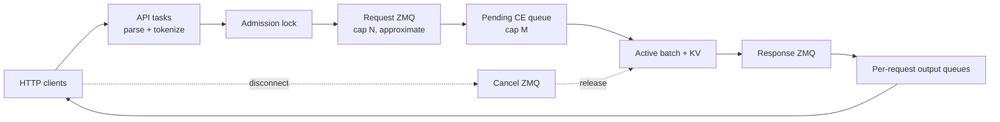
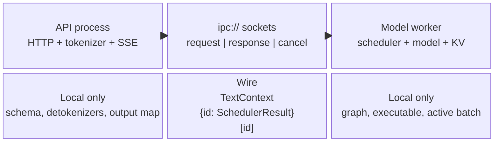
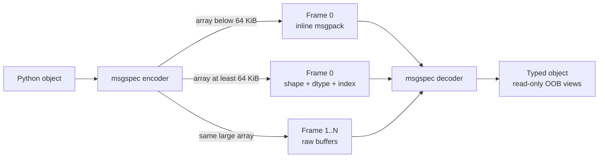
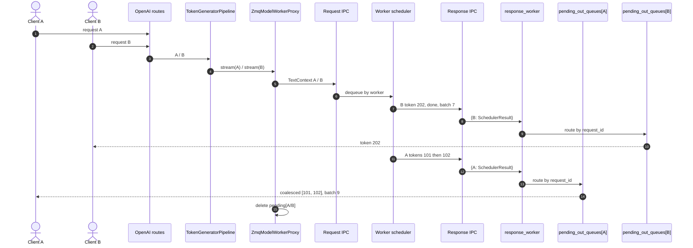
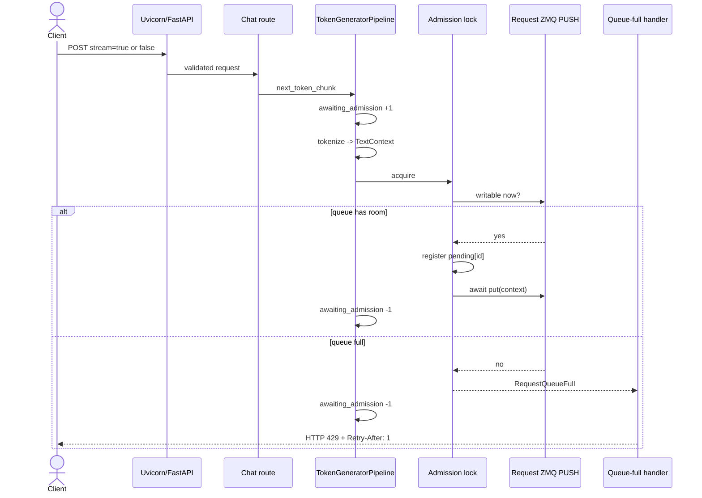
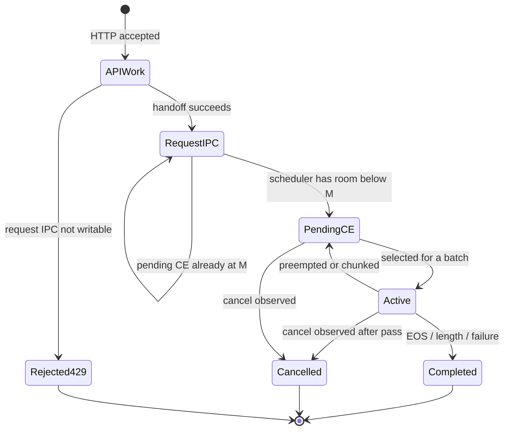
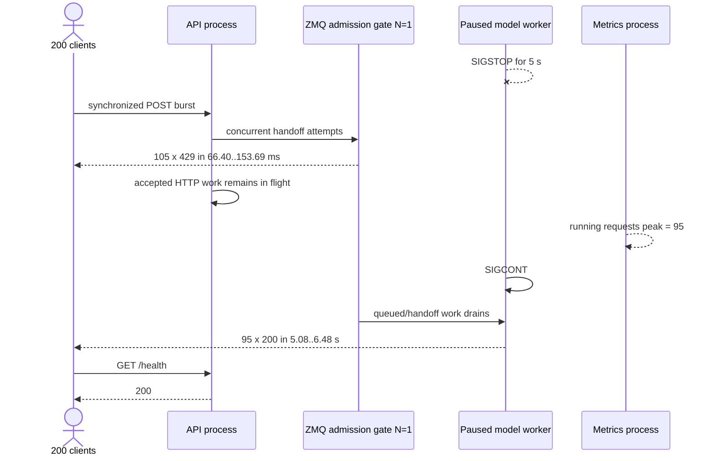
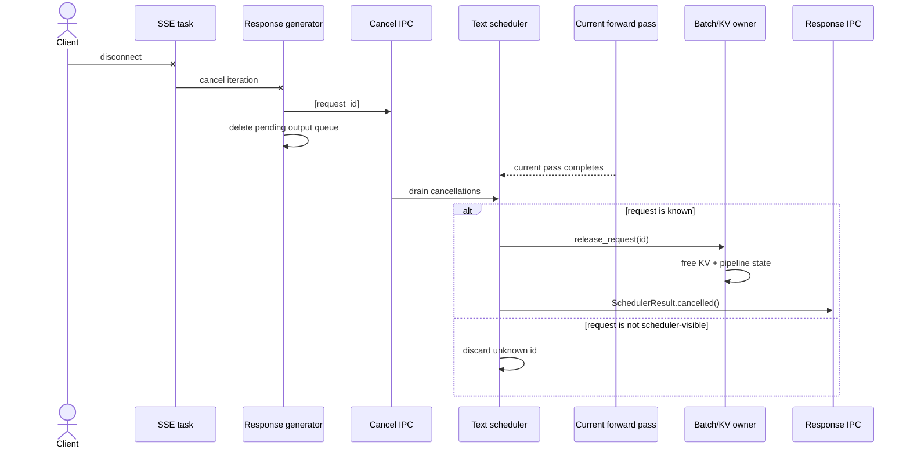
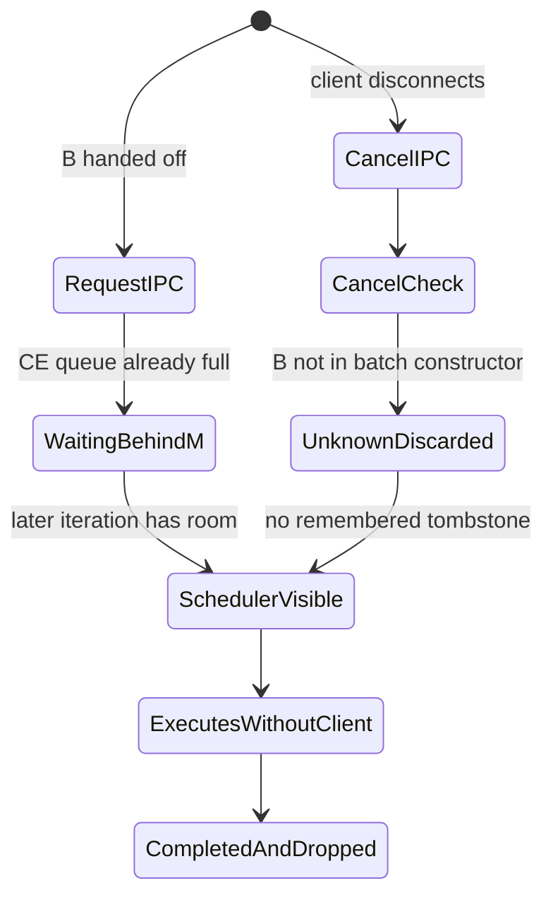
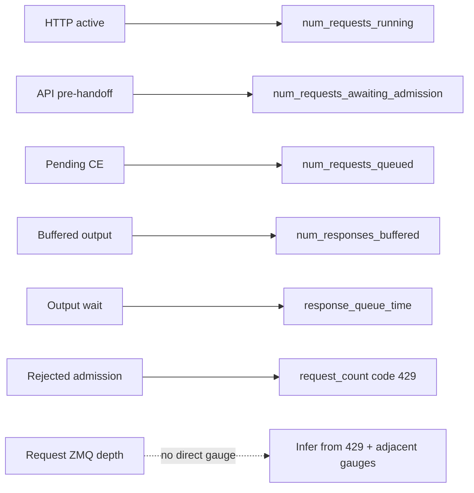

# Phase 4: IPC, Backpressure, and Cancellation

## Four Backlogs

`SOURCE + CPU-RUN`

```text
EXTERNAL CLIENTS                    API PROCESS                 MODEL WORKER

TCP connections          API-side work       cap N          cap M       active
┌──────────────┐         ┌──────────────┐  ┌──────────┐  ┌──────────┐  ┌──────┐
│ HTTP waiting │ ──────> │ parse/tokenize│->│ request  │->│ pending  │->│batch │
│ or streaming │         │ + admit lock │  │ ZMQ HWM │  │ CE queue │  │ + KV │
└──────────────┘         └──────────────┘  └──────────┘  └──────────┘  └──┬───┘
                                                                          │
client <---- SSE/JSON <---- per-request asyncio.Queue <---- response ZMQ <-+
   │                              ^
   └-- disconnect -> cancel ZMQ --+-----------------------> scheduler release

N does not cap HTTP connections.  M does not cap active decode requests.
```



| Region                       | Owner         | Bound in this path                |
|------------------------------|---------------|-----------------------------------|
| accepted HTTP / tokenization | API process   | not `N` or `M`                    |
| request IPC                  | ZMQ PUSH/PULL | `max_queue_size = N`, approximate |
| pending prefill / CE         | model worker  | `max_pending_requests = M`        |
| active CE/TG + KV            | scheduler     | batch, token, and KV limits       |
| response IPC                 | ZMQ PUSH/PULL | unbounded HWM in this code path   |
| per-client response buffer   | API process   | unbounded `asyncio.Queue`         |

## Process Boundary

`SOURCE`

```text
API PROCESS                                      MODEL-WORKER PROCESS

OpenAI schema                                    no OpenAI schema
Text tokenizer                                   no HTTP/SSE objects
response formatter                               model graph + executable
per-request detokenizers                         scheduler + batch constructor
pending_out_queues[id]                           KV cache + model state

                 three independent ipc:// channels
TextContext ---------------- request ----------------------------->
            <--------------- response ---- {id: SchedulerResult}
[request_id] -------------- cancellation ------------------------>
```



Isolation keeps network/client lifetimes out of the device-owning process.
A worker failure can be supervised without placing Uvicorn, sockets, and model
state in one Python runtime.

## Multipart Wire

`SOURCE + CPU-RUN`

<details>
<summary>Q&A: What does "multipart wire" mean?</summary>

“Wire” means the serialized representation of a Python message while it
crosses the ZMQ IPC boundary. It is not the public HTTP wire.

```text
API Python object
      |
      v
msgpack metadata + NumPy buffer frames
      |
      v
ZMQ IPC message
      |
      v
model-worker Python object
```

For a small array, one logical message can contain one frame:

```text
Frame 0: msgpack metadata + array bytes
```

For a large array, MAX uses multiple frames:

```text
Frame 0: metadata, shape, dtype, frame reference
Frame 1: raw NumPy array buffer
```

The receiver combines the frames and reconstructs the `TextContext`. The
large-array example below is `8,192 int64 values x 8 bytes = 65,536 bytes`,
which reaches the approximately 64 KiB out-of-band threshold.

`copy=False` avoids an extra memory copy; the received NumPy array can be a
read-only view backed by ZMQ-owned memory.

```text
msgpack       = describes the object
NumPy frame   = carries large numerical data
multipart     = keeps the frames together as one ZMQ message
wire          = serialized data crossing API -> worker
```

The complete multipart message must be admitted together. Sending frame 0 and
then failing on frame 1 would corrupt the message stream, which is why MAX
checks writability before sending and protects admission with a lock.

The model graph, KV cache, and scheduler objects stay in the worker. Only
request/output data and required metadata cross this boundary.

</details>

```text
small text context array: 22 x int64 = 176 B

ZMQ message
┌──────────────────────────────────────┐
│ frame 0: msgpack metadata + ndarray │  inline copy
└──────────────────────────────────────┘

array at threshold: 8192 x int64 = 65,536 B

ZMQ multipart message
┌──────────────────────────────────────┐ ┌───────────────────────────────┐
│ frame 0: msgpack + OOB placeholder 0│ │ frame 1: raw ndarray buffer   │
└──────────────────────────────────────┘ └───────────────────────────────┘
                         copy=False send / read-only receive view
```



Measured codec cases:

| Array               |    Bytes | Frames | Equal | Codec-level source alias |
|---------------------|---------:|-------:|-------|--------------------------|
| 22 `int64` tokens   |    `176` |    `1` | yes   | no                       |
| 8192 `int64` values | `65,536` |    `2` | yes   | yes                      |

The alias is inside the codec probe. Across the real process boundary, the
receiver owns a ZMQ-backed view and does not share the sender's NumPy storage.

## Normal Response Routing

`SOURCE + CPU-RUN`

```text
Client A -> request id A -----------------------> worker
Client B -> request id B -----------------------> worker

worker sends B:token202 ------------------------> response_worker
                                                    |
                                                    +-> pending[B] -> Client B
worker sends A:token101, A:token102 ------------>  +-> pending[A] -> Client A

terminal result -> generator exits -> pending[id] deleted
```



Measured: worker response order `B, A, A`; each client received only its own
tokens; both pending-output entries were removed.

## Admission Gate

`SOURCE + TEST + CPU-RUN`

```text
request accepted
      |
      v   +1 maxserve.num_requests_awaiting_admission
tokenize / build TextContext
      |
      v
acquire admission lock
      |
      +-- request ZMQ writable? -- no --> RequestQueueFull
      |                                      |
      |                                      v
      |                         HTTP 429 + Retry-After: 1
      |                         no pending[id], no put
      |
      `-- yes --> create pending[id] -> await put(context) -> release lock
                                                       |
                      -1 awaiting-admission <----------+
```



The streaming route awaits submission and the first generator item before
constructing `EventSourceResponse`; admission failure is therefore a real 429,
not a committed 200 with an error frame.

## Two Caps

`SOURCE + CPU-RUN`

```text
                 API                                   WORKER

         request ZMQ backlog                    scheduler CE backlog
       0 <= approximately <= N                       0 <= <= M
                 |                                      |
                 +------------ drain only if -----------+
                                      room under M

M=2 probe
  initial              ZMQ-side queue [A B C D E]    CE []
  first drain          ZMQ-side queue [C D E]        CE [A B]
  second drain         ZMQ-side queue [C D E]        CE [A B]
  raise M to 5         ZMQ-side queue []             CE [A B C D E]
```



| Knob                     | Default                | Counts                           | Does not count                           |
|--------------------------|------------------------|----------------------------------|------------------------------------------|
| `max_queue_size=N`       | unbounded              | messages buffered by request ZMQ | API tasks, scheduler CE, active requests |
| `max_pending_requests=M` | unbounded              | not-yet-running CE contexts      | active CE/TG, request ZMQ, HTTP tasks    |
| `max_batch_size`         | model/config dependent | requests selected for one pass   | every queued request                     |

`N` is a ZeroMQ high-water mark, so enforcement is approximate. In this
revision, `None` and `0` both resolve to ZMQ HWM `0`, meaning unbounded.

Scheduler probes use the production scheduler/batch/KV code with the
repository's deterministic CPU fake model pipeline.

## Stalled-Worker Burst

`CPU-RUN`; controlled fault injection, not a production procedure.

```text
server: CPU | max_batch_size=1 | N=1 | M=1
client: 200 synchronized requests | 13 prompt IDs | max_tokens=1

t=0       SIGSTOP model worker
t=0       200 POSTs released together
t=50ms    first fast 429 responses
t=5s      SIGCONT model worker
t=5-6.5s accepted requests finish

result: 95 x HTTP 200 | 105 x HTTP 429 | health 200 before and after
```



Observed `maxserve.request_count{code="429"}` delta: `105`.

The result is intentionally asymmetric: `N=1` did **not** mean one accepted
HTTP request. ZMQ HWM enforcement is approximate, and API tasks exist outside
the transport cap. Use an ingress proxy/load balancer for a hard global
connection or request-concurrency limit.

## Cancellation Timeline

`SOURCE + CPU-RUN`

```text
client disconnect
      |
      v
ASGI closes response generator
      |
      v
proxy _drain_responses catches BaseException
      |-- cancel_queue.put_nowait([id])
      `-- finally: delete pending_out_queues[id]
                         |
                         v
worker checks cancel queue after current scheduler pass
      |-- id known -> release CE/TG + KV + pipeline state -> cancelled result
      `-- id unknown -> no tombstone in text scheduler
```



### Iteration-Boundary Result

```text
prefill pass -> token 42 -> request enters decode
cancel arrives
decode pass  -> token 43 -> cancellation check -> release -> cancelled result

generated length: 1 before cancel -> 2 after cancel iteration
scheduler contains request after release: false
```

Cancellation does not interrupt a model invocation already in flight. It is
observed after that scheduler iteration.

### Pre-Visibility Race

`CPU-RUN + SOURCE`, current behavior at revision `1de3369d51`.

```text
M=1

request A: scheduler-visible CE [A]
request B: still in request queue [B]
cancel B : arrives on separate cancel queue

iteration 1: run A -> drain cancel B -> B is unknown -> discard cancel
iteration 2: drain request queue -> admit B -> B executes
```



The API correctly forgets B's output queue, so no disconnected client receives
data. The model worker can still perform avoidable work. The LLM scheduler has
no pre-arrival cancellation tombstone in this revision; the one-shot scheduler
does maintain a bounded remembered-cancellation set.

## Observability Map

`SOURCE`

```text
HTTP active -------- maxserve.num_requests_running
API pre-handoff ---- maxserve.num_requests_awaiting_admission
scheduler CE ------- maxserve.num_requests_queued
API output buffers - maxserve.num_responses_buffered
output wait time --- maxserve.response_queue_time
load shedding ------ maxserve.request_count{code="429"}

missing: exact live depth of the request ZMQ socket
```



## Production Control Loop

```text
load balancer concurrency cap
          |
          v
MAX API tasks -> N request HWM -> M pending CE -> active batch/KV
     ^                |                 |               |
     |                +---- 429 --------+               |
     |                                                  v
client retry: Retry-After + exponential backoff + jitter    latency/throughput
     ^                                                          |
     +---------------- autoscale / shed / tune <--- metrics -----+
```

| Signal                       | Interpretation                               | Action                                 |
|------------------------------|----------------------------------------------|----------------------------------------|
| 429 rises, worker healthy    | deliberate load shedding                     | retry with jitter; scale replicas      |
| API pre-handoff rises        | parsing/tokenization/admission-lock pressure | cap ingress; profile API CPU           |
| scheduler CE stays at `M`    | worker cannot admit prefill fast enough      | tune `M`; add capacity                 |
| response buffers rise        | clients/network consume too slowly           | enforce client timeouts; cap ingress   |
| KV pressure/preemption rises | active set exceeds memory efficiency         | reduce batch/concurrency or add memory |

Set both `N` and `M`. `N` alone cannot back up if the worker keeps draining
into an unbounded pending queue. Keep `M >= max_batch_size` as the CLI guidance
states, then load-test rather than treating either value as an exact count.

## Reproduce

Internal CPU probe:

```bash
murali_docs/labs/tracing/run_ipc_backpressure_trace.sh \
  > /tmp/phase4_ipc_trace.json
python3 -m json.tool /tmp/phase4_ipc_trace.json
```

Bounded CPU server:

```bash
HF_HOME=/local/mnt/workspace/.murali_hf \
MAX_SERVE_METRICS_ENDPOINT_PORT=18001 \
./bazelw --output_user_root=/local/mnt/workspace/.murali_bazel/user run \
  --config=prebuilt-mojo \
  --disk_cache=/local/mnt/workspace/.murali_bazel/disk \
  --repository_cache=/local/mnt/workspace/.murali_bazel/repo \
  //max/python/max/_entrypoints:pipelines -- \
  serve --model modularai/SmolLM-135M-Instruct-FP32 \
  --devices cpu --quantization-encoding float32 --max-length 256 \
  --max-batch-size 1 --max-queue-size 1 --max-pending-requests 1 \
  --host 127.0.0.1 --port 18000 --allow-cold-interpreter-cache
```

Find the model worker, then inject a five-second stall and burst. Use only on
the disposable learning server:

```bash
ps -eo pid,ppid,rss,cmd --forest | grep multiprocessing.spawn

python3 murali_docs/labs/client/backpressure_burst.py \
  --pause-worker-pid MODEL_WORKER_PID --pause-seconds 5 \
  --requests 200 --max-tokens 1 --require-429 \
  > /tmp/phase4_burst.json
```

## Evidence Card

| Item                        | Result                                                        |
|-----------------------------|---------------------------------------------------------------|
| Repository revision traced  | `1de3369d51`                                                  |
| Device                      | CPU                                                           |
| IPC                         | real local `ipc://` ZMQ + msgspec probe                       |
| normal routing              | out-of-order B/A responses reached correct streams            |
| pending cap                 | `M=2`: `2` admitted, `3` remained; raising to `5` drained all |
| full-queue contract         | no request put; no pending entry; HTTP `429`; retry `1s`      |
| decode cancellation         | one current iteration completed, then state released          |
| pre-visibility cancellation | cancellation discarded; request admitted later                |
| live burst                  | `95` HTTP 200, `105` HTTP 429, health remained `200`          |
| GPU claim                   | none; IPC and scheduler control flow are host-side            |

Source pins:

- API/worker queue construction:
  [`api_server.py`](../../max/python/max/serve/api_server.py#L156)
- HTTP 429 handler:
  [`api_server.py`](../../max/python/max/serve/api_server.py#L307)
- capacity settings: [`config.py`](../../max/python/max/serve/config.py#L158)
- pre-stream handoff:
  [`openai_routes.py`](../../max/python/max/serve/router/openai_routes.py#L2508)
- API admission accounting:
  [`llm.py`](../../max/python/max/serve/pipelines/llm.py#L352)
- proxy admission and cleanup:
  [`zmq_interface.py`](../../max/python/max/serve/worker_interface/zmq_interface.py#L105)
- response demultiplexing:
  [`zmq_interface.py`](../../max/python/max/serve/worker_interface/zmq_interface.py#L247)
- queue topology:
  [`zmq_interface.py`](../../max/python/max/serve/worker_interface/zmq_interface.py#L294)
- HWM socket setup:
  [`_zmq_queue.py`](../../max/python/max/serve/worker_interface/_zmq_queue.py#L162)
- multipart send/receive:
  [`_zmq_queue.py`](../../max/python/max/serve/worker_interface/_zmq_queue.py#L318)
- OOB threshold and framing:
  [`serialization.py`](../../max/python/max/pipelines/modeling/types/utils/serialization.py#L79)
- pending cap drain:
  [`text_generation_scheduler.py`](../../max/python/max/serve/scheduler/text_generation_scheduler.py#L160)
- cancellation iteration boundary:
  [`text_generation_scheduler.py`](../../max/python/max/serve/scheduler/text_generation_scheduler.py#L286)
- CE/TG/KV release:
  [`text_batch_constructor.py`](../../max/python/max/serve/scheduler/batch_constructor/text_batch_constructor.py#L913)
- remembered one-shot cancellations:
  [`one_shot_scheduler.py`](../../max/python/max/serve/scheduler/one_shot_scheduler.py#L100)
- request/queue metrics:
  [`metrics.py`](../../max/python/max/serve/telemetry/metrics.py#L86)
- queue-full route tests:
  [`test_openai_routes.py`](../../max/tests/tests/serve/test_openai_routes.py#L209)
- IPC behavior tests:
  [`test_zmq_interface.py`](../../max/tests/tests/serve/test_zmq_interface.py#L128)
- pending-cap test:
  [`test_paged_scheduler.py`](../../max/tests/tests/serve/scheduler/test_paged_scheduler.py#L161)
