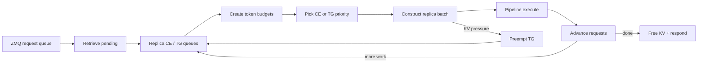
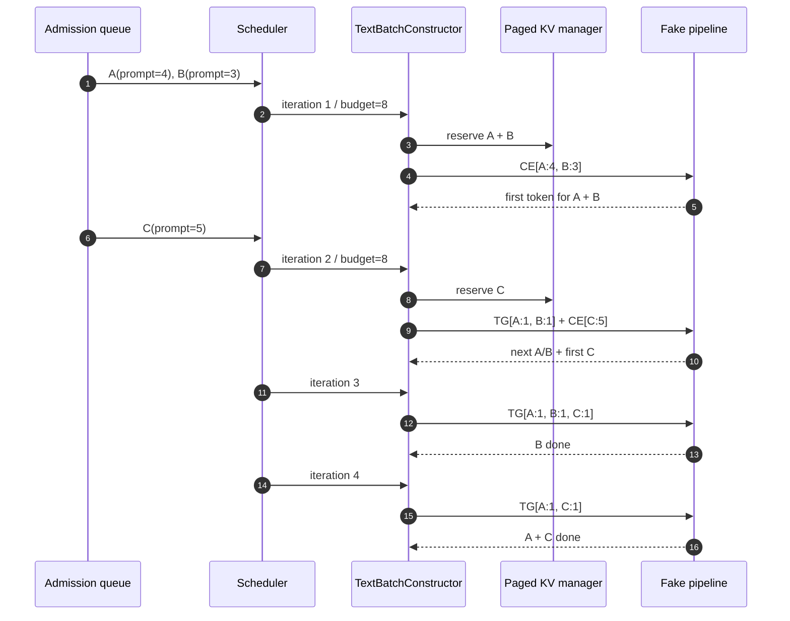
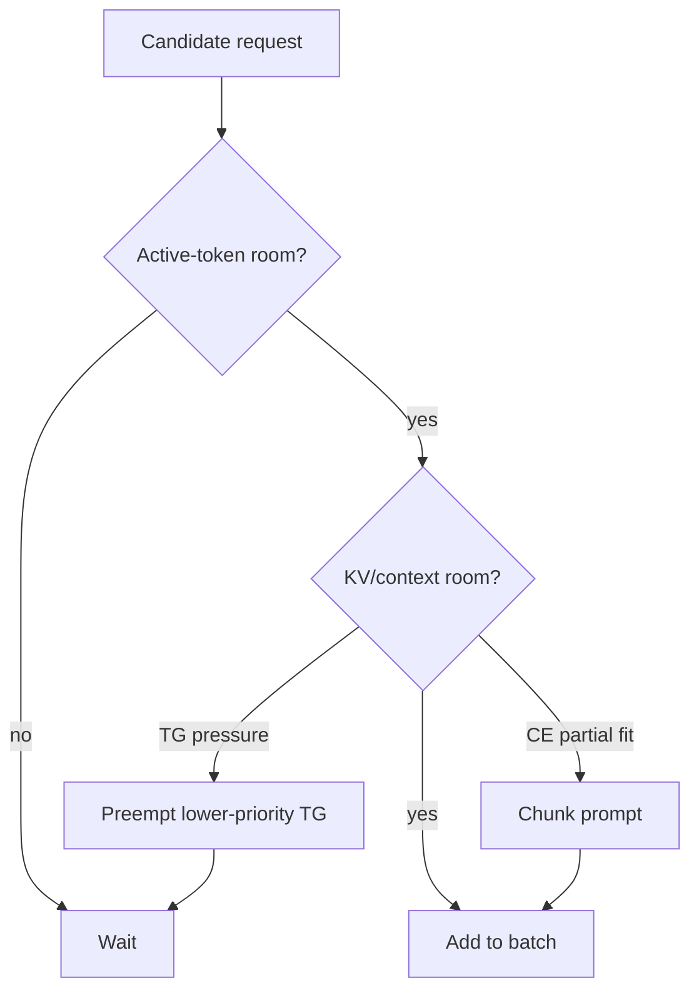
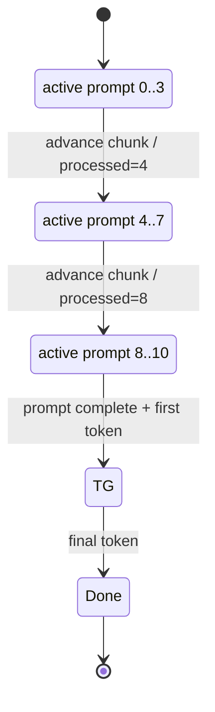
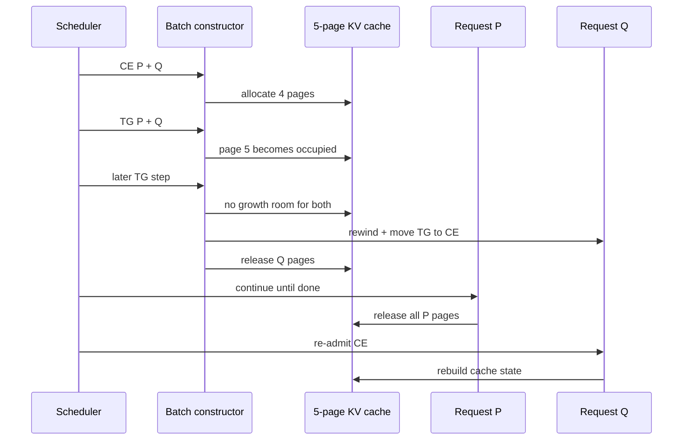
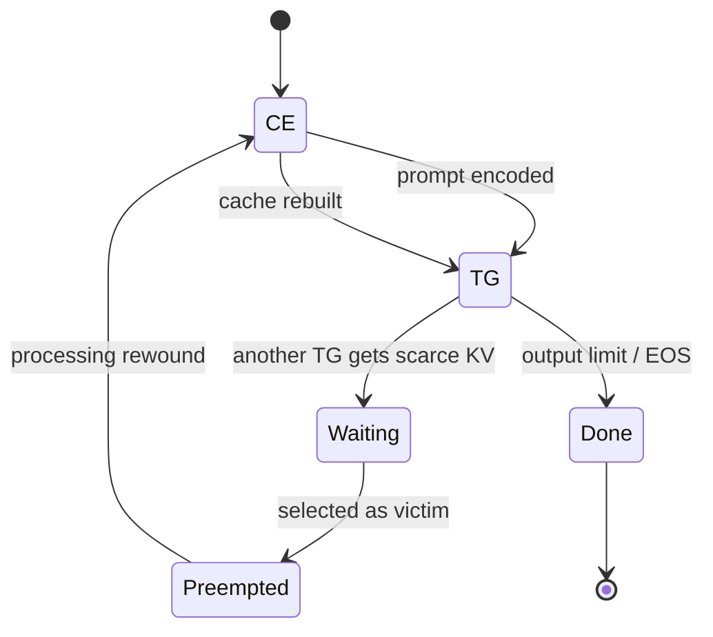
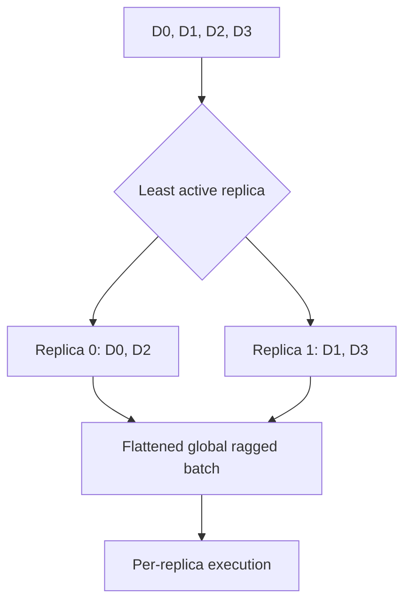

# Phase 5: Continuous Batching Scheduler

## Iteration Machine

`SOURCE + CPU-RUN`

```text
request ZMQ queue
       |
       v
retrieve pending -> CE/TG queues -> token + KV budget -> replica batch
                                              |              |
                                              | no fit       v
                                              +--------> preempt TG
                                                             |
                                                             v
pipeline.execute -> generated token -> advance/release -> next iteration
```



## Mixed Prefill + Decode

`CPU-RUN`: batch size `3`, active-token budget `8`, in-flight batching on.

```text
iteration    1             2                 3             4
          +---------+  +-------------+  +-----------+  +-------+
A         | CE 4    |->| TG 1        |->| TG 1      |->| TG 1  | done
B         | CE 3    |->| TG 1        |->| TG 1 done |
C                       | CE 5 joins |->| TG 1      |->| TG 1  | done
          +---------+  +-------------+  +-----------+  +-------+
tokens        7             7                3            2
```



| Iteration | Selected work                | Input tokens | KV pages after | Result                |
|----------:|------------------------------|-------------:|---------------:|-----------------------|
|         1 | `A CE:4`, `B CE:3`           |            7 |              7 | A/B enter TG          |
|         2 | `A TG:1`, `B TG:1`, `C CE:5` |            7 |             14 | C joins active decode |
|         3 | `A TG:1`, `B TG:1`, `C TG:1` |            3 |             12 | B completes           |
|         4 | `A TG:1`, `C TG:1`           |            2 |              0 | A/C complete          |

## Budget Passport

`SOURCE`

```text
active-token budget
  CE contributes its selected prompt chunk
  TG contributes one active token

total-context budget (when configured)
  rounds KV demand to page boundaries
  prevents a token-valid batch from exceeding KV capacity
```



## Chunked Prefill

`CPU-RUN`: prompt `11`, output limit `2`, budget `4`.

```text
NEW -> CE[0:4] -> CE[4:8] -> CE[8:11] + sample -> TG[1] -> DONE
          4             4             3                1
```



| Iteration | Kind | Active | Processed after | Queue after |
|----------:|------|-------:|----------------:|-------------|
|         1 | CE   |      4 |               4 | CE head     |
|         2 | CE   |      4 |               8 | CE head     |
|         3 | CE   |      3 |              11 | TG          |
|         4 | TG   |      1 |              12 | complete    |

## KV-Pressure Preemption

`CPU-RUN`: two ten-token requests share only five pages of two tokens.

```text
pages used   i1  i2  i3  i4  i5  i6  i7  i8
             4   4   5   5   4   4   0   3

P            CE  TG  TG  TG  TG  TG  TG  DONE
Q            CE  TG  wait wait PREEMPT->CE wait wait CE(replay)
```





## Data-Parallel Placement

`CPU-RUN + SOURCE`

```text
arrival: D0 D1 D2 D3

least-loaded choice
  replica 0: D0, D2
  replica 1: D1, D3

global staged batch
  [D0 D2] [D1 D3]
```



Padding is `SOURCE` only in this probe: production can install
`DPBatchPadder`; the repository test helper does not.

## Reproduce

```bash
murali_docs/labs/scheduler/run_scheduler_trace.sh --compact \
  > /tmp/phase5_scheduler_trace.json
```

## Source Pins

| Decision                          | Source                                                                                                          |
|-----------------------------------|-----------------------------------------------------------------------------------------------------------------|
| budgets + CE/TG selection         | [`text_batch_constructor.py`](../../max/python/max/serve/scheduler/batch_constructor/text_batch_constructor.py) |
| budget counters                   | [`token_budget.py`](../../max/python/max/serve/scheduler/batch_constructor/token_budget.py)                     |
| scheduler iteration               | [`text_generation_scheduler.py`](../../max/python/max/serve/scheduler/text_generation_scheduler.py)             |
| deterministic pipeline/KV doubles | [`common.py`](../../max/tests/tests/serve/scheduler/common.py)                                                  |
| expected scheduler traces         | [`test_paged_scheduler.py`](../../max/tests/tests/serve/scheduler/test_paged_scheduler.py)                      |
