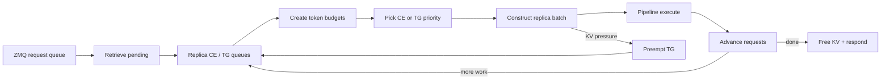
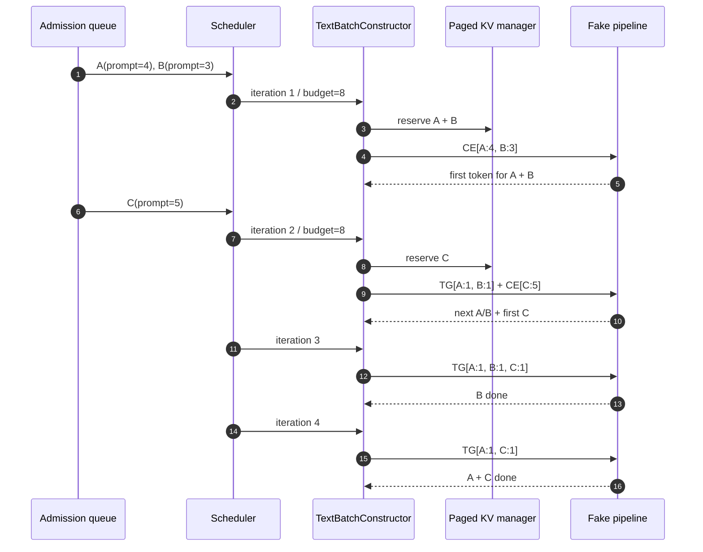
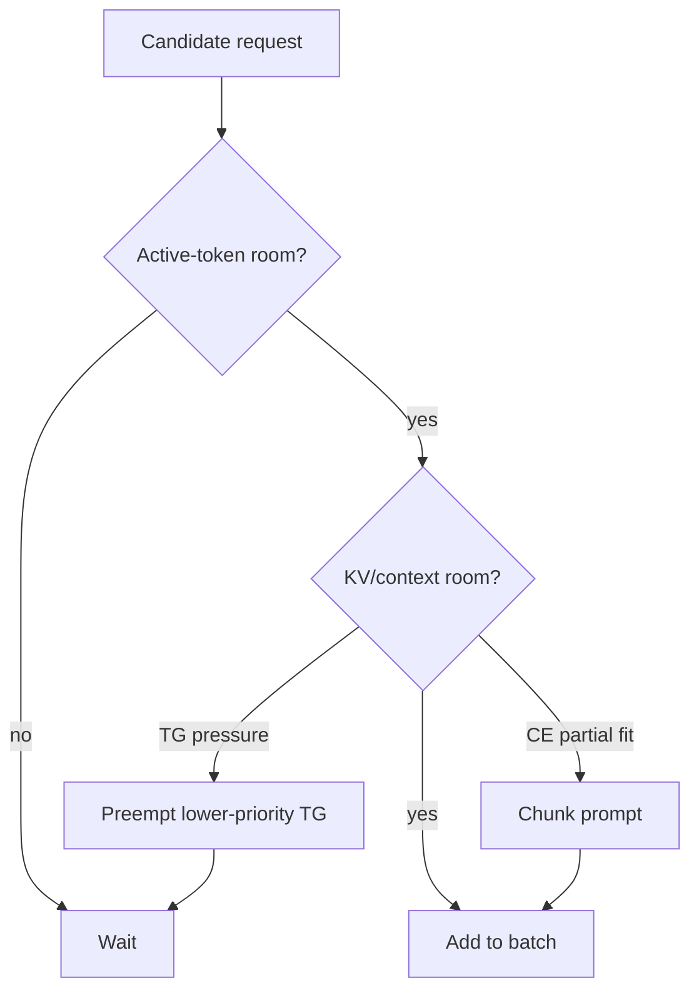
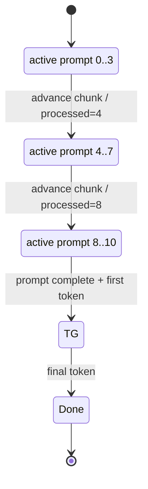
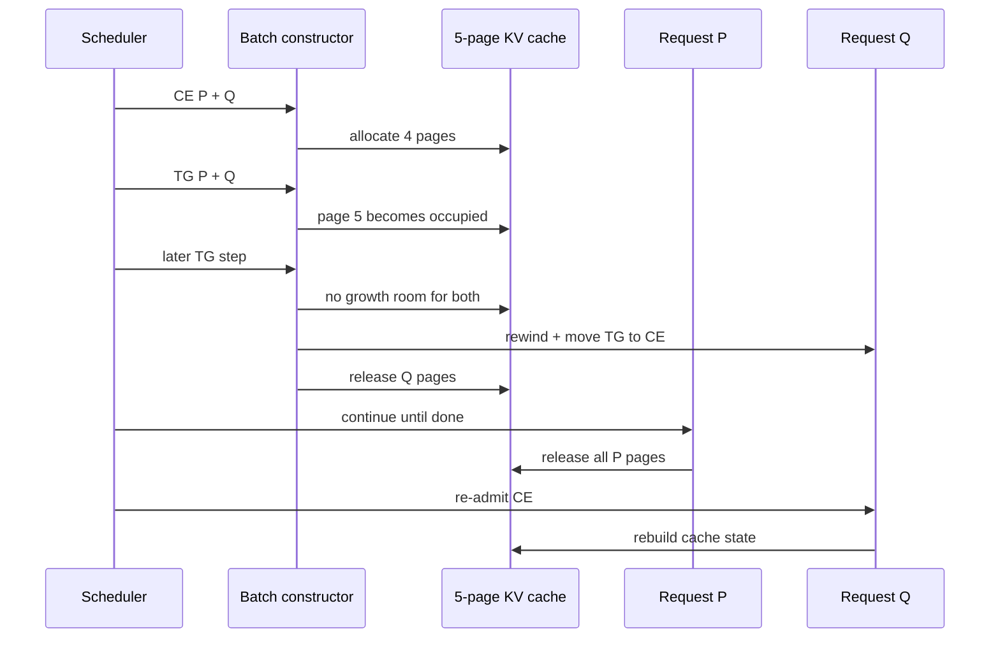
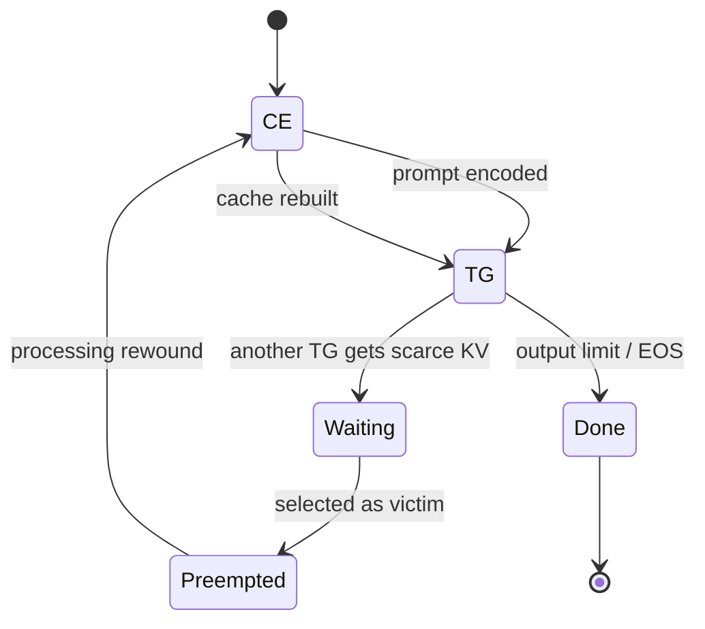
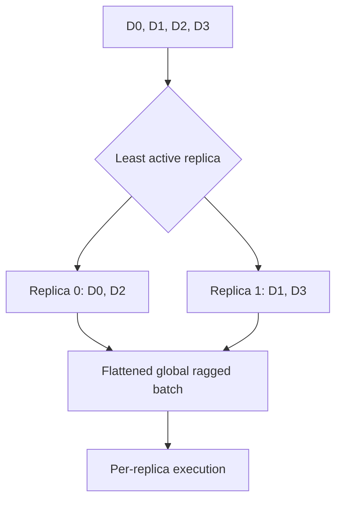

# Phase 5: Continuous Batching Scheduler

<details>
<summary>Q&A: What does "one model replica in one scheduler iteration" mean?</summary>

A **scheduler iteration** is one pass through the scheduler loop: pick waiting
work, build a batch, run the pipeline, advance request state, then repeat.

A **model replica** is one independent model execution lane. So:

```text
one model replica in one scheduler iteration
```

means:

```text
the requests chosen to run on that execution lane during this scheduler step
```

With `data_parallel_degree=1`, there is one execution lane and one local batch:

```text
iteration 1
replica 0 batch: A, B
```

With `data_parallel_degree=2`, there are two execution lanes. Each one gets a
local batch for the same scheduler iteration:

```text
iteration 1
replica 0 local batch: A, C
replica 1 local batch: B, D

global pipeline call: [A, C] + [B, D]
```

So **data parallelism** does not mean one shared queue feeds one giant local
batch. It means each replica has its own local batch, and those local batches
are executed together as one global pipeline call.

</details>

<details>
<summary>Q&A: What does model replica mean? Is the model physically copied?</summary>

A **model replica** is an independent model execution lane. For scheduler
reasoning, treat each replica as a separate place where requests can be queued,
batched, executed, and tracked.

With `data_parallel_degree=1`, there is one model execution lane:

```text
replica 0 -> one CE/TG queue set -> one local batch
```

With `data_parallel_degree=2`, there are two execution lanes:

```text
replica 0 -> local batch: A, C
replica 1 -> local batch: B, D

global pipeline call = [replica 0 batch] + [replica 1 batch]
```

So a **replica batch** means the requests assigned to one model replica for the
current scheduler iteration. With data parallelism, each replica builds its own
local batch, and those local batches are executed together as one global
pipeline call.

The model is conceptually replicated, but the physical memory layout depends on
the runtime and devices:

- on multiple GPUs, each GPU usually has its own copy of the model weights;
- in one CPU process, read-only weights may be shared rather than duplicated;
- in multiple processes, the OS/runtime may share read-only mapped pages;
- KV cache is request state and is not shared as one global decode state across
  replicas.

For this scheduler document, the important simplification is:

```text
replica = independent model execution lane
```

It does not always mean:

```text
replica = a full physical duplicate of every model byte
```

</details>

<details>
<summary>Q&A: What is the difference between active token room and KV cache room?</summary>

**Active token room** is the scheduler's compute budget for the current
iteration. It asks:

```text
Can this request fit in the next model execution step?
```

For CE / prefill, active-token cost is the selected prompt chunk size. For TG /
decode, active-token cost is usually `1` token.

Example with active-token budget `8`:

```text
CE 5 + TG 1 + TG 1 = 7  -> fits
CE 7 + CE 5        = 12 -> does not fit
```

**KV cache room** is the memory budget for storing attention history across
iterations. It asks:

```text
Can the system allocate enough KV-cache pages for this request's context?
```

A request can fit the active-token budget but still fail KV allocation. For
example, a TG request may consume only `1` active token in this iteration, but
it still needs KV space for the newly generated token. If KV pages are full,
the scheduler may delay CE, prioritize TG, or preempt another request.

Short version:

```text
active token room = compute/batch capacity for this iteration
KV cache room     = memory capacity for request history across iterations
```

A request must fit both to run.

</details>

<details>
<summary>Q&A: How is batching done?</summary>

Batching happens once per scheduler iteration:

```text
1. Pull new requests from the request queue
2. Put new requests into CE queues
3. Choose CE and/or TG work
4. Check active-token budget
5. Check KV-cache room
6. Build the batch
7. Run the model once
8. Move each request to CE, TG, or done
```

Requests start in **CE**:

```text
CE = context encoding / prefill
```

CE processes the prompt. After the prompt is encoded, the request moves to
**TG**:

```text
TG = token generation / decode
```

TG usually generates one output token per scheduler iteration.

Example:

```text
Request A: prompt length 4, output length 3
Request B: prompt length 3, output length 2

iteration 1:
  batch = A CE 4 + B CE 3
  result: A and B move to TG

iteration 2:
  batch = A TG 1 + B TG 1
  result: A and B each generate one token

iteration 3:
  batch = A TG 1 + B TG 1
  result: B finishes

iteration 4:
  batch = A TG 1
  result: A finishes
```

With in-flight batching, new CE work can join while older requests are already
decoding:

```text
iteration 1:
  A CE 4 + B CE 3

iteration 2:
  A TG 1 + B TG 1 + C CE 5

iteration 3:
  A TG 1 + B TG 1 + C TG 1
```

A request is added only if it fits both active-token room and KV-cache room.
For example, with active-token budget `8`:

```text
A CE 4 + B CE 3          = 7  -> fits active-token budget
A CE 4 + B CE 3 + C CE 5 = 12 -> does not fit
```

Even if active tokens fit, KV cache can still block the request:

```text
TG 1 fits active-token budget
but no KV page is available -> cannot add
```

Short version:

```text
CE queue: new / prefill work
TG queue: decode work

scheduler picks from CE/TG queues,
checks token budget and KV room,
runs one model batch,
then moves each request to CE, TG, or done.
```

</details>

## Iteration Machine

`SOURCE + CPU-RUN`

```text
request ZMQ queue
       |
       v
retrieve pending -> CE/TG queues -> token + KV budget -> replica batch
                                              |              |
                                              | no fit       v
                                              +--------> preempt TG
                                                             |
                                                             v
pipeline.execute -> generated token -> advance/release -> next iteration
```

<details>
<summary>Q&A: What are replica batches, replica CE/TG queues, KV pressure, and TG resume?</summary>

A **replica batch** is the work selected for one model replica in one scheduler
iteration. With data parallelism, each replica has its own local batch; the
scheduler then combines those per-replica batches into the global pipeline
input. With `data_parallel_degree=1`, there is only one replica batch.

**Replica CE / TG queues** are the per-replica waiting lists inside the batch
constructor:

- **CE queue**: requests that still need context encoding / prefill. New
  requests enter CE first, unless their prompt state is already complete.
- **TG queue**: requests whose prompt has been encoded and that are now
  generating one token per decode step.

The queues are per replica because each replica owns its assigned requests,
local batch slots, LoRA state, and KV-cache placement decisions.

**KV pressure** is detected in two ways. First, the scheduler can look at the
replica's KV usage percentage with `kv_cache.pressure_pct(replica_idx)`; above
`MAX_SERVE_TG_PRIORITY_KV_PERCENTAGE` it prioritizes TG over CE so active
generations can drain before admitting more prefill. Second, actual allocation
failure during CE or TG, such as `InsufficientBlocksError`, means the requested
KV pages do not currently fit.

When a TG request is preempted, it does not simply pause and resume from the
same decode state. The scheduler releases its KV blocks, calls pipeline
release, resets the context, removes it from TG, and puts it back into CE. It
resumes only when a later scheduler iteration admits it for CE again, rebuilds
the prompt/KV state, moves it back to TG, and then continues generation.

</details>



## Mixed Prefill + Decode

`CPU-RUN`: batch size `3`, active-token budget `8`, in-flight batching on.

```text
iteration    1             2                 3             4
          +---------+  +-------------+  +-----------+  +-------+
A         | CE 4    |->| TG 1        |->| TG 1      |->| TG 1  | done
B         | CE 3    |->| TG 1        |->| TG 1 done |
C                       | CE 5 joins |->| TG 1      |->| TG 1  | done
          +---------+  +-------------+  +-----------+  +-------+
tokens        7             7                3            2
```



| Iteration | Selected work                | Input tokens | KV pages after | Result                |
|----------:|------------------------------|-------------:|---------------:|-----------------------|
|         1 | `A CE:4`, `B CE:3`           |            7 |              7 | A/B enter TG          |
|         2 | `A TG:1`, `B TG:1`, `C CE:5` |            7 |             14 | C joins active decode |
|         3 | `A TG:1`, `B TG:1`, `C TG:1` |            3 |             12 | B completes           |
|         4 | `A TG:1`, `C TG:1`           |            2 |              0 | A/C complete          |

## Budget Passport

`SOURCE`

```text
active-token budget
  CE contributes its selected prompt chunk
  TG contributes one active token

total-context budget (when configured)
  rounds KV demand to page boundaries
  prevents a token-valid batch from exceeding KV capacity
```



## Chunked Prefill

`CPU-RUN`: prompt `11`, output limit `2`, budget `4`.

```text
NEW -> CE[0:4] -> CE[4:8] -> CE[8:11] + sample -> TG[1] -> DONE
          4             4             3                1
```



| Iteration | Kind | Active | Processed after | Queue after |
|----------:|------|-------:|----------------:|-------------|
|         1 | CE   |      4 |               4 | CE head     |
|         2 | CE   |      4 |               8 | CE head     |
|         3 | CE   |      3 |              11 | TG          |
|         4 | TG   |      1 |              12 | complete    |

## KV-Pressure Preemption

`CPU-RUN`: Here we have two requests P & Q. KV cache Page limit is 5.   P has CE length of 2 and  Q also has CE length of 2.

```text
pages used   i1  i2  i3  i4  i5  i6  i7  i8
             4   4   5   5   4   4   0   3

P            CE  TG  TG  TG  TG  TG  TG  DONE
Q            CE  TG  wait wait PREEMPT->CE wait wait CE(replay)
```





## Data-Parallel Placement

`CPU-RUN + SOURCE`

<details>
<summary>Q&A: What does least-loaded choice mean?</summary>

**Least-loaded choice** means a new request is assigned to the replica that
currently has the least assigned work.

Example with two replicas:

```text
arrival: D0 D1 D2 D3

start:
  replica 0: empty
  replica 1: empty

place D0:
  replica 0: D0
  replica 1: empty

place D1 on the less-loaded replica:
  replica 0: D0
  replica 1: D1

both replicas now have one request; tie can go to replica 0

place D2:
  replica 0: D0, D2
  replica 1: D1

place D3 on the less-loaded replica:
  replica 0: D0, D2
  replica 1: D1, D3
```

So the placement becomes:

```text
replica 0: D0, D2
replica 1: D1, D3
```

Here, "loaded" roughly means how much work is already assigned to the replica,
such as CE queue size, TG queue size, and sometimes external in-flight counts.
The goal is to avoid putting all requests on one replica while another replica
is idle.

</details>

<details>
<summary>Q&A: How do we decide how many replicas to use?</summary>

The number of replicas comes from the configured **data-parallel degree**:

```text
number of replicas = data_parallel_degree
```

Examples:

```text
data_parallel_degree = 1 -> 1 replica
data_parallel_degree = 2 -> 2 replicas
data_parallel_degree = 4 -> 4 replicas
```

The practical choice depends on hardware and memory:

- **available devices**: on GPU, the useful replica count is usually bounded by
  the number of GPUs;
- **model memory**: larger models leave less room for extra replicas;
- **KV-cache memory**: each replica needs room for its active request state;
- **traffic pattern**: more replicas help when there are many concurrent
  independent requests;
- **batching efficiency**: too many replicas can make each replica's local
  batch small, which may waste capacity.

Short version:

```text
choose replica count from:
  available devices
  model size
  KV-cache memory
  expected concurrency
  batching efficiency
```

In this section, two replicas are used as a teaching example:

```text
replica 0: D0, D2
replica 1: D1, D3
```

</details>

```text
arrival: D0 D1 D2 D3

least-loaded choice
  replica 0: D0, D2
  replica 1: D1, D3

global staged batch
  [D0 D2] [D1 D3]
```



Padding is `SOURCE` only in this probe: production can install
`DPBatchPadder`; the repository test helper does not.

## Reproduce

```bash
murali_docs/labs/scheduler/run_scheduler_trace.sh --compact \
  > /tmp/phase5_scheduler_trace.json
```

<details>
<summary>Q&A: What does the generated JSON contain?</summary>

The generated JSON contains deterministic CPU evidence for:

```text
mixed prefill + decode
chunked prefill
KV-pressure preemption
data-parallel placement
```

It is written to:

```text
/tmp/phase5_scheduler_trace.json
```

</details>

## Source Pins

| Decision                          | Source                                                                                                          |
|-----------------------------------|-----------------------------------------------------------------------------------------------------------------|
| budgets + CE/TG selection         | [`text_batch_constructor.py`](../../max/python/max/serve/scheduler/batch_constructor/text_batch_constructor.py) |
| budget counters                   | [`token_budget.py`](../../max/python/max/serve/scheduler/batch_constructor/token_budget.py)                     |
| scheduler iteration               | [`text_generation_scheduler.py`](../../max/python/max/serve/scheduler/text_generation_scheduler.py)             |
| deterministic pipeline/KV doubles | [`common.py`](../../max/tests/tests/serve/scheduler/common.py)                                                  |
| expected scheduler traces         | [`test_paged_scheduler.py`](../../max/tests/tests/serve/scheduler/test_paged_scheduler.py)                      |
