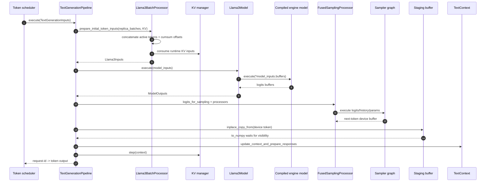
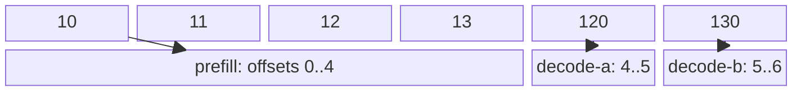
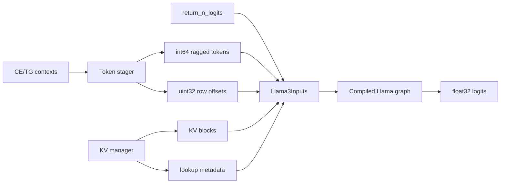
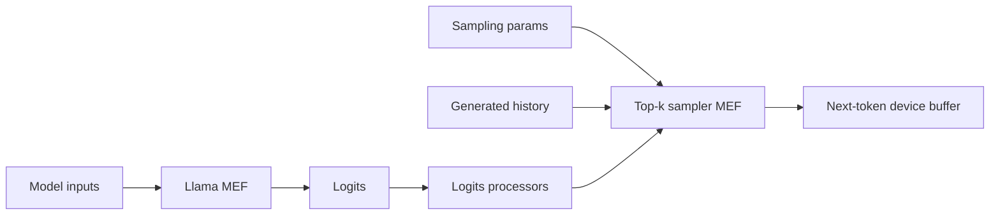
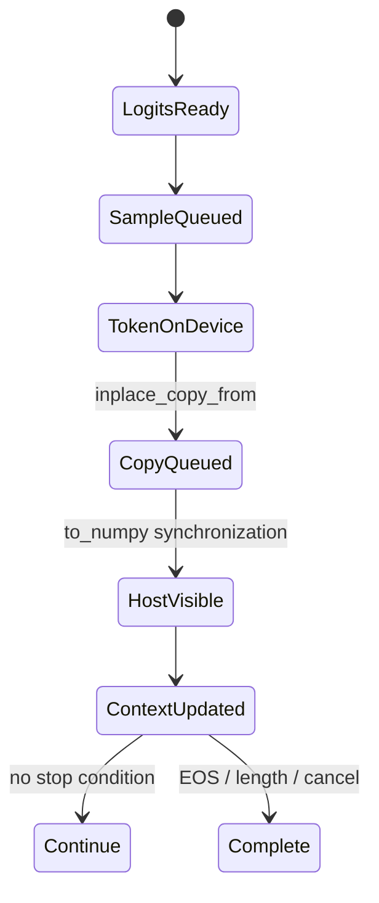

# Phase 6: Scheduler Batch to Sampled Token

## Full Step

`SOURCE`

```text
Scheduler      Pipeline       Batch processor      Model       Sampler      Python
   |              |                 |                 |            |           |
   | contexts --->| prepare_batch   |                 |            |           |
   |              |---------------> | ragged + KV     |            |           |
   |              |<--------------- | buffers         |            |           |
   |              |---------------------------------->| execute    |           |
   |              |<----------------------------------| logits     |           |
   |              |----------------------------------------------->| token     |
   |              |<-----------------------------------------------| device buf|
   |              | D2H staging + to_numpy ----------------------------------->|
   |              | update context + KV step                         responses |
   |<-------------|                                                            |
```

<details>
<summary>Q&A: What does Token scheduler mean, and where does it sit in the AI stack?</summary>

`Token scheduler` means the MAX Serve scheduler component that decides which
request contexts should run in the next model step.

It is not the tokenizer. It does not convert text into token IDs. By this
point, requests already have token buffers and text-generation contexts.

```text
Client HTTP request
  -> OpenAI-compatible API layer
  -> request admission / queues
  -> token scheduler
  -> TextGenerationPipeline
  -> batch processor / KV manager
  -> compiled model execution
  -> sampler
  -> response streaming / HTTP response
```

Its job is mainly to choose which requests run now, decide CE/prefill versus
TG/decode work, build `TextGenerationInputs`, enforce batch/token/queue/KV
limits, send the selected batch to `TextGenerationPipeline`, and receive the
generated token outputs so requests can continue or finish.

So in the sequence diagram:

```text
Token scheduler -> TextGenerationPipeline: execute(TextGenerationInputs)
```

means:

```text
The scheduler has already selected a batch of active request contexts, and now
it asks the pipeline to run one generation step for those contexts.
```

</details>

<details>
<summary>Q&A: What does prepare_initial_token_inputs(replica_batches, KV) mean?</summary>

`prepare_initial_token_inputs(replica_batches, KV)` means the pipeline asks
the model-specific batch processor to convert the scheduler-selected requests
into the exact input buffers the model needs for this execution step.

In the sequence diagram:

```text
TextGenerationPipeline -> Llama3BatchProcessor:
  prepare_initial_token_inputs(replica_batches, KV)
```

means:

```text
Here are the requests selected by the scheduler, grouped per replica.
Here is the KV cache manager/state.
Build the Llama3Inputs needed to run the model.
```

Breakdown:

- `replica_batches`: requests selected for each model replica in this
  scheduler iteration.
- `KV`: the KV cache manager/state, used to provide existing attention-cache
  blocks and allocate/update lookup metadata.
- `prepare_initial_token_inputs`: model-specific preparation that builds
  concatenated active token IDs, row offsets for ragged batching, KV lookup
  metadata, and model input buffers such as `Llama3Inputs`.

This step does not run the model yet. It prepares the model inputs for the
next step:

```text
scheduler-selected contexts
  -> ragged token buffer + row offsets + KV metadata
  -> Llama3Inputs
  -> model execute
```

</details>

<details>
<summary>Q&A: What do consume runtime KV inputs and Llama3Inputs mean?</summary>

Step 4 in the diagram is:

```text
B->>K: consume runtime KV inputs
```

This means the `Llama3BatchProcessor` asks the KV manager for the KV-cache
runtime data needed by the selected batch. The KV cache stores previous
attention keys and values for active requests. The model needs to know which
KV blocks belong to each request, where new tokens should write their KV
values, and which lookup metadata lets attention read the prior tokens.

In short:

```text
For these selected requests, provide the KV-cache buffers and lookup metadata
that the compiled Llama model needs for this execution.
```

Step 5 in the diagram is:

```text
B-->>P: Llama3Inputs
```

This means the batch processor returns the fully prepared, model-specific
input object to the pipeline. `Llama3Inputs` can contain:

- concatenated token IDs for all requests in the batch;
- row offsets that identify each request within the flat token buffer;
- KV-cache blocks and lookup metadata;
- control inputs such as how many logits to return;
- other buffers required by the compiled graph.

The complete flow is:

```text
selected requests
  -> token and row-offset buffers
  -> KV-cache buffers and lookup metadata
  -> Llama3Inputs
  -> Llama3Model.execute(...)
```

Short version:

```text
consume runtime KV inputs = get KV-cache data for this batch
Llama3Inputs              = final model-ready input bundle for Llama3
```

</details>

<details>
<summary>Q&A: Does FusedSamplingProcessor run on the accelerator or host CPU?</summary>

By default, the actual sampling work runs on the accelerator or GPU.

There are two parts:

```text
Python host:
  FusedSamplingProcessor object
  -> coordinates inputs and launches the sampler graph

GPU/accelerator:
  logits processing and sampling graph
  -> top-k/top-p, temperature, penalties, and constraints
  -> selected token ID
```

The Python `FusedSamplingProcessor` is a host-side controller, but the
tensor operations and token selection are performed on the sampler device.
The usual path is:

```text
model logits on GPU
  -> sampler graph on GPU
  -> next-token device buffer
  -> staging buffer
  -> CPU/NumPy when the token is copied back
```

If `sample_on_host = true` is configured, logits are copied to the host CPU
and sampling runs there instead. The default is `sample_on_host = false`.

</details>

<details>
<summary>Q&A: Is FusedSamplingProcessor a separate graph from the language model?</summary>

Yes. `FusedSamplingProcessor` uses a separate sampler graph from the
language-model graph:

```text
Language-model graph:
  tokens + KV cache
    -> transformer layers
    -> logits

Sampler graph:
  logits + history + sampling parameters
    -> temperature/top-k/top-p/penalties
    -> selected token ID
```

The language model produces logits. The sampler graph chooses the next token
from those logits. They are separate compiled graphs, but they run in the same
generation step and can run on the same GPU or accelerator.

`FusedSamplingProcessor` is the Python-side object that prepares inputs and
launches the sampler graph. It is not itself the compiled model graph.

</details>

<details>
<summary>Q&A: What are the Staging buffer and TextContext, and what do steps 14 to 17 mean?</summary>

`Staging buffer` and `TextContext` serve different purposes:

- `Staging buffer`: a temporary buffer used to move the sampled token from
  accelerator/device memory into host-visible memory. It also ensures the
  CPU does not read the token before the device copy finishes.
- `TextContext`: the per-request state object. It tracks the prompt, generated
  tokens, token position, sampling settings, EOS/output limits, and KV-cache
  association.

The final steps are:

```text
14. D-->>P: to_numpy waits for visibility
```

The pipeline reads the staging buffer as a NumPy/CPU value. `to_numpy()`
waits for the device-to-host copy to complete before returning the token.

```text
15. P->>C: update_context_and_prepare_responses
```

The pipeline updates each request's `TextContext` with the new token, checks
EOS and output-length limits, and prepares the response data.

```text
16. P->>K: step(context)
```

The KV manager advances the KV-cache state for that request. It records the
new token's cache position and updates the KV metadata for the next generation
iteration.

```text
17. P-->>S: request-id -> token output
```

The pipeline returns the generated token to the token scheduler, associated
with its request ID. The scheduler can stream it to the client or schedule
the request for another decode step.

```text
device token
  -> staging buffer
  -> CPU-visible token
  -> TextContext update
  -> KV-cache update
  -> scheduler/client response
```

</details>



## Ragged Buffer Probe

<details>
<summary>Q&A: What is a Ragged Buffer Probe, and why is it called ragged?</summary>

A `Ragged Buffer Probe` is a small diagnostic example showing how requests
with different token counts are packed into one model input buffer.

It is called `ragged` because each request has a different number of active
tokens:

```text
prefill:  [10, 11, 12, 13]  -> 4 tokens
decode-a: [120]              -> 1 token
decode-b: [130]              -> 1 token
```

Instead of padding every request to the same length, MAX concatenates them:

```text
tokens:       [10, 11, 12, 13, 120, 130]
row_offsets:  [0, 4, 5, 6]
```

The offsets identify each request's slice:

```text
prefill:  tokens[0:4]
decode-a: tokens[4:5]
decode-b: tokens[5:6]
```

A rectangular padded representation would look like this:

```text
[10, 11, 12, 13]
[120,  0,  0,  0]
[130,  0,  0,  0]
```

The ragged representation avoids padding, reducing unnecessary computation
and allowing prefill and decode requests with different lengths to share one
batch.

`Probe` means this is a small test or inspection example used to verify that
the concatenation and offset logic works correctly.

</details>

`CPU-RUN`

```text
contexts                         concatenated int64 tokens

prefill  active=[10 11 12 13] --+       0   1   2   3   4    5
decode-a active=[120] -----------+----> [10, 11, 12, 13, 120, 130]
decode-b active=[130] -----------+       ^               ^    ^
                                         0               4    5   6
row offsets uint32: [0, 4, 5, 6]         | prefill       | da | db |
```



| Request    | Scheduler kind | Processed | Active          | Ragged slice |
|------------|----------------|----------:|-----------------|--------------|
| `prefill`  | CE             |         0 | `[10,11,12,13]` | `[0:4]`      |
| `decode-a` | TG             |         3 | `[120]`         | `[4:5]`      |
| `decode-b` | TG             |         2 | `[130]`         | `[5:6]`      |

The probe calls the shared ragged-array helper. Production Llama staging uses
the same concatenate/cumulative-offset layout in pinned reusable buffers.

## Llama Input Passport

`SOURCE + COMPILE-ONLY`

```text
Llama3Inputs.buffers
  1 tokens               int64   [total_seq_len]                 device
  2 input_row_offsets    uint32  [batch + 1]                     device
  3 return_n_logits      int64   [symbolic one-element input]    host
  4 signal buffers       device  only when collective path needs them
  5 KV cache blocks      dtype   [pages,2,layers,page,kv_heads,head_dim]
  6 KV lookup metadata   uint32/int64 host + device buffers
```



<details>
<summary>Q&A: What are KV blocks and KV lookup metadata?</summary>

The KV manager provides two related but different inputs to the compiled
attention graph: the cached K/V data and the metadata that locates it.

`KV blocks` contain the actual attention keys and values for previously
processed tokens. They are stored in fixed-size pages rather than one large
contiguous allocation. The documented layout is:

```text
[pages, 2, layers, page_size, kv_heads, head_dim]
```

For example:

```text
[pages, 2, 30, 128, 3, 64]

pages      = number of physical KV pages
2          = key and value
30         = transformer layers
128        = tokens per page
3          = KV attention heads
64         = dimension per head
```

`KV lookup metadata` tells the attention kernel how to map a request's logical
token positions to the physical KV pages where its data is stored. It can
include block/page IDs, sequence lengths, valid tokens in the final page,
current query lengths, and positions for writing new K/V values. Exact fields
vary by backend.

For example, with a page size of 4:

```text
request A:
  sequence length: 10
  block table:     [7, 2, 9]

logical tokens 0..3   -> physical page 7
logical tokens 4..7   -> physical page 2
logical tokens 8..9   -> physical page 9
```

The flow is:

```text
KV manager
  -> KV blocks: actual K/V tensor values
  -> lookup metadata: mapping and lengths
  -> compiled attention graph
```

The blocks are the data; the lookup metadata is the address map and shape
information needed to read and update that data.

</details>

CUDA `sm_80` exported signature for Model A:

| Buffer               | Shape                               | Device  |
|----------------------|-------------------------------------|---------|
| tokens               | `[total_seq_len]`                   | `gpu:0` |
| row offsets          | `[input_row_offsets_len]`           | `gpu:0` |
| return-logit control | symbolic                            | `cpu:0` |
| paged KV storage     | `[pages,2,30,128,3,64]`             | `gpu:0` |
| logits               | `[input_row_offsets_len - 1,49152]` | `gpu:0` |

## Model + Sampler Split

`SOURCE + COMPILE-ONLY`

```text
Llama graph                       top-k sampler graph
ragged tokens + KV               logits + history + top-k/top-p/temp + seed
          |                                         |
          v                                         v
float32 logits [rows,vocab]  ----------------> int64 token [batch]
```



The virtual CUDA compile emitted separate `llama3`, `top_k_sampler`,
`ragged_logprobs`, and `realize_future_token_graph` MEFs. It did not execute
them.

## Host Visibility Boundary

`SOURCE`; accelerator timing remains `GPU-LAB`.

```text
device sampler output
       |
       | inplace_copy_from
       v
STAGING buffer on sampler device
       |
       | to_numpy() waits for tracked copy
       v
NumPy token IDs
       |
       +--> TokenBuffer.advance_with_token
       +--> EOS / output-limit checks
       +--> response payload
       +--> KV manager step
```



## Reproduce

```bash
murali_docs/labs/graph/run_ragged_batch_probe.sh
```

## Source Pins

| Stage                     | Source                                                                                                 |
|---------------------------|--------------------------------------------------------------------------------------------------------|
| pipeline execute + D2H    | [`text_generation.py`](../../max/python/max/pipelines/lib/pipeline_variants/text_generation.py)        |
| Llama staging             | [`batch_processor.py`](../../max/python/max/pipelines/architectures/llama3/batch_processor.py)         |
| shared ragged helper      | [`batch_processor.py`](../../max/python/max/pipelines/lib/interfaces/batch_processor.py)               |
| engine buffer call        | [`model.py`](../../max/python/max/pipelines/architectures/llama3/model.py)                             |
| sampling + async copy API | [`sampling_logits_processor.py`](../../max/python/max/pipelines/sampling/sampling_logits_processor.py) |
