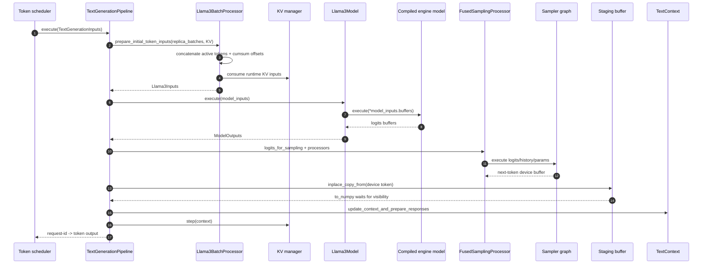
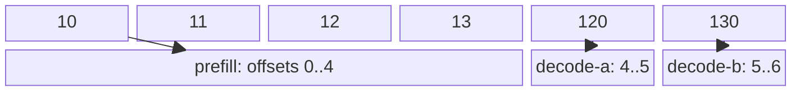
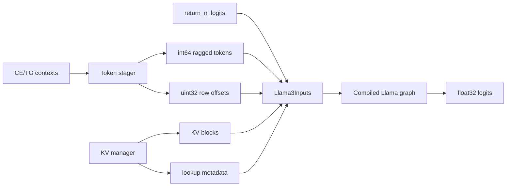
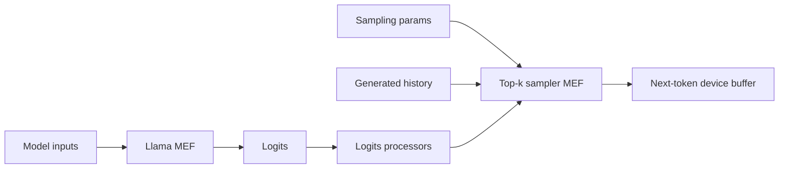
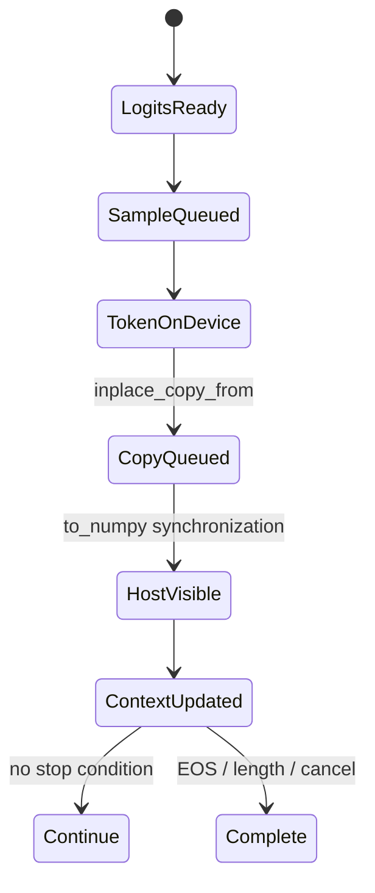

# Phase 6: Scheduler Batch to Sampled Token

## Full Step

`SOURCE`

```text
Scheduler      Pipeline       Batch processor      Model       Sampler      Python
   |              |                 |                 |            |           |
   | contexts --->| prepare_batch   |                 |            |           |
   |              |---------------> | ragged + KV     |            |           |
   |              |<--------------- | buffers         |            |           |
   |              |---------------------------------->| execute    |           |
   |              |<----------------------------------| logits     |           |
   |              |----------------------------------------------->| token     |
   |              |<-----------------------------------------------| device buf|
   |              | D2H staging + to_numpy ----------------------------------->|
   |              | update context + KV step                         responses |
   |<-------------|                                                            |
```



## Ragged Buffer Probe

`CPU-RUN`

```text
contexts                         concatenated int64 tokens

prefill  active=[10 11 12 13] --+       0   1   2   3   4    5
decode-a active=[120] -----------+----> [10, 11, 12, 13, 120, 130]
decode-b active=[130] -----------+       ^               ^    ^
                                         0               4    5   6
row offsets uint32: [0, 4, 5, 6]         | prefill       | da | db |
```



| Request    | Scheduler kind | Processed | Active          | Ragged slice |
|------------|----------------|----------:|-----------------|--------------|
| `prefill`  | CE             |         0 | `[10,11,12,13]` | `[0:4]`      |
| `decode-a` | TG             |         3 | `[120]`         | `[4:5]`      |
| `decode-b` | TG             |         2 | `[130]`         | `[5:6]`      |

The probe calls the shared ragged-array helper. Production Llama staging uses
the same concatenate/cumulative-offset layout in pinned reusable buffers.

## Llama Input Passport

`SOURCE + COMPILE-ONLY`

```text
Llama3Inputs.buffers
  1 tokens               int64   [total_seq_len]                 device
  2 input_row_offsets    uint32  [batch + 1]                     device
  3 return_n_logits      int64   [symbolic one-element input]    host
  4 signal buffers       device  only when collective path needs them
  5 KV cache blocks      dtype   [pages,2,layers,page,kv_heads,head_dim]
  6 KV lookup metadata   uint32/int64 host + device buffers
```



CUDA `sm_80` exported signature for Model A:

| Buffer               | Shape                     | Device  |
|----------------------|---------------------------|---------|
| tokens               | `[total_seq_len]`         | `gpu:0` |
| row offsets          | `[input_row_offsets_len]` | `gpu:0` |
| return-logit control | symbolic                  | `cpu:0` |
| paged KV storage     | `[pages,2,30,128,3,64]`   | `gpu:0` |
| logits               | `[batch,49152]`           | `gpu:0` |

## Model + Sampler Split

`SOURCE + COMPILE-ONLY`

```text
Llama graph                       top-k sampler graph
ragged tokens + KV               logits + history + top-k/top-p/temp + seed
          |                                         |
          v                                         v
float32 logits [rows,vocab]  ----------------> int64 token [batch]
```



The virtual CUDA compile emitted separate `llama3`, `top_k_sampler`,
`ragged_logprobs`, and `realize_future_token_graph` MEFs. It did not execute
them.

## Host Visibility Boundary

`SOURCE`; accelerator timing remains `GPU-LAB`.

```text
device sampler output
       |
       | inplace_copy_from
       v
STAGING buffer on sampler device
       |
       | to_numpy() waits for tracked copy
       v
NumPy token IDs
       |
       +--> TokenBuffer.advance_with_token
       +--> EOS / output-limit checks
       +--> response payload
       +--> KV manager step
```



## Reproduce

```bash
murali_docs/labs/graph/run_ragged_batch_probe.sh
```

## Source Pins

| Stage                     | Source                                                                                                 |
|---------------------------|--------------------------------------------------------------------------------------------------------|
| pipeline execute + D2H    | [`text_generation.py`](../../max/python/max/pipelines/lib/pipeline_variants/text_generation.py)        |
| Llama staging             | [`batch_processor.py`](../../max/python/max/pipelines/architectures/llama3/batch_processor.py)         |
| shared ragged helper      | [`batch_processor.py`](../../max/python/max/pipelines/lib/interfaces/batch_processor.py)               |
| engine buffer call        | [`model.py`](../../max/python/max/pipelines/architectures/llama3/model.py)                             |
| sampling + async copy API | [`sampling_logits_processor.py`](../../max/python/max/pipelines/sampling/sampling_logits_processor.py) |
