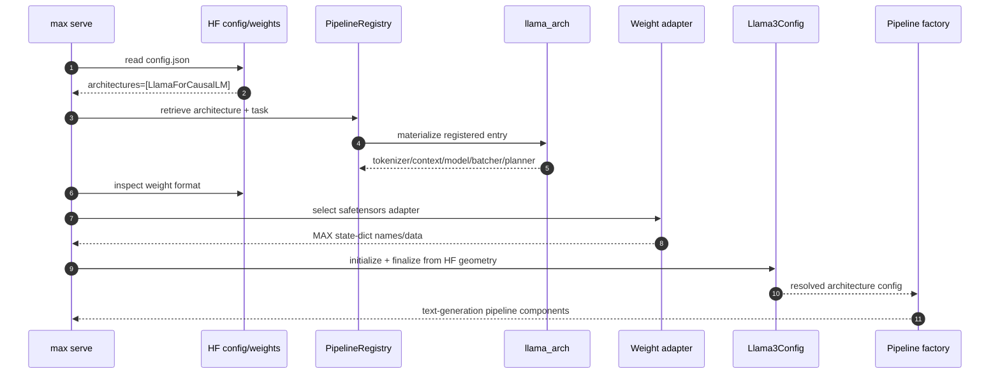
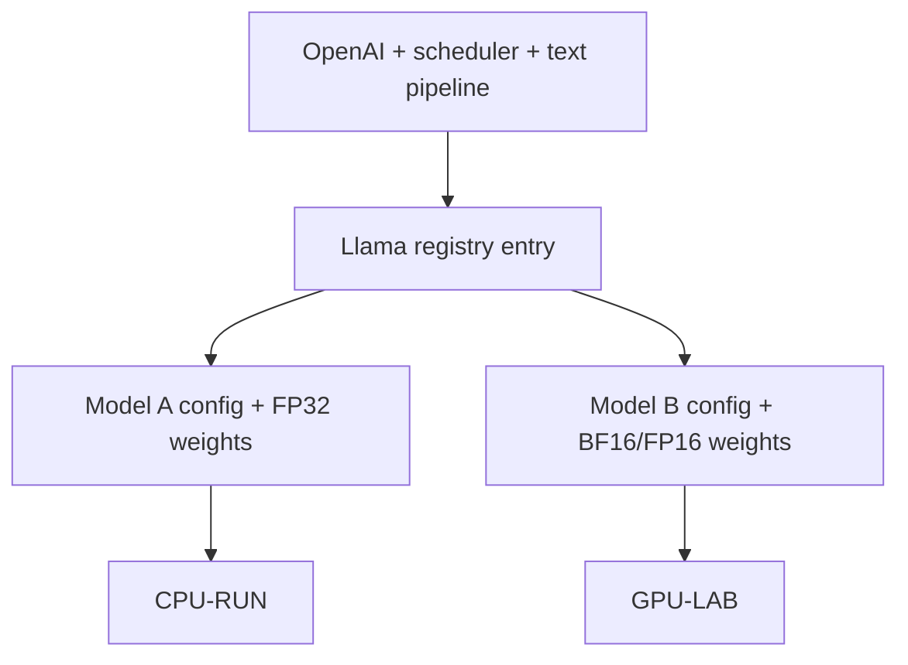
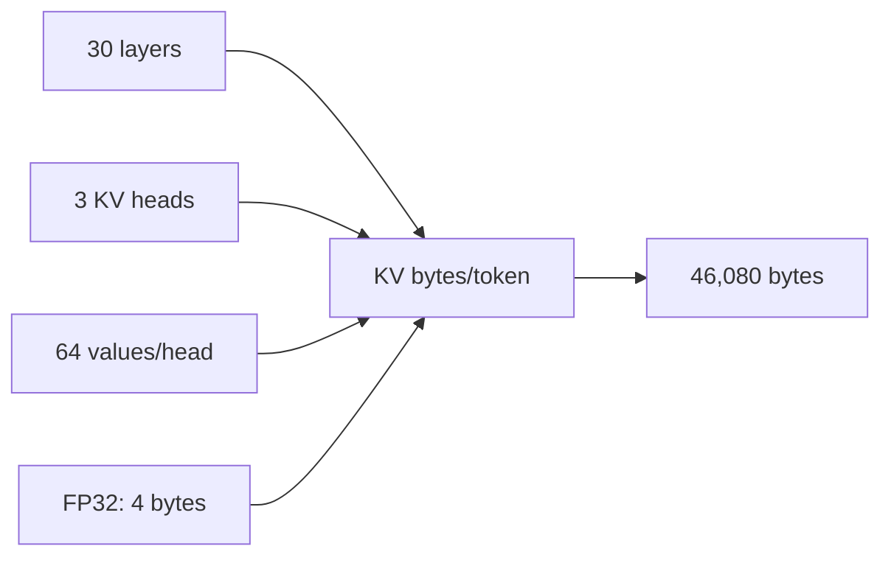
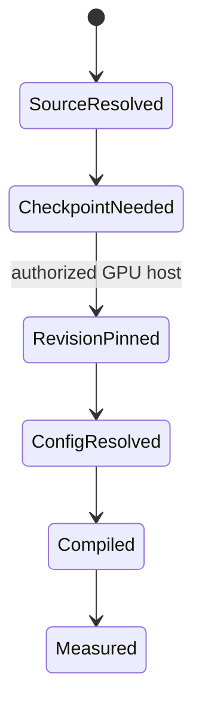
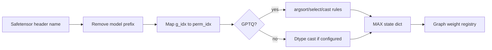
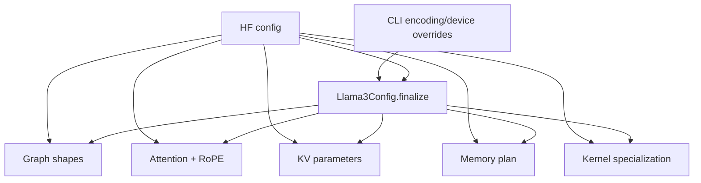

# Phase 7: Model Registry, Configuration, and Weights

## Resolution Chain

<details>
<summary>Q&A: What does each step in the Resolution Chain sequence diagram mean?</summary>

The diagram shows how `max serve` converts a Hugging Face model ID into a
ready-to-run MAX text-generation pipeline:

```text
HF model files
  -> identify architecture
  -> find MAX registry entry
  -> resolve model components
  -> adapt weights
  -> finalize configuration
  -> create the serving pipeline
```

<details>
<summary>Step 1: <code>CLI -> HF: read config.json</code></summary>

`max serve` asks the Hugging Face model loader/repository for the model's
`config.json`, which contains the architecture and geometry.

For the cached Model A checkpoint, the file is:

```text
/local/mnt/workspace/.murali_hf/hub/models--modularai--SmolLM-135M-Instruct-FP32/
snapshots/1ade67aacf72511c94c55529056f7222c1c0b586/config.json
```

Relevant contents include:

```json
{
  "architectures": ["LlamaForCausalLM"],
  "model_type": "llama",
  "hidden_size": 576,
  "intermediate_size": 1536,
  "num_hidden_layers": 30,
  "num_attention_heads": 9,
  "num_key_value_heads": 3,
  "head_dim": 64,
  "vocab_size": 49152,
  "max_position_embeddings": 2048,
  "rope_theta": 10000.0,
  "torch_dtype": "float32",
  "use_cache": true
}
```

</details>

<details>
<summary>Step 2: <code>HF -> CLI: architectures=[LlamaForCausalLM]</code></summary>

The loader returns the architecture name declared in `config.json`.
This identifies the model family MAX must support.

Here, `HF` represents the Hugging Face model repository/config loader and
`CLI` represents the MAX serving process. This is runtime data flow, not
communication with a separate Hugging Face service.

The registry is still required because `LlamaForCausalLM` is only a model
name. MAX maps that name to executable components:

```text
LlamaForCausalLM
  -> llama_arch
  -> Llama3Model
  -> TextTokenizer
  -> TextContext
  -> Llama3BatchProcessor
  -> PagedMemoryPlanner
```

In short:

```text
config.json      = declares the model architecture and geometry
PipelineRegistry = maps that declaration to MAX implementation components
```

</details>

<details>
<summary>Step 3: <code>CLI -> PipelineRegistry: retrieve architecture + task</code></summary>

MAX asks its registry which implementation handles this architecture for
the requested task, such as `TEXT_GENERATION`.

This registry is not a database. It is an in-process Python singleton,
`PIPELINE_REGISTRY`, backed by Python dictionaries in `ArchLookup`.
Conceptually, it is a lookup table:

```text
(architecture name, task)
  -> SupportedArchitecture runtime object
```

For built-in architectures, the table is populated lazily. At import time,
MAX records lightweight descriptors such as:

```text
"LlamaForCausalLM" -> module=".llama3", symbol="llama_arch"
```

When `LlamaForCausalLM` is first requested, MAX imports that module and
retrieves the actual Python object named `llama_arch`.

The returned object is a `SupportedArchitecture` dataclass instance. For
Llama, the complete structure is effectively:

```python
SupportedArchitecture(
    name="LlamaForCausalLM",
    example_repo_ids=[
        "meta-llama/Llama-3.1-8B-Instruct",
        "deepseek-ai/DeepSeek-R1-Distill-Llama-8B",
        "meta-llama/Llama-Guard-3-8B",
        "meta-llama/Llama-3.2-1B-Instruct",
        "meta-llama/Llama-3.2-3B-Instruct",
        "deepseek-ai/deepseek-coder-6.7b-instruct",
        "modularai/Llama-3.1-8B-Instruct-GGUF",
    ],
    default_encoding=Llama3Config.DEFAULT_ENCODING,
    supported_encodings=Llama3Config.SUPPORTED_ENCODINGS,
    pipeline_model=Llama3Model,
    task=PipelineTask.TEXT_GENERATION,
    tokenizer=TextTokenizer,
    default_weights_format=WeightsFormat.safetensors,
    context_type=TextContext,
    config=Llama3Config,
    weight_adapters={
        WeightsFormat.safetensors:
            weight_adapters.convert_safetensor_state_dict,
        WeightsFormat.gguf:
            weight_adapters.convert_gguf_state_dict,
    },
    multi_gpu_supported=True,
    input_modalities={InputModality.TEXT},
    required_arguments={},
    checkpoints_recurrent_state=False,
    context_validators=[],
    supports_empty_batches=False,
    requires_max_batch_context_length=False,
    tool_parser=None,
    batching=Llama3BatchProcessor,
    reasoning_parser=None,
    default_structured_output_backend=None,
    default_structured_output_any_whitespace=None,
    denoising_cache_defaults=None,
    checkpoint_draft_width=None,
    supports_overlap_scheduler=True,
    supports_device_graph_capture=True,
    supports_spec_decode_mixed_batches=False,
    memory_planner=PagedMemoryPlanner,
    cascade_pipeline_factory=CommonTextGenPipeline,
    pipeline_cls=None,
)
```

About the callable fields in that object:

```text
TextTokenizer                 = class used to create tokenizer instances
convert_safetensor_state_dict = function for adapting safetensors weights
                                into MAX's internal layout
convert_gguf_state_dict       = function for adapting GGUF weights into
                                MAX's internal layout
```

`TextTokenizer` is a class object stored in the architecture metadata.
Later, MAX instantiates it with the model path, pipeline config, revision,
max length, and trust settings. The created tokenizer instance wraps a
Hugging Face `AutoTokenizer` delegate and provides request-time behavior
such as encoding, decoding, applying chat templates, and creating text
contexts.

`convert_safetensor_state_dict` and `convert_gguf_state_dict` are function
objects stored in the `weight_adapters` dictionary. They do not convert a
model *to* safetensors or *to* GGUF. They convert *from* the loaded
checkpoint format into the names and `WeightData` objects expected by MAX.

For example:

```text
HF/GGUF checkpoint tensor names
  -> adapter function
  -> MAX tensor names + WeightData
```

These fields are mostly classes and callables, not already-created model
instances. Later steps use this metadata to initialize config, create the
tokenizer, select weight adapters, estimate memory, and build the pipeline
factory.

</details>

<details>
<summary>Step 4: <code>PipelineRegistry -> llama_arch: materialize registered entry</code></summary>

The registry resolves the `llama_arch` record into a concrete architecture
definition. This selects the implementation; weights are not executed yet.

</details>

<details>
<summary>Step 5: <code>llama_arch -> PipelineRegistry: tokenizer/context/model/batcher/planner</code></summary>

The architecture supplies `TextTokenizer`, `TextContext`, `Llama3Model`,
`Llama3BatchProcessor`, and `PagedMemoryPlanner`.

</details>

<details>
<summary>Step 6: <code>CLI -> HF: inspect weight format</code></summary>

MAX examines the checkpoint to identify its format, tensor names, shapes,
dtype, and possible quantization metadata.

Concretely, MAX resolves the model's weight files and determines what kind
of checkpoint it has. For example:

```text
model-00001-of-00002.safetensors
model-00002-of-00002.safetensors
  -> WeightsFormat.safetensors

model.Q4_K_M.gguf
  -> WeightsFormat.gguf
```

In the text-generation pipeline this is driven by the resolved weight
paths:

```python
weight_paths = model_config.resolved_weight_paths()

weights=load_weights(weight_paths)
format=weights_format(weight_paths)
```

`weights_format(weight_paths)` checks the file extensions and requires all
weight files to have the same supported format. This step answers:

```text
What files do we have?
Are they safetensors or GGUF?
Which raw tensor names and data are available?
What dtype or quantization metadata is present?
```

</details>

<details>
<summary>Step 7: <code>CLI -> Weight adapter: select safetensors adapter</code></summary>

MAX selects the adapter that knows how to read the checkpoint format and
map its tensors into MAX's expected representation.

Once MAX knows the weight format, it selects the matching adapter from the
architecture metadata:

```python
adapter = weight_adapters.get(weights_format(weight_paths))
```

For Llama:

```python
weight_adapters = {
    WeightsFormat.safetensors:
        weight_adapters.convert_safetensor_state_dict,
    WeightsFormat.gguf:
        weight_adapters.convert_gguf_state_dict,
}
```

So the selected function depends on the detected checkpoint format:

```text
WeightsFormat.safetensors -> convert_safetensor_state_dict
WeightsFormat.gguf        -> convert_gguf_state_dict
```

The adapter's job is mostly name/layout translation. For safetensors, MAX
removes or rewrites Hugging Face-style prefixes where needed:

```text
model.layers.0.self_attn.q_proj.weight
  -> layers.0.self_attn.q_proj.weight
```

For GGUF, MAX maps llama.cpp-style names into MAX model names:

```text
blk.0.attn_q.weight
  -> layers.0.self_attn.q_proj.weight
```

In short:

```text
resolved weight paths
  -> detect format: safetensors or GGUF
  -> load raw weights
  -> select adapter for that format
  -> adapter rewrites tensor names/data into MAX layout
  -> Llama3Model receives weights it knows how to bind
```

</details>

<details>
<summary>Step 8: <code>Weight adapter -> CLI: MAX state-dict names/data</code></summary>

The adapter returns MAX-compatible weights. For example:

```text
model.layers.0.self_attn.q_proj.weight
  -> layers.0.self_attn.q_proj.weight
```

</details>

<details>
<summary>Step 9: <code>CLI -> Llama3Config: initialize + finalize from HF geometry</code></summary>

MAX combines Hugging Face geometry with CLI overrides such as device,
dtype/encoding, maximum length, and batch limits. Finalization derives
attention shapes, KV-cache geometry, memory requirements, and scheduler
limits.

Here, "Hugging Face geometry" means the model shape declared in
`config.json`. It is the static architecture dimensions MAX must match
when building the executable model. For the cached Model A config, examples
include:

```json
{
  "hidden_size": 576,
  "intermediate_size": 1536,
  "num_hidden_layers": 30,
  "num_attention_heads": 9,
  "num_key_value_heads": 3,
  "head_dim": 64,
  "vocab_size": 49152,
  "max_position_embeddings": 2048,
  "rope_theta": 10000.0
}
```

Those fields tell MAX:

```text
hidden_size=576              model vector width
num_attention_heads=9        query attention heads
num_key_value_heads=3        KV heads for grouped-query attention
head_dim=64                  each attention head width
num_hidden_layers=30         transformer block count
intermediate_size=1536       MLP expansion size
vocab_size=49152             embedding/lm_head vocabulary size
max_position_embeddings=2048 nominal context length from HF config
rope_theta=10000.0           rotary embedding parameter
```

So "geometry" is not GPU placement or runtime scheduling. It is the
model's structural dimensions.

The CLI/config overrides are runtime choices layered on top:

```text
device
  Which hardware MAX should target, such as CPU, GPU 0, or multiple GPUs.

dtype/encoding
  How weights/compute are represented, such as float32, bfloat16, q4_k,
  or gptq. In Llama3Config this becomes fields like dtype,
  quantization_encoding, model_quantization_encoding, and
  quantization_config.

maximum length
  The effective maximum sequence/context length MAX will serve. It may come
  from the HF config, a CLI/config override, or architecture policy. For
  example, HF may declare max_position_embeddings=2048, while the user may
  request a lower max length to reduce KV-cache memory.

batch limits
  Serving limits such as max batch size or max total batch tokens. These
  affect scheduler capacity and memory planning, not the model's
  mathematical shape.
```

`initialize` builds the first `Llama3Config` from the Hugging Face geometry
plus runtime settings. For Llama, this fills fields such as:

```text
hidden_size
num_attention_heads
num_key_value_heads
num_hidden_layers
max_seq_len
dtype
quantization_encoding
kv_params
devices
```

`finalize` means MAX has now seen both the HF config and the adapted weight
state dict, so it can fill details that cannot be known from `config.json`
alone. For Llama, finalize can determine:

```text
norm_dtype
  Read from actual norm weight dtype, such as
  layers.0.input_layernorm.weight.

tie_word_embeddings
  Decide whether lm_head.weight exists separately or embeddings are shared.

quant_config
  Parse checkpoint quantization metadata from loaded weights/config.

stacked_mlp
  Detect whether weights use fused gate_up_proj layout.

stacked_qkv
  Detect whether weights use fused qkv_proj layout.
```

In short:

```text
initialize = build config from HF geometry + runtime settings
finalize   = complete config after seeing actual adapted weights
```

</details>

<details>
<summary>Step 10: <code>Llama3Config -> Pipeline factory: resolved architecture config</code></summary>

The finalized configuration is passed to the pipeline factory. It now
describes a consistent executable model.

In code, `PipelineRegistry.retrieve_factory()` first selects the pipeline
class for the resolved task:

```python
pipeline_class = get_pipeline_for_task(task, pipeline_config)

if arch.pipeline_cls is not None:
    pipeline_class = arch.pipeline_cls
```

For normal Llama text generation, this is usually
`TextGenerationPipeline`. MAX then packages the architecture-resolved
pieces into factory keyword arguments:

```python
factory_kwargs: dict[str, Any] = {
    "pipeline_config": pipeline_config,
    "pipeline_model": arch.pipeline_model,
    "weight_adapters": arch.weight_adapters,
    "tokenizer": typed_tokenizer,
    "memory_plan": memory_plan,
}

pipeline_factory = cast(
    Callable[[], PipelineTypes],
    functools.partial(pipeline_class, **factory_kwargs),
)
```

For Llama, this is conceptually:

```python
pipeline_factory = functools.partial(
    TextGenerationPipeline,
    pipeline_config=pipeline_config,
    pipeline_model=Llama3Model,
    weight_adapters={
        WeightsFormat.safetensors: convert_safetensor_state_dict,
        WeightsFormat.gguf: convert_gguf_state_dict,
    },
    tokenizer=TextTokenizer(...),
    memory_plan=memory_plan,
)
```

The important point is that this is a callable factory. It captures all
the resolved pieces needed to construct the pipeline, but the pipeline
object does not have to be constructed at the registry lookup line itself.

</details>

<details>
<summary>Step 11: <code>Pipeline factory -> CLI: text-generation pipeline components</code></summary>

The factory returns the runnable tokenizer, context handling, batching,
KV-memory planner, model, and weight integration. The CLI can then
initialize the server.

`retrieve_factory()` returns a `RetrievedPipeline` object:

```python
@dataclass(frozen=True)
class RetrievedPipeline:
    tokenizer: PipelineTokenizer[Any, Any, Any]
    factory: Callable[[], PipelineTypes]
    memory_plan: MemoryPlan
```

The actual return is:

```python
return RetrievedPipeline(
    tokenizer=tokenizer,
    factory=pipeline_factory,
    memory_plan=memory_plan,
)
```

The serve CLI receives it like this:

```python
retrieved = PIPELINE_REGISTRY.retrieve_factory(
    pipeline_config,
    task=pipeline_args.task,
    override_architecture=override_architecture,
)

tokenizer = retrieved.tokenizer
pipeline_factory = retrieved.factory
memory_plan = retrieved.memory_plan
```

Then the CLI passes those pieces into serving settings:

```python
pipeline_settings = ServingTokenGeneratorSettings(
    model_factory=pipeline_factory,
    pipeline_config=pipeline_config,
    tokenizer=tokenizer,
    task=pipeline_config.task,
    reasoning_parser_name=pipeline_config.runtime.reasoning_parser,
    temperature=pipeline_config.runtime.temperature,
    thinking_temperature=pipeline_config.runtime.thinking_temperature,
    memory_plan=memory_plan,
)
```

Later, when the factory is invoked, `TextGenerationPipeline` constructs the
actual `Llama3Model` and passes in loaded weights plus the selected weight
adapter:

```python
self._pipeline_model = pipeline_model(
    pipeline_config=self._pipeline_config,
    session=session,
    devices=self._devices,
    kv_cache_config=model_config.kv_cache,
    weights=load_weights(weight_paths),
    adapter=weight_adapters.get(weights_format(weight_paths)),
    return_logits=...,
    max_batch_size=max_batch_size,
    memory_plan=memory_plan,
)
```

In short:

```text
step 10 = build a callable factory that knows how to construct the pipeline
step 11 = return tokenizer + pipeline factory + memory plan to the CLI
```

</details>

The key distinction is:

```text
registry resolution = choose the implementation
weight adaptation   = make checkpoint tensors fit that implementation
config finalization = calculate executable geometry
pipeline factory    = assemble the runnable serving pipeline
```

</details>

`SOURCE + CPU-RUN`

```text
HF repo/config.json
  architectures[0] = LlamaForCausalLM
               |
               v
PipelineRegistry / ArchitectureLookup
               |
               v
llama_arch
  task       Text generation       tokenizer  TextTokenizer
  context    TextContext           model      Llama3Model
  batching   Llama3BatchProcessor  memory     PagedMemoryPlanner
  weights    safetensors -> Llama adapter
```



## Two-Model Resolution

| Property          | Model A                                | Model B                                      |
|-------------------|----------------------------------------|----------------------------------------------|
| ID                | `modularai/SmolLM-135M-Instruct-FP32`  | `meta-llama/Llama-3.1-8B-Instruct`           |
| Evidence          | `CPU-RUN` cached snapshot              | `SOURCE + BOUNDARY`; gated checkpoint absent |
| HF architecture   | `LlamaForCausalLM`                     | `LlamaForCausalLM`                           |
| registry entry    | `llama_arch`                           | `llama_arch`                                 |
| task              | `TEXT_GENERATION`                      | `TEXT_GENERATION`                            |
| tokenizer/context | `TextTokenizer` / `TextContext`        | same                                         |
| model/batcher     | `Llama3Model` / `Llama3BatchProcessor` | same                                         |
| memory planner    | `PagedMemoryPlanner`                   | same                                         |
| weight route      | safetensors adapter                    | safetensors adapter                          |
| execution lane    | CPU float32                            | future GPU BF16/FP16 lane                    |

```text
same server + scheduler + pipeline shell
                    |
          +---------+---------+
          |                   |
          v                   v
 Model A config/weights   Model B config/weights
 30 small blocks         32 large blocks
 CPU mechanics           GPU production study
```



## Model A Geometry

`CPU-RUN`

| Field              |   Value | Drives                           |
|--------------------|--------:|----------------------------------|
| layers             |      30 | transformer repetition, KV depth |
| hidden size        |     576 | residual/linear shapes           |
| intermediate size  |    1536 | MLP shapes                       |
| Q heads / KV heads |   9 / 3 | GQA ratio `3:1`                  |
| head dimension     |      64 | attention vector width           |
| vocabulary         |  49,152 | embedding/logit width            |
| max positions      |   2,048 | configured context ceiling       |
| RoPE theta         |  10,000 | rotary frequencies               |
| weight dtype       | float32 | storage and kernel dtype         |

```text
one unsharded KV token
  K + V
  = 2 x layers x KV heads x head_dim x dtype bytes
  = 2 x 30 x 3 x 64 x 4
  = 46,080 bytes = 45 KiB/token
```



## Model B Geometry Boundary

`BOUNDARY + GPU-LAB`

The gated `meta-llama` snapshot is not cached. A public Modular GGUF mirror
reports the canonical Llama 3.1 8B geometry: 32 layers, hidden 4096, 32 Q
heads, 8 KV heads, vocabulary 128,256, and context 131,072. Confirm the exact
gated revision and encoding on the GPU host before measurement.

```text
local source proves implementation selection
        |
        v
GPU host resolves exact model revision + dtype + weights
        |
        v
memory plan -> compile -> initialize -> execute/profile
```



## Weight-Name Adaptation

`CPU-RUN + SOURCE`: 272 tensor headers inspected; payloads were not loaded.

```text
checkpoint key                                 MAX state-dict key
model.embed_tokens.weight                  -> embed_tokens.weight
model.layers.0.input_layernorm.weight      -> layers.0.input_layernorm.weight
model.layers.0.self_attn.q_proj.weight     -> layers.0.self_attn.q_proj.weight
model.layers.0.mlp.gate_proj.weight        -> layers.0.mlp.gate_proj.weight
model.norm.weight                          -> norm.weight

rule 1: replace "model." with ""
rule 2: replace "g_idx" with "perm_idx" for GPTQ
```



## Configuration Fan-Out

`SOURCE`

```text
HF config
  +-> graph dimensions: hidden, intermediate, layers, vocab
  +-> attention: Q/KV heads, head_dim, RoPE
  +-> KV geometry: layers x KV heads x head_dim x dtype
  +-> scheduler limits: max sequence after memory planning
  +-> kernel specialization: dtype/head_dim/target/layout
```



## Reproduce

```bash
murali_docs/labs/graph/run_model_resolution_probe.sh \
  > /tmp/phase7_resolution.json
```

## Source Pins

| Concern               | Source                                                                                         |
|-----------------------|------------------------------------------------------------------------------------------------|
| registry lookup       | [`registry.py`](../../max/python/max/pipelines/lib/registry.py)                                |
| architecture records  | [`arch_lookup.py`](../../max/python/max/pipelines/lib/arch_lookup.py)                          |
| Llama registration    | [`arch.py`](../../max/python/max/pipelines/architectures/llama3/arch.py)                       |
| config finalization   | [`model_config.py`](../../max/python/max/pipelines/architectures/llama3/model_config.py)       |
| weight conversion     | [`weight_adapters.py`](../../max/python/max/pipelines/architectures/llama3/weight_adapters.py) |
| graph model selection | [`model.py`](../../max/python/max/pipelines/architectures/llama3/model.py)                     |
