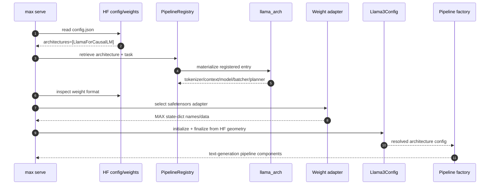
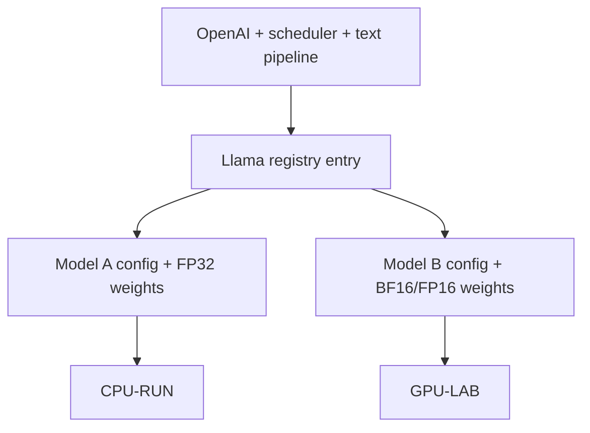
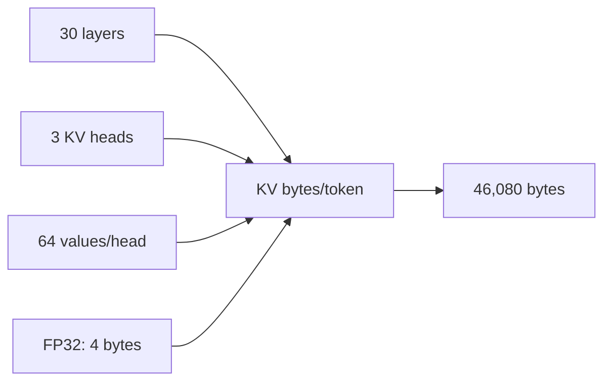
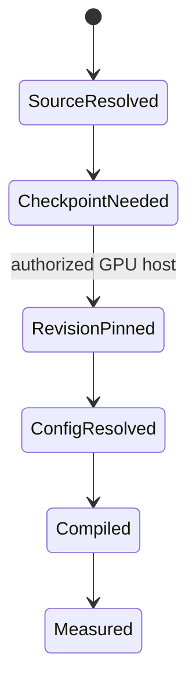
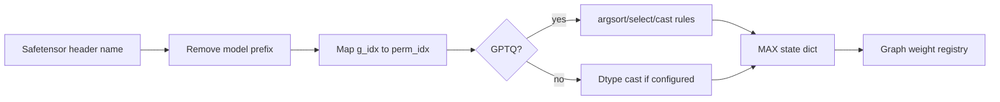
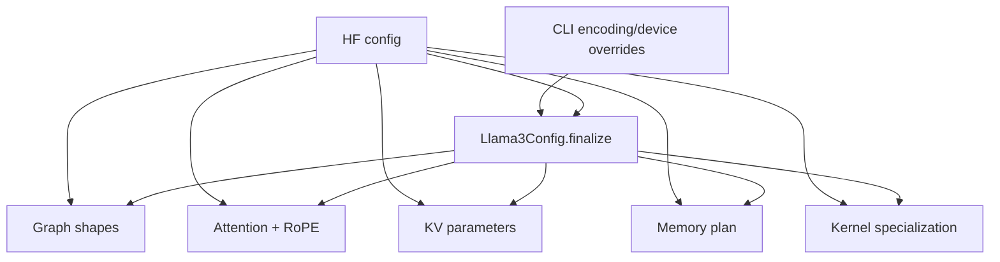

# Phase 7: Model Registry, Configuration, and Weights

## Resolution Chain

`SOURCE + CPU-RUN`

```text
HF repo/config.json
  architectures[0] = LlamaForCausalLM
               |
               v
PipelineRegistry / ArchitectureLookup
               |
               v
llama_arch
  task       Text generation       tokenizer  TextTokenizer
  context    TextContext           model      Llama3Model
  batching   Llama3BatchProcessor  memory     PagedMemoryPlanner
  weights    safetensors -> Llama adapter
```



## Two-Model Resolution

| Property          | Model A                                | Model B                                      |
|-------------------|----------------------------------------|----------------------------------------------|
| ID                | `modularai/SmolLM-135M-Instruct-FP32`  | `meta-llama/Llama-3.1-8B-Instruct`           |
| Evidence          | `CPU-RUN` cached snapshot              | `SOURCE + BOUNDARY`; gated checkpoint absent |
| HF architecture   | `LlamaForCausalLM`                     | `LlamaForCausalLM`                           |
| registry entry    | `llama_arch`                           | `llama_arch`                                 |
| task              | `TEXT_GENERATION`                      | `TEXT_GENERATION`                            |
| tokenizer/context | `TextTokenizer` / `TextContext`        | same                                         |
| model/batcher     | `Llama3Model` / `Llama3BatchProcessor` | same                                         |
| memory planner    | `PagedMemoryPlanner`                   | same                                         |
| weight route      | safetensors adapter                    | safetensors adapter                          |
| execution lane    | CPU float32                            | future GPU BF16/FP16 lane                    |

```text
same server + scheduler + pipeline shell
                    |
          +---------+---------+
          |                   |
          v                   v
 Model A config/weights   Model B config/weights
 30 small blocks         32 large blocks
 CPU mechanics           GPU production study
```



## Model A Geometry

`CPU-RUN`

| Field              |   Value | Drives                           |
|--------------------|--------:|----------------------------------|
| layers             |      30 | transformer repetition, KV depth |
| hidden size        |     576 | residual/linear shapes           |
| intermediate size  |    1536 | MLP shapes                       |
| Q heads / KV heads |   9 / 3 | GQA ratio `3:1`                  |
| head dimension     |      64 | attention vector width           |
| vocabulary         |  49,152 | embedding/logit width            |
| max positions      |   2,048 | configured context ceiling       |
| RoPE theta         |  10,000 | rotary frequencies               |
| weight dtype       | float32 | storage and kernel dtype         |

```text
one unsharded KV token
  K + V
  = 2 x layers x KV heads x head_dim x dtype bytes
  = 2 x 30 x 3 x 64 x 4
  = 46,080 bytes = 45 KiB/token
```



## Model B Geometry Boundary

`BOUNDARY + GPU-LAB`

The gated `meta-llama` snapshot is not cached. A public Modular GGUF mirror
reports the canonical Llama 3.1 8B geometry: 32 layers, hidden 4096, 32 Q
heads, 8 KV heads, vocabulary 128,256, and context 131,072. Confirm the exact
gated revision and encoding on the GPU host before measurement.

```text
local source proves implementation selection
        |
        v
GPU host resolves exact model revision + dtype + weights
        |
        v
memory plan -> compile -> initialize -> execute/profile
```



## Weight-Name Adaptation

`CPU-RUN + SOURCE`: 272 tensor headers inspected; payloads were not loaded.

```text
checkpoint key                                 MAX state-dict key
model.embed_tokens.weight                  -> embed_tokens.weight
model.layers.0.input_layernorm.weight      -> layers.0.input_layernorm.weight
model.layers.0.self_attn.q_proj.weight     -> layers.0.self_attn.q_proj.weight
model.layers.0.mlp.gate_proj.weight        -> layers.0.mlp.gate_proj.weight
model.norm.weight                          -> norm.weight

rule 1: replace "model." with ""
rule 2: replace "g_idx" with "perm_idx" for GPTQ
```



## Configuration Fan-Out

`SOURCE`

```text
HF config
  +-> graph dimensions: hidden, intermediate, layers, vocab
  +-> attention: Q/KV heads, head_dim, RoPE
  +-> KV geometry: layers x KV heads x head_dim x dtype
  +-> scheduler limits: max sequence after memory planning
  +-> kernel specialization: dtype/head_dim/target/layout
```



## Reproduce

```bash
murali_docs/labs/graph/run_model_resolution_probe.sh \
  > /tmp/phase7_resolution.json
```

## Source Pins

| Concern               | Source                                                                                         |
|-----------------------|------------------------------------------------------------------------------------------------|
| registry lookup       | [`registry.py`](../../max/python/max/pipelines/lib/registry.py)                                |
| architecture records  | [`arch_lookup.py`](../../max/python/max/pipelines/lib/arch_lookup.py)                          |
| Llama registration    | [`arch.py`](../../max/python/max/pipelines/architectures/llama3/arch.py)                       |
| config finalization   | [`model_config.py`](../../max/python/max/pipelines/architectures/llama3/model_config.py)       |
| weight conversion     | [`weight_adapters.py`](../../max/python/max/pipelines/architectures/llama3/weight_adapters.py) |
| graph model selection | [`model.py`](../../max/python/max/pipelines/architectures/llama3/model.py)                     |
