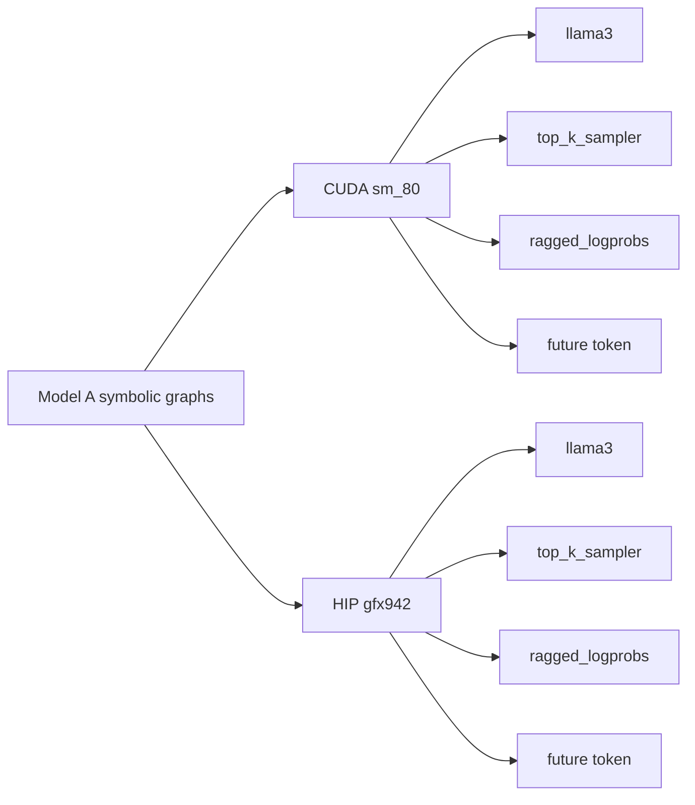

# Accelerator Compile Manifest

`COMPILE-ONLY`, 2026-10-04, revision `8236b97fc9` parent source.

```text
SmolLM-135M-Instruct-FP32 / max length 128 / batch 1
          |
          +-> cuda:sm_80  -> 4 MEFs -> 3,564,123 bytes
          |
          +-> hip:gfx942  -> 4 MEFs -> 6,375,651 bytes

graph fingerprints equal; target binaries and SHA-256 values differ
```



| Graph                        | Manifest fingerprint | CUDA bytes | CUDA SHA-256 prefix | HIP bytes | HIP SHA-256 prefix |
|------------------------------|----------------------|-----------:|---------------------|----------:|--------------------|
| `llama3`                     | `67e9a8ae9b74`       |  1,542,673 | `7c0c5a288ec5`      | 3,953,665 | `0997cca2f38f`     |
| `top_k_sampler`              | `15be7068a270`       |    828,727 | `7860a55dbda3`      | 1,039,847 | `723c4a5b2137`     |
| `ragged_logprobs`            | `9dec92f7dcda`       |    142,958 | `026a13dc10fc`      |   140,302 | `8a4a3fbb9143`     |
| `realize_future_token_graph` | `a4498b0c8e0a`       |  1,049,765 | `44fdff5e3461`      | 1,241,837 | `5d12c584c866`     |

## Commands

```bash
# CUDA
max warm-cache --target cuda:sm_80 \
  --model modularai/SmolLM-135M-Instruct-FP32 \
  --devices gpu --quantization-encoding float32 \
  --max-length 128 --max-batch-size 1 \
  --export-mefs /tmp/murali_smollm_cuda_sm80_mefs

# AMD
max warm-cache --target hip:gfx942 \
  --model modularai/SmolLM-135M-Instruct-FP32 \
  --devices gpu --quantization-encoding float32 \
  --max-length 128 --max-batch-size 1 \
  --export-mefs /tmp/murali_smollm_hip_gfx942_mefs
```

Actual runs used the repository `//max/python/max/_entrypoints:pipelines`
Bazel target and the cache flags recorded in Phase 0. MEF binaries remain in
`/tmp` and are not committed.
