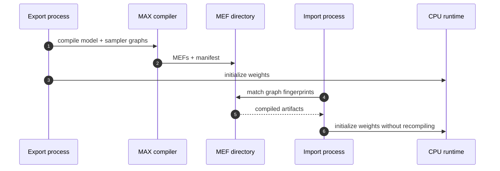

# CPU MEF Reuse And Compiler IR

`CPU-RUN + COMPILE-ONLY + BOUNDARY`, 2026-10-04, revision `4820070fe7`.

## Reuse Result

```text
process A                              process B
---------                              ---------
build Graph                            build same Graph
compile CPU target                     match manifest fingerprint
export 3 MEFs -----------------------> import compiled artifacts
initialize weights                     initialize weights
model compile: 20.8 s                  model compile: 0.0 s
sampler compile: 0.9 s                 sampler compile: 0.0 s
```



| Run            | Model compile | Sampler compile | Wall time | Evidence  |
|----------------|--------------:|----------------:|----------:|-----------|
| export process |        20.8 s |           0.9 s |   34.16 s | `CPU-RUN` |
| import process |         0.0 s |           0.0 s |   11.51 s | `CPU-RUN` |

Wall time also includes Bazel launch, CLI/config resolution, and cached weight
discovery. The compile fields isolate graph compilation.

## Artifact Passport

```text
/tmp/murali_smollm_cpu_mefs_audit/
  manifest.json
  llama3-9dad1a8c01e2.mef
  ragged_logprobs-a85375f15f2e.mef
  top_k_sampler-dad366554fb3.mef
```

| Graph             |     Bytes | SHA-256 prefix |
|-------------------|----------:|----------------|
| `llama3`          | 2,200,841 | `bbf42bb154ee` |
| `ragged_logprobs` |   243,821 | `8634483517a8` |
| `top_k_sampler`   | 2,434,866 | `0d3f8a0c5e39` |

CPU does not build the overlap scheduler's future-token graph.

## Compiler IR

`COMPILE-ONLY`

```text
CUDA sm_80 virtual target
  -> Graph lowering
  -> pre-jit stop
  -> 1 generated Mojo file: 55,591 B
  -> 8 staged MLIR files
  -> no kernel JIT
  -> no device execution
```


Evidence retained outside Git:

```text
/tmp/murali_smollm_cuda_ir_audit/ragged_logprobs.mojo
bytes  = 55,591
sha256 = da61dbc8c2b9239d128f04622b890c6e91a923c41acc0c20c491972b90a8739a
```

`pre-jit` stops at the first graph compiled by `warm-cache`; this run captured
the `ragged_logprobs` graph.

## Accelerator Import Boundary

`COMPILE-ONLY + BOUNDARY`

```text
CUDA MEF -> virtual device -> compile lookup succeeds
                           -> initialization rejected
                           -> real matching GPU required
```

Observed error:

```text
Cannot initialize a path-compiled artifact in virtual-device mode:
graph names are unknown without an MLIR module to inspect.
Initialize on a real device instead, or compile from a Graph/Module.
```

This does not invalidate the exported CUDA/HIP MEFs. It defines the point at
which this CPU-only host must hand the experiment to `GPU-LAB`.

## Commands

```bash
# Export CPU MEFs.
max warm-cache \
  --model modularai/SmolLM-135M-Instruct-FP32 \
  --devices cpu --quantization-encoding float32 \
  --max-length 128 --max-batch-size 1 \
  --export-mefs /tmp/murali_smollm_cpu_mefs_audit

# Reuse CPU MEFs in a new process.
max warm-cache \
  --model modularai/SmolLM-135M-Instruct-FP32 \
  --devices cpu --quantization-encoding float32 \
  --max-length 128 --max-batch-size 1 \
  --precompiled-mefs /tmp/murali_smollm_cpu_mefs_audit

# Emit target-specific Mojo/MLIR and stop before kernel JIT.
MODULAR_DEBUG=ir-output-dir=/tmp/murali_smollm_cuda_ir_audit,pre-jit \
max warm-cache --target cuda:sm_80 \
  --model modularai/SmolLM-135M-Instruct-FP32 \
  --devices gpu --quantization-encoding float32 \
  --max-length 128 --max-batch-size 1
```

The recorded runs used the repository Bazel entrypoint and cache flags from the
root learning [README](../../README.md).

Source: [`InferenceSession`](../../../max/python/max/engine/api.py) and
[`warm-cache`](../../../max/python/max/_entrypoints/pipelines.py).
