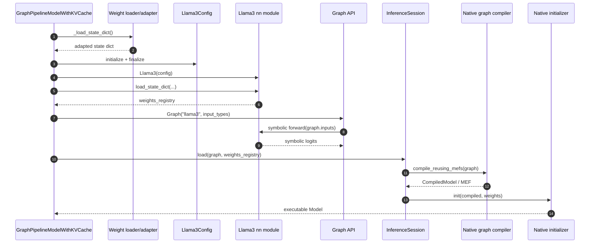
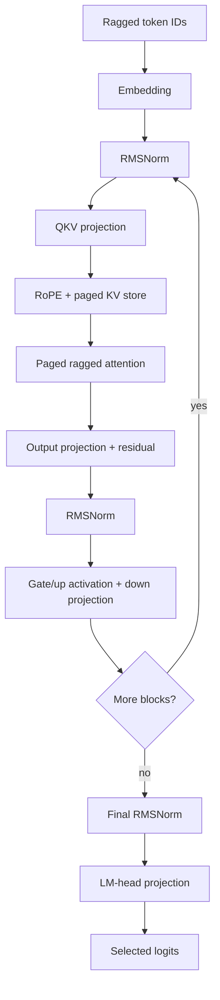
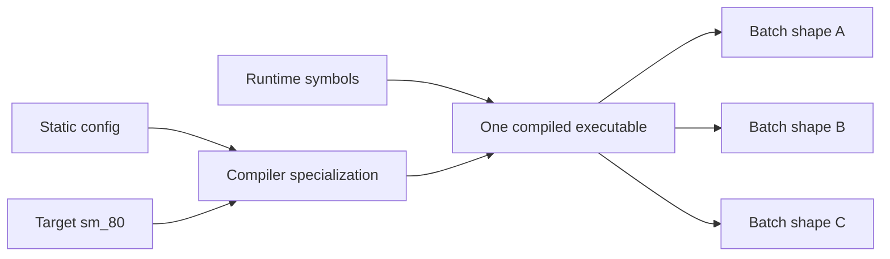
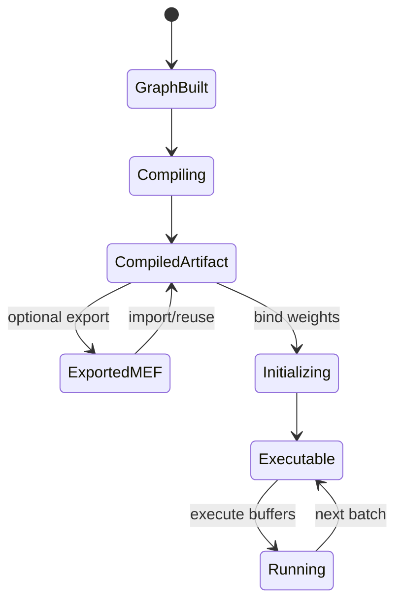
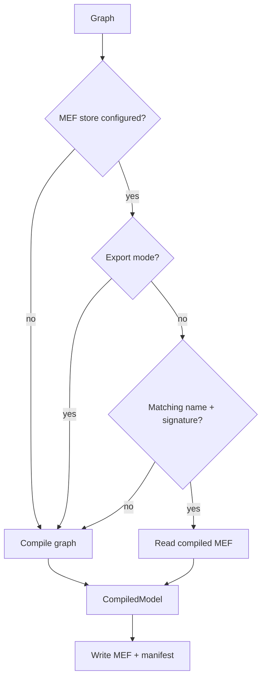
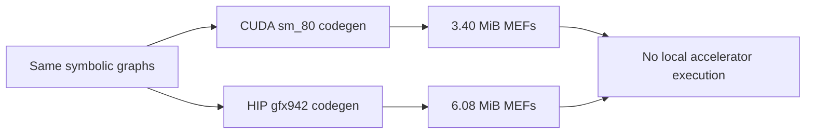
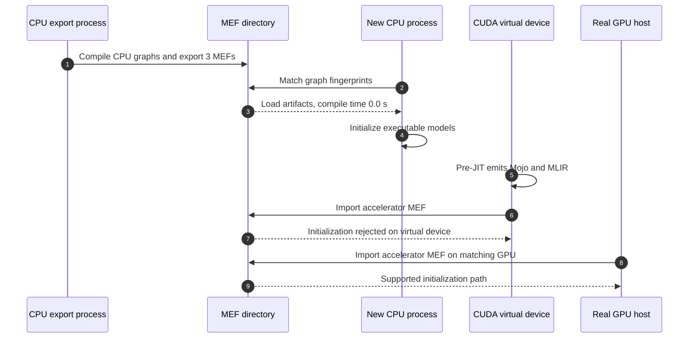
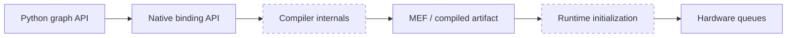

# Phase 8: Llama Graph Construction and Compilation

## Lifecycle

`SOURCE + COMPILE-ONLY`

```text
checkpoint
   |
   v
load/adapt state dict -> finalize Llama3Config -> instantiate Llama3
                                                   |
                                                   v
                                        declare external weights
                                                   |
                                                   v
Graph(input_types) -> symbolic forward -> graph.output -> compile -> init
                                                           |          |
                                                           |          v
                                                           |    executable Model
                                                           v          |
                                                     reusable MEF      v
                                                               execute(buffers)
```



## Graph Body

`SOURCE`

```text
ragged token IDs
      |
      v
token embedding
      |
      v
+------------------------------------------------+
| Transformer block x N                          |
| RMSNorm -> QKV projection -> RoPE + KV store   |
|         -> paged ragged attention -> O proj    |
| residual -> RMSNorm -> gate/up MLP -> down     |
+------------------------------------------------+
      |
      v
final RMSNorm -> output projection -> selected logits
```



## Symbolic Versus Specialized

`COMPILE-ONLY`: Model A, CUDA `sm_80`.

```text
symbolic at execution                    fixed/specialized at compile
----------------------------------       ----------------------------
total_seq_len                            model dtype: float32
input_row_offsets_len                    layers: 30
total_num_pages                          page size: 128
replica_0_batch_size                     KV heads: 3
replica_0_max_num_pages                  head dimension: 64
return_n_logits value                    vocabulary: 49,152
KV lookup/cache lengths                  target: CUDA sm_80
```



Primary model signature:

| Position | Type/shape                                                     | Device  |
|---------:|----------------------------------------------------------------|---------|
|        0 | `int64[total_seq_len]`                                         | `gpu:0` |
|        1 | `uint32[input_row_offsets_len]`                                | `gpu:0` |
|        2 | `int64[return_n_logits]`                                       | `cpu:0` |
|        3 | `float32[pages,2,30,128,3,64]` mutable KV buffer               | `gpu:0` |
|      4-9 | cache lengths, lookup table, maxima, stride, dispatch metadata | mixed   |
|   output | `float32[input_row_offsets_len - 1, 49152]`                    | `gpu:0` |

## Compile Is Not Initialize

`SOURCE`

```text
Graph/Module
    |
    | compile
    v
CompiledModel
  target machine code + graph metadata
  no bound weights/device allocations
    |
    | init(weights_registry)
    v
Model
  weights bound + runtime resources allocated
  execute/capture/replay capable
```



`session.load(graph, weights_registry=...)` is the current convenience path:

```text
load = compile_reusing_mefs + init_all + select one model
```

## MEF Cache Decision

`SOURCE`

```text
session has MEF store?
   | no                         | yes
   v                            v
compile graph              exporting?
                              | yes -> compile -> export -> manifest
                              | no  -> matching artifact?
                                      | yes -> compile/load MEF
                                      | no  -> compile graph
```



## Cross-Compile Evidence

`COMPILE-ONLY`

| Target        | Model compile | Sampler compile | Future-token compile | MEFs | Total bytes |
|---------------|--------------:|----------------:|---------------------:|-----:|------------:|
| CUDA `sm_80`  |        53.6 s |          10.4 s |                8.0 s |    4 |   3,564,123 |
| HIP `gfx942`  |        70.2 s |          14.5 s |                7.9 s |    4 |   6,375,651 |

```text
same graph names + signatures + manifest fingerprints
                         |
            +------------+------------+
            |                         |
            v                         v
      CUDA sm_80 MEFs           HIP gfx942 MEFs
      different bytes/hash      different bytes/hash
      never executed            never executed
```



Details:
[accelerator compile manifest](08_graph/accelerator_compile_manifest.md).

## MEF Reuse And IR Proof

`CPU-RUN + COMPILE-ONLY + BOUNDARY`

```text
CPU Graphs -> compile + export 3 MEFs -> new process -> import -> init
                    20.8s model compile                  0.0s compile

CUDA virtual graph -> pre-jit -> emitted Mojo + staged MLIR
CUDA MEF path       -> virtual init blocked -> real GPU required
```



| CPU run        | Model compile | Sampler compile | Wall time | Result               |
|----------------|--------------:|----------------:|----------:|----------------------|
| export process |        20.8 s |           0.9 s |   34.16 s | 3 MEFs, 4,879,528 B  |
| import process |         0.0 s |           0.0 s |   11.51 s | initialized from MEF |

The CUDA `pre-jit` run emitted one `55,591 B` Mojo file plus eight staged MLIR
files, then stopped before kernel JIT as requested. Accelerator MEF execution
and initialization remain `GPU-LAB`.

Details: [CPU MEF reuse and IR evidence](08_graph/cpu_mef_reuse.md).

## Native Boundary

`BOUNDARY`

```text
visible Python                       native implementation boundary
Graph / Module MLIR ----------------> compile_from_object
InferenceSession.compile -----------> compiler pipeline + code generation
InferenceSession.init --------------> weight/device allocation
Model.execute ----------------------> command submission/runtime
```



Implementation behind `max._core` is not present as Python/Mojo source in this
checkout; signatures, artifacts, logs, and profiles are the evidence surface.

## Reproduce Metadata Inspection

```bash
murali_docs/labs/graph/inspect_mef_manifest.py \
  /tmp/murali_smollm_cuda_sm80_mefs
```

## Source Pins

| Stage                  | Source                                                                                 |
|------------------------|----------------------------------------------------------------------------------------|
| shared load template   | [`pipeline_model.py`](../../max/python/max/pipelines/lib/interfaces/pipeline_model.py) |
| Llama graph hook       | [`model.py`](../../max/python/max/pipelines/architectures/llama3/model.py)             |
| blocks + input types   | [`llama3.py`](../../max/python/max/pipelines/architectures/llama3/llama3.py)           |
| compile/init/MEF store | [`engine/api.py`](../../max/python/max/engine/api.py)                                  |
| native public contract | [`engine.pyi`](../../max/python/max/_core/engine.pyi)                                  |
