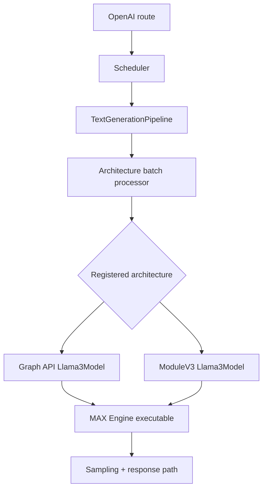
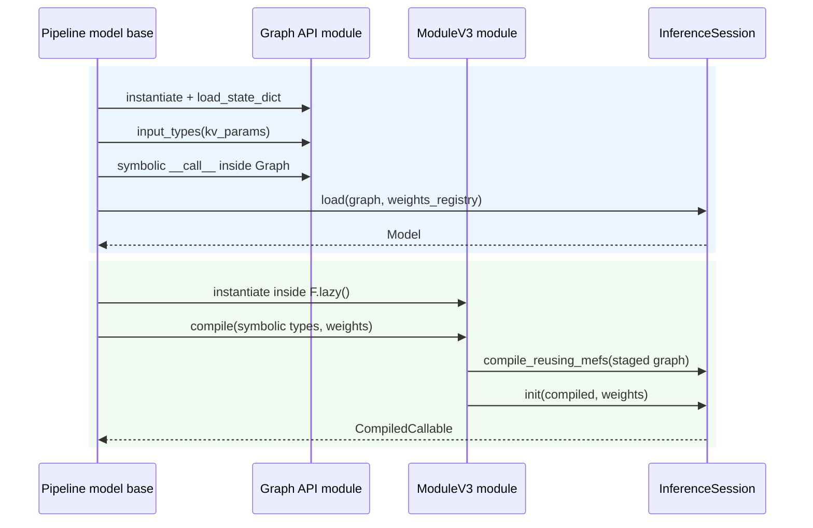
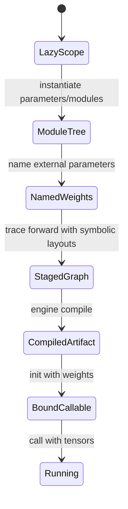
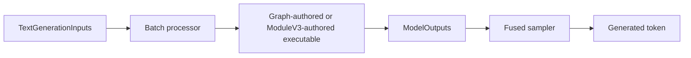
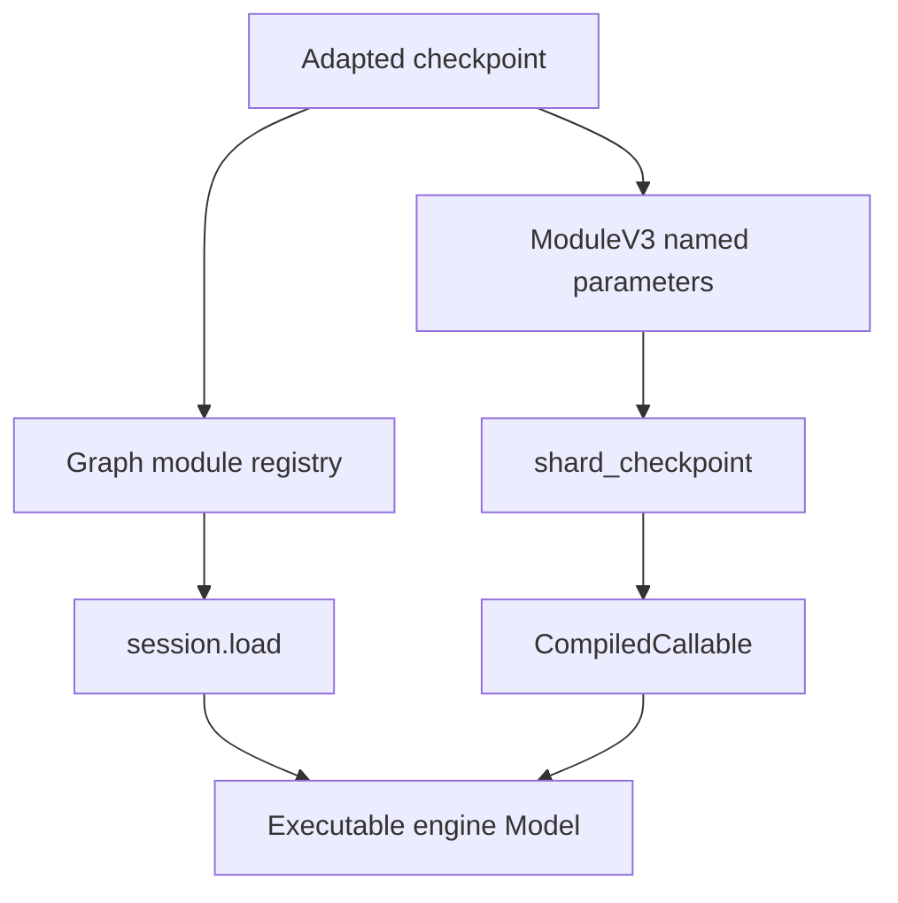

# Phase 9: Graph API Versus ModuleV3

## One Serving Shell, Two Authoring Paths

`SOURCE`

```text
HTTP -> IPC -> scheduler -> TextGenerationPipeline -> batch processor
                                                     |
                       +-----------------------------+------------------+
                       |                                                |
                       v                                                v
               Graph API Llama                                  ModuleV3 Llama
               explicit Graph                                   lazy Module tree
                       |                                                |
                       +---------------- executable model --------------+
                                        |
                                        v
                               logits -> sampler -> token
```



## Construction Sequences

`SOURCE`

```text
Graph API                              ModuleV3
---------                              --------
adapt state dict                       adapt/prepare state dict
finalize config                        finalize config
instantiate Llama3                     enter F.lazy + default_dtype
load_state_dict                        instantiate module + .to(device)
collect weights_registry               derive symbolic input types
open Graph(input_types)                module.compile(types, weights)
call module on graph inputs             |- stage forward
graph.output                            |- shard/name weights
session.load(graph, weights)            |- compile_reusing_mefs
                                        `- init -> CompiledCallable
```



## Comparison Matrix

| Concern                 | Graph API Llama                             | ModuleV3 Llama                                 |
|-------------------------|---------------------------------------------|------------------------------------------------|
| registry name           | `LlamaForCausalLM`                          | `LlamaForCausalLM_ModuleV3`                    |
| model construction      | `TensorValue` modules                       | `max.experimental.nn.Module` tree              |
| deferred creation       | graph context captures operations           | `F.lazy()` defers tensor realization           |
| input source            | `Llama3.input_types(kv_params)`             | batch processor `get_symbolic_inputs(...)`     |
| weight declaration      | `load_state_dict` then explicit registry    | external parameters named from module tree     |
| compile entry           | `session.load(graph, weights_registry=...)` | `nn_model.compile(*types, weights=state_dict)` |
| compiled wrapper        | engine `Model`                              | `CompiledCallable` wrapping engine `Model`     |
| runtime call            | `model.execute(*buffers)`                   | `compiled_callable(*buffers)`                  |
| output adaptation       | batch processor `process_outputs`           | tensors unwrapped to driver buffers            |
| multi-GPU declaration   | supported                                   | disabled in current Llama registration         |
| overlap/device capture  | supported by registration/config            | disabled in current Llama registration         |
| outer serving semantics | unchanged                                   | unchanged                                      |

## What `F.lazy()` Changes

`SOURCE`

```text
outside F.lazy                         inside F.lazy
Tensor allocation may realize data    module parameters stay symbolic/lazy
                                            |
                                            v
                                  Module.compile(input layouts)
                                            |
                                            v
                                  trace forward into a graph
                                            |
                                            v
                                  bind checkpoint values at init
```



## Same Runtime Contract

`SOURCE`

```text
TextGenerationInputs
  -> ragged tokens + offsets + KV inputs
  -> executable returns logits
  -> ModelOutputs
  -> FusedSamplingProcessor
  -> host-visible token

Only the box that authors/compiles the model graph changes.
```



## Weight Ownership

`SOURCE`

```text
Graph API
  checkpoint -> module.load_state_dict -> module.state_dict -> session.load

ModuleV3
  checkpoint -> prepare_state_dict -> shard_checkpoint(module parameters)
             -> CompiledCallable._weights -> session.init
```



## Learning Boundary

```text
learn once                         compare separately
----------                         ------------------
HTTP/SSE                           authoring ergonomics
IPC/cancellation                   state-dict naming
scheduler/KV policy                symbolic input creation
sampling/responses                 compile wrapper/features
```

`SOURCE`: ModuleV3 is an alternate graph-authoring route, not a second serving
architecture.

## Source Pins

| Stage                    | Source                                                                                              |
|--------------------------|-----------------------------------------------------------------------------------------------------|
| both load templates      | [`pipeline_model.py`](../../max/python/max/pipelines/lib/interfaces/pipeline_model.py)              |
| Module compile API       | [`module.py`](../../max/python/max/experimental/nn/module.py)                                       |
| staged/compiled callable | [`compilation.py`](../../max/python/max/experimental/compilation.py)                                |
| Graph API Llama          | [`llama3/model.py`](../../max/python/max/pipelines/architectures/llama3/model.py)                   |
| ModuleV3 Llama           | [`llama3_modulev3/model.py`](../../max/python/max/pipelines/architectures/llama3_modulev3/model.py) |
| ModuleV3 registration    | [`llama3_modulev3/arch.py`](../../max/python/max/pipelines/architectures/llama3_modulev3/arch.py)   |
