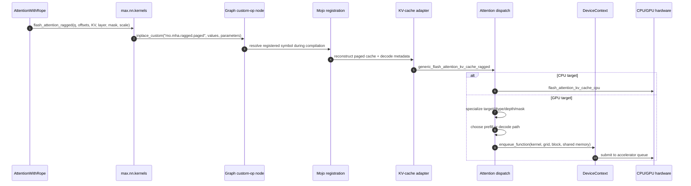
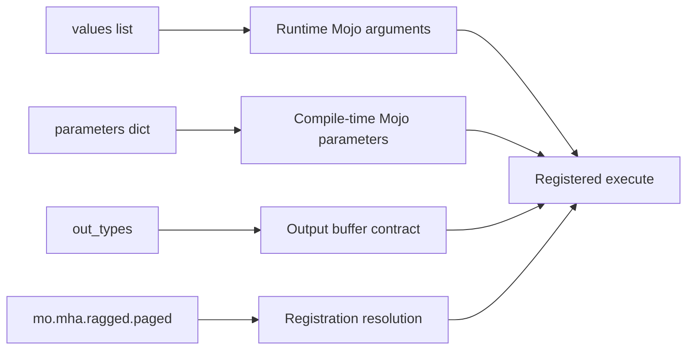
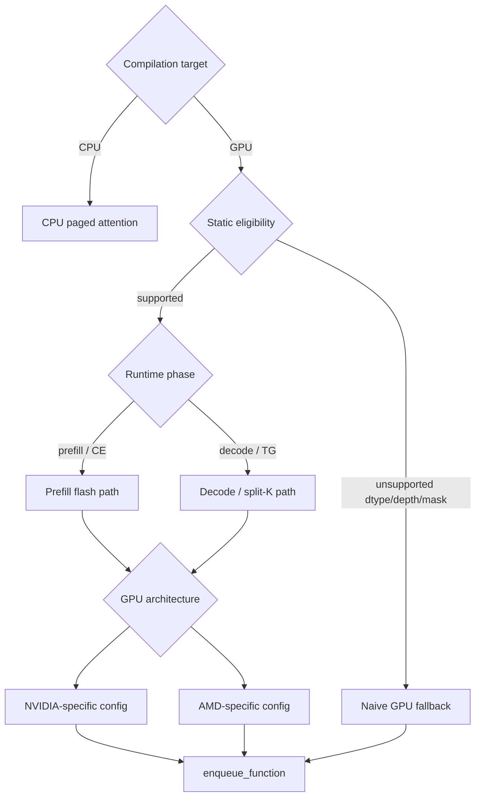
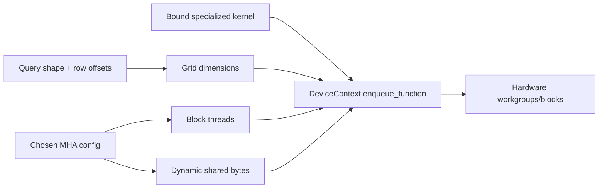
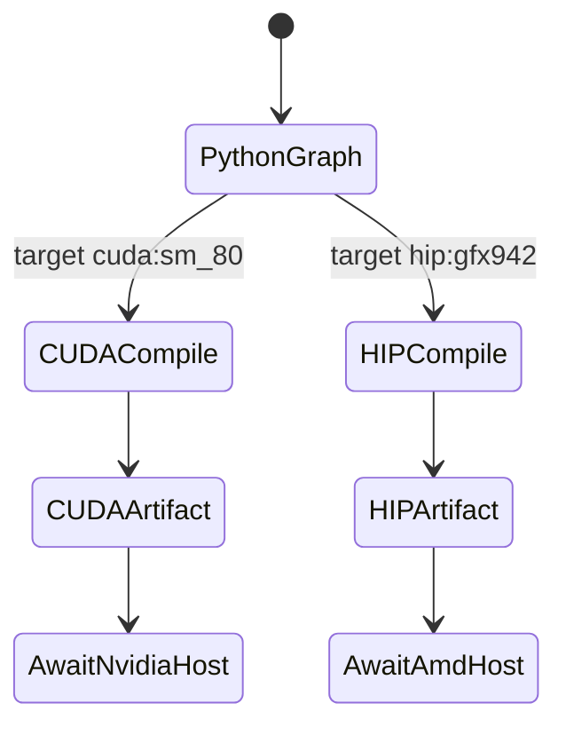
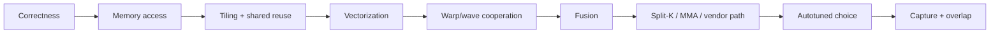
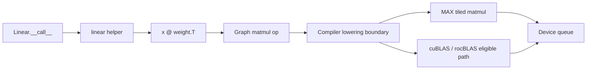
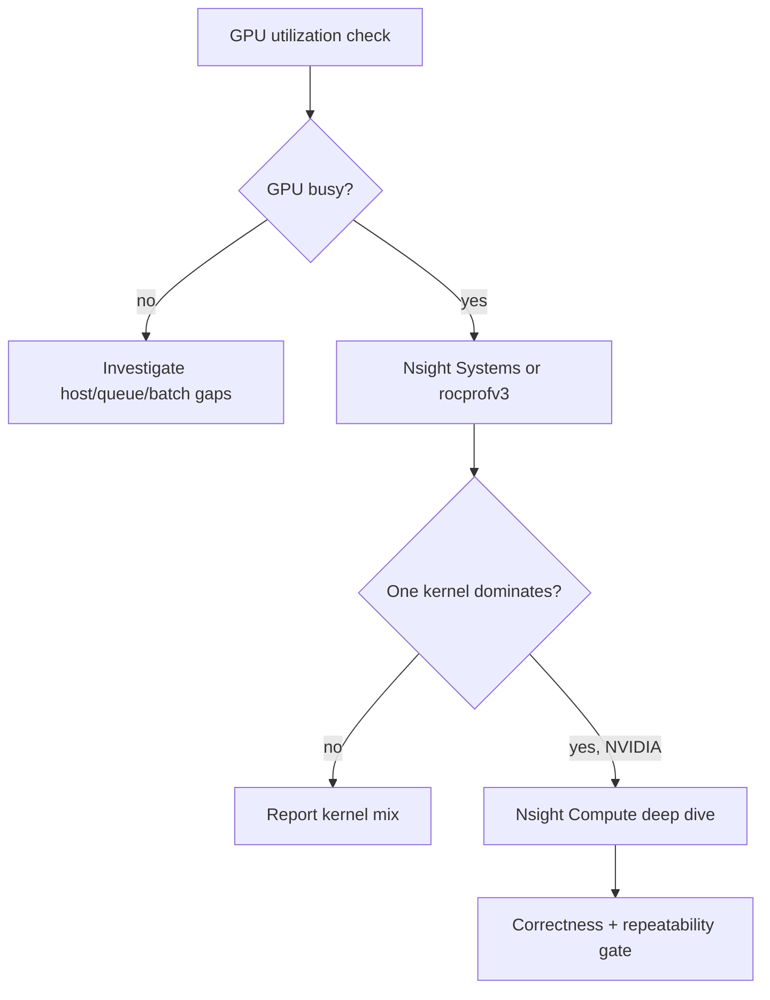

# Phase 10: Python to Mojo to Hardware

## Canonical Attention Trace

`SOURCE + COMPILE-ONLY`

```text
Python graph layer
  AttentionWithRope.__call__
    -> rope_split_store_ragged
    -> flash_attention_ragged
    -> ops.inplace_custom("mo.mha.ragged.paged")
                         |
                         v
Mojo graph-kernel registry
  @extensibility.register("mo.mha.ragged.paged")
    -> _execute_mha_ragged_paged_scalar_args
    -> generic_get_paged_cache
    -> generic_flash_attention_kv_cache_ragged
                         |
                 +-------+-------+
                 |               |
                 v               v
          CPU attention      GPU attention dispatch
                                  |
                         prefill / decode + target
                                  |
                         DeviceContext.enqueue_function
                                  |
                                  v
                           GPU command queue
```



## Custom-Op Passport

`SOURCE`

| Order | Python graph value          | Mojo registration argument          | Type/rank           | Role                         |
|------:|-----------------------------|-------------------------------------|---------------------|------------------------------|
|   out | declared `out_types[0]`     | `output`                            | query dtype, rank 3 | attention result             |
|     0 | `input`                     | `q`                                 | query dtype, rank 3 | ragged queries               |
|     1 | `input_row_offsets`         | `input_row_offsets`                 | `uint32`, rank 1    | sequence boundaries          |
|     2 | flattened KV                | `kv_blocks`                         | cache dtype, rank 6 | physical K/V pages           |
|     3 | flattened KV                | `page_stride`                       | `int64`, rank 1     | page layout                  |
|     4 | flattened KV                | `cache_lengths`                     | `uint32`, rank 1    | valid tokens/request         |
|     5 | flattened KV                | `kv_lookup_table`                   | `uint32`, rank 2    | logical-to-physical mapping  |
|     6 | flattened KV                | `max_prompt_length`                 | `uint32`, rank 1    | prefill dispatch bound       |
|     7 | flattened KV                | `max_cache_length`                  | `uint32`, rank 1    | decode dispatch bound        |
|     8 | `layer_idx`                 | `layer_idx`                         | `uint32` scalar     | K/V layer selection          |
|     9 | CPU constant                | `scale`                             | `float32` scalar    | `1/sqrt(head_dim)`           |
|    10 | attention dispatch metadata | `mha_decode_dispatch_metadata`      | `int64`, rank 1     | decode partition decisions   |
| param | `_mha_parameters(...)`      | `mask_str`, `local_window_size`     | compile-time        | mask specialization          |
| param | inferred op/device types    | `target`, query/cache/output dtypes | compile-time        | hardware/type specialization |

This passport is the unquantized paged-cache case. Quantized KV adds scale
buffers and scale lookup metadata before the layer/scale arguments.

```text
Python values -------------------------> Mojo runtime arguments
Python parameters ---------------------> Mojo compile-time parameters
out_types -----------------------------> preallocated output contract
op name -------------------------------> registration lookup key
```



## Dispatch Tree

`SOURCE`

```text
target
├── CPU
│   `-> flash_attention_kv_cache_cpu
└── GPU
    ├── static: vendor + architecture + dtype + head depth + mask
    ├── runtime: prefill or token generation + lengths + batch
    ├── optimized flash route when supported
    │   ├── NVIDIA architecture branches (including SM90/SM100 cases)
    │   └── AMD architecture branches (CDNA/RDNA cases)
    └── naive/two-pass fallback when constraints reject flash route
```



Compile-time pruning removes invalid branches for the selected target. Batch
lengths and the CE/TG condition still choose among compiled runtime paths.

| Study configuration          | Source-derived eligibility                                      |
|------------------------------|-----------------------------------------------------------------|
| Model A, FP32, CUDA `sm_80`  | depth 64 is flash-attention eligible                            |
| Model A, FP32, HIP `gfx942`  | AMD optimized predicate rejects FP32; fallback remains          |
| Model B, BF16, depth 128     | optimized route is eligible; exact kernel still needs `GPU-LAB` |

## Launch Geometry

`SOURCE`; values vary by selected specialization.

```text
logical attention work
  batch x heads x query tiles
          |
          v
LaunchDim(grid x/y/z)
  NVIDIA and AMD may order x/y differently
          |
          v
block_dim = selected config.num_threads()
shared_mem_bytes = selected tile footprint
          |
          v
ctx.enqueue_function[bound kernel](buffers, scalars, metadata, launch config)
```



## CUDA and HIP Compile Proof

`COMPILE-ONLY`

```text
same graph fingerprint
        |
        +-> cuda:sm_80 -> CUDA-target MEF bytes
        |
        `-> hip:gfx942 -> AMD-target MEF bytes

No GPU queues were created. No kernel timing was measured.
```



See [the compile manifest](08_graph/accelerator_compile_manifest.md).

## Optimization Ladder

`SOURCE + GPU-LAB`

```text
correct reference
   -> contiguous/coalesced global access
   -> tiled K/V reuse in shared memory
   -> vectorized loads/stores
   -> warp/wave reductions
   -> fused scale + mask + softmax + value product
   -> split-K for long decode cache
   -> tensor-core/MMA or vendor route when dtype/target allow
   -> tuned tile/warp/partition choice
   -> graph capture + overlap to reduce launch gaps
```



Every arrow requires correctness comparison first; speedup, occupancy, and
bandwidth remain `GPU-LAB` measurements.

## Linear/Matmul Contrast

`SOURCE`

```text
Attention custom op                       Dense Linear
-------------------                       ------------
Python names a custom operation           Linear.__call__
registration owns typed boundary             -> linear(...)
Mojo explicitly dispatches it                -> x @ weight.T
                                             -> graph-native matmul
                                             -> compiler-selected MAX/vendor path
```



Attention exposes an explicit Python-to-Mojo registration seam. Plain matmul
is graph-native; the exact lowering choice is a compiler decision and must be
confirmed in emitted IR or a hardware profile.

## GPU Verification Runbook

`GPU-LAB`

```text
1 utilization sample
      |
      v
2 short kernel breakdown
      |
      v
3 map MHA trace/kernel names to this dispatch tree
      |
      v
4 deep-dive only the dominant kernel
      |
      v
5 change one variable -> correctness -> re-profile
```



Capture separately:

| Workload         | Expected question                                    |
|------------------|------------------------------------------------------|
| one long prefill | Is attention/GEMM compute or bandwidth dominant?     |
| batch-1 decode   | Are launch and memory-read costs dominant?           |
| batched decode   | Does batching improve occupancy/throughput?          |
| KV-pressure case | Do scheduling gaps/preemption dominate tail latency? |

## Source Pins

| Layer                  | Source                                                                                  |
|------------------------|-----------------------------------------------------------------------------------------|
| graph attention call   | [`attention_with_rope.py`](../../max/python/max/nn/attention/attention_with_rope.py)    |
| Python custom op       | [`kernels.py`](../../max/python/max/nn/kernels.py)                                      |
| Mojo registration      | [`attention.mojo`](../../max/kernels/src/graph_compiler/builtin_kernels/attention.mojo) |
| argument adapter       | [`kernels.mojo`](../../max/kernels/src/graph_compiler/builtin_kernels/kernels.mojo)     |
| CPU/GPU dispatch       | [`kv_cache_ragged.mojo`](../../max/kernels/src/nn/kv_cache_ragged.mojo)                 |
| GPU MHA selection      | [`mha.mojo`](../../max/kernels/src/nn/attention/gpu/mha.mojo)                           |
| graph linear           | [`linear.py`](../../max/python/max/nn/linear.py)                                        |
| matmul implementations | [`matmul`](../../max/kernels/src/linalg/matmul)                                         |
| device APIs            | [`max.gpu`](../../max/mojo/max/gpu)                                                     |
