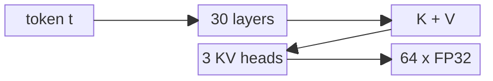
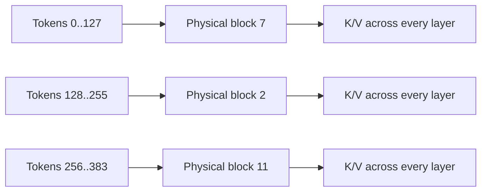
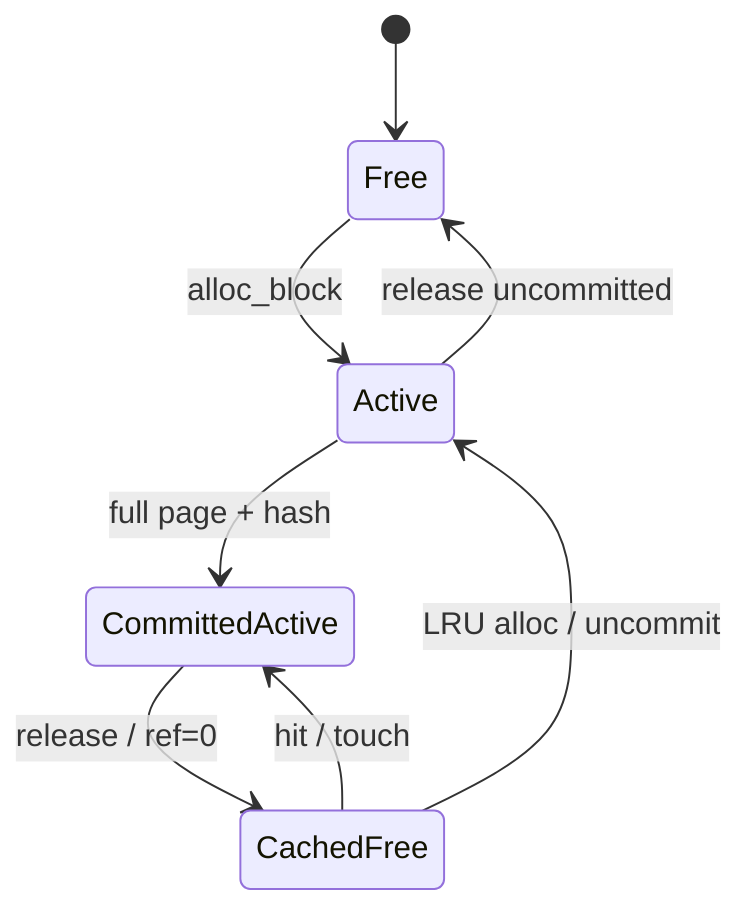
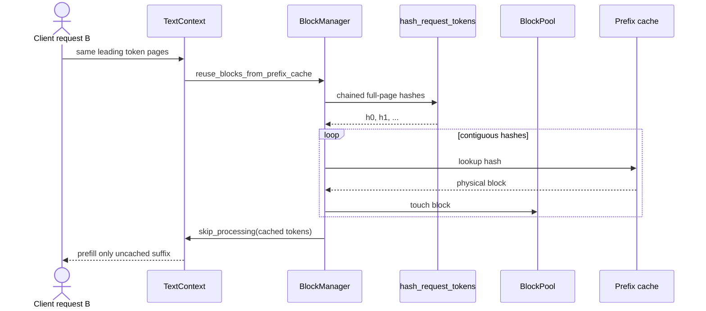
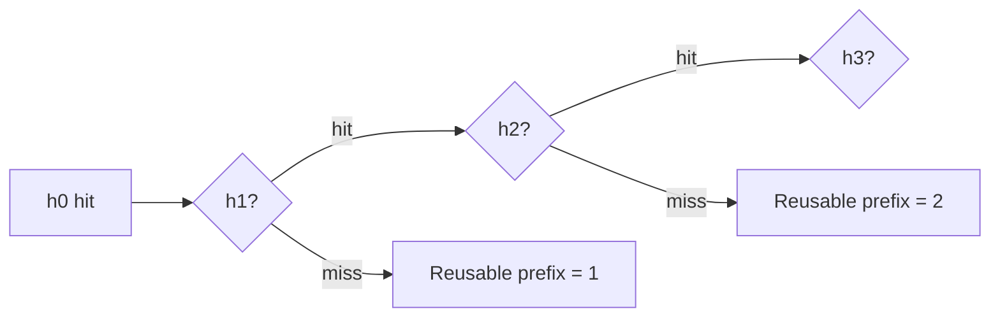
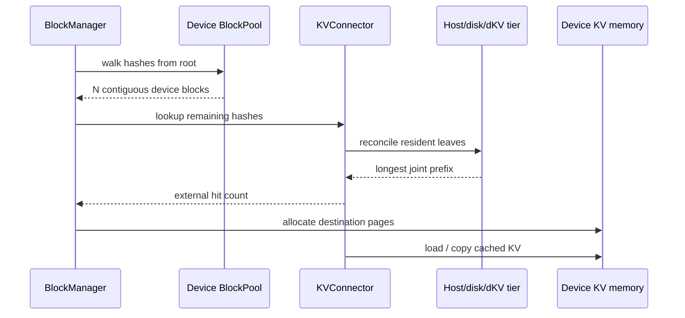
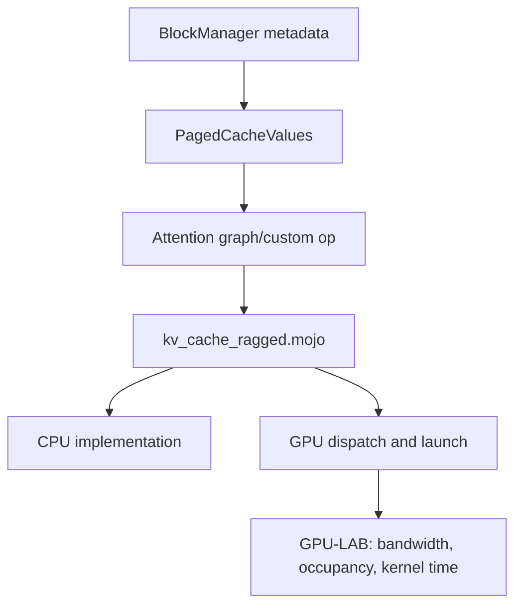

# Phase 11: Paged KV Cache

`CPU-RUN` + `SOURCE` + `TEST` + `GPU-LAB`

## One Token's KV Payload

`SOURCE`

```text
token t
  |
  +-- layer 0  : K[3 heads x 64] + V[3 heads x 64]
  +-- layer 1  : K[3 heads x 64] + V[3 heads x 64]
  |      ...
  +-- layer 29 : K[3 heads x 64] + V[3 heads x 64]

FP32 bytes/token = 2 x 30 x 3 x 64 x 4 = 46,080 B
128-token page   = 46,080 x 128         = 5,898,240 B = 5.625 MiB
```



| Model A payload                         |    Result |
|-----------------------------------------|----------:|
| One token                               |  46,080 B |
| One 128-token page                      | 5.625 MiB |
| Whole pages in an ideal 1 GiB KV budget |       182 |
| Token slots in those pages              |    23,296 |

`ideal payload != deployable budget`

```text
device memory
  - weights
  - graph/runtime workspace
  - allocator reserve
  - communication buffers
  = memory left for KV pages
```

## Logical Tokens, Physical Pages

`SOURCE`

```text
request R logical positions
  0..127       128..255      256..383
     |             |             |
     v             v             v
page table R = [ block 7,      block 2,      block 11 ]
                    |             |              |
device pool      [page 2] ... [page 7] ... [page 11]
```



## Block Lifecycle

`CPU-RUN + SOURCE`

```text
 FREE
   | alloc: ref 0 -> 1
   v
 ACTIVE ---- full page + hash ----> COMMITTED + ACTIVE
   | release: ref -> 0                         |
   |                                          | release
   v                                          v
 FREE + CACHED + EVICTABLE <---- hit/touch ---- CACHED + ACTIVE
   |
   | LRU allocation under pressure
   v
 EVICT HASH -> ACTIVE FOR NEW OWNER
```



The two-block production-class probe observed:

| Event                            | Free LRU order | Prefix cache        |
|----------------------------------|----------------|---------------------|
| initial                          | `[0, 1]`       | `{}`                |
| commit A, release                | `[1, 0]`       | `A -> 0`            |
| hit A                            | `[1]`          | `A -> 0`            |
| release A, then commit/release B | `[0, 1]`       | `A -> 0, B -> 1`    |
| allocate LRU                     | `[1]`          | `B -> 1`; A evicted |

## Prefix Hash Chain

`CPU-RUN + SOURCE`

```text
33 prompt tokens, block size 8

[0..7] --H(parent,tokens)--> h0
 h0 + [8..15] ------------> h1
 h1 + [16..23] -----------> h2
 h2 + [24..31] -----------> h3
 token 32 remains active; a 100% hit is forbidden
```



Observed lookup invariants:

```text
cache = [h0, h1, h2, --]  -> hit = 3 pages
cache = [h0, --, h2, --]  -> hit = 1 page
                                  ^ stop at first gap

17-token request; two 8-token pages cached
  -> skipped 16
  -> processed 16
  -> active 1
  -> no transfer with NullConnector
```



## Tier Walk

`SOURCE + BOUNDARY`

```text
hash chain
   |
   v
device prefix cache (G0)
   | first miss; remaining suffix only
   v
KVConnector
   +--> host tier --H2D--> device page
   +--> disk/dKV ----promotion----^

all leaves agree on one contiguous prefix
```



No host/device transfer was measured on this CPU-only machine.

## Pressure and Preemption

`SOURCE + TEST`

```text
new/chunked request
      |
      v
blocks needed <= free? -- yes --> allocate --> CE/TG batch
      |
      no
      v
select victim -> release pages -> rewind processing -> pending CE
      |                                      |
      +--------------- later ----------------+
                         re-prefill
```



```mermaid
stateDiagram-v2
    [*] --> Pending
    Pending --> Allocating: scheduler admission
    Allocating --> Active: enough pages
    Allocating --> Preempted: insufficient pages
    Active --> Preempted: growth exceeds free pages
    Preempted --> Pending: release + rewind
    Active --> Complete: EOS / limit / cancel
    Complete --> CachedFree: release; committed pages retained
```

Phase 5 already proved KV-pressure preemption and re-prefill on CPU.

## Page to Mojo Kernel

`SOURCE + GPU-LAB`

```text
BlockManager page IDs + row offsets
             |
             v
PagedCacheValues / graph attention op
             |
             v
kv_cache_ragged.mojo
  - store K/V into page
  - read historical K/V
  - dispatch prefill/decode attention
             |
             v
CPU kernel [available] | GPU kernel [measure later]
```



## Capacity Diagnosis

`GPU-LAB`

```text
                 saturation symptom
                        |
       +----------------+----------------+
       |                |                |
       v                v                v
 compute busy      HBM bytes/token   KV pages exhausted
 large CE GEMMs    decode GEMV/MHA   preemptions + queue
       |                |                |
   compute-bound   bandwidth-bound   capacity-bound
```

Measure before choosing a branch: TTFT, TPOT, batch shape, queue depth,
KV utilization, preemptions, accelerator utilization, and kernel mix.

## Reproduce

```bash
murali_docs/labs/kv_cache/run_kv_cache_trace.sh --compact \
  > /tmp/phase11_kv_cache_trace.json
```

## Source Pins

- `max/python/max/pipelines/kv_cache/paged_kv_cache/block_pool.py`: block
  allocation, reference counts, cache commits, touch, and LRU eviction.
- `max/python/max/pipelines/kv_cache/paged_kv_cache/block_manager.py`: chained
  hashes, contiguous lookup, reuse, tier loading, allocation, and release.
- `max/python/max/pipelines/kv_cache/prefix_hit.py`: multi-leaf longest-prefix
  reconciliation.
- `max/python/max/pipelines/kv_cache/kv_connector.py`: external tier boundary.
- `max/kernels/src/nn/kv_cache_ragged.mojo`: paged K/V stores and attention.
- `max/tests/integration/nn/kv_cache/test_prefix_cache_hit_counts.py`: gap,
  read-only, device, and external-tier invariants.
- `docs/max/serve/prefix-caching.mdx`: serving flags and supported scope.
