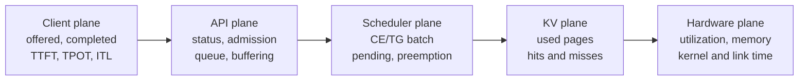
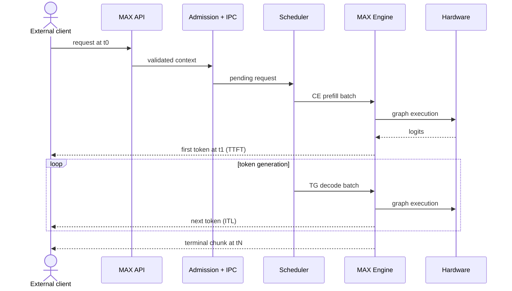
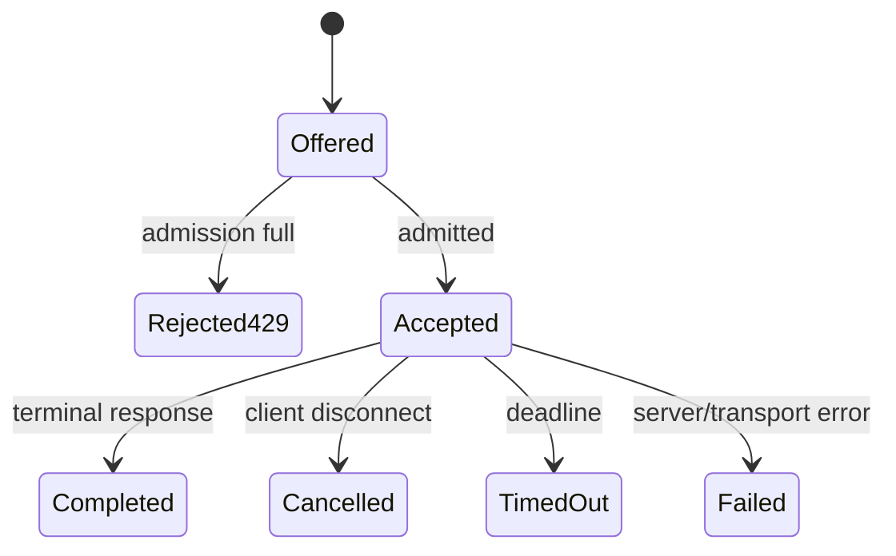
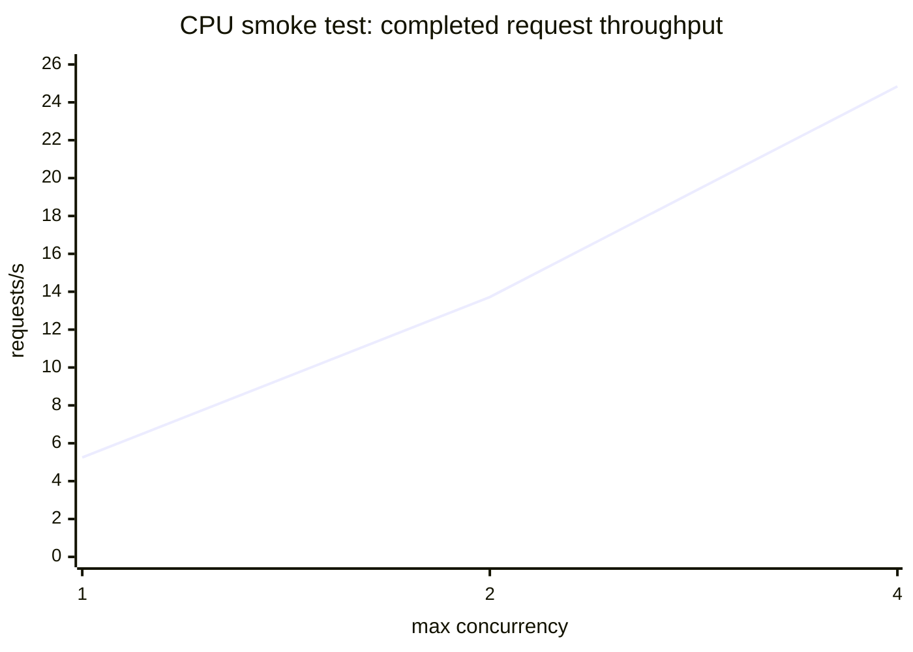
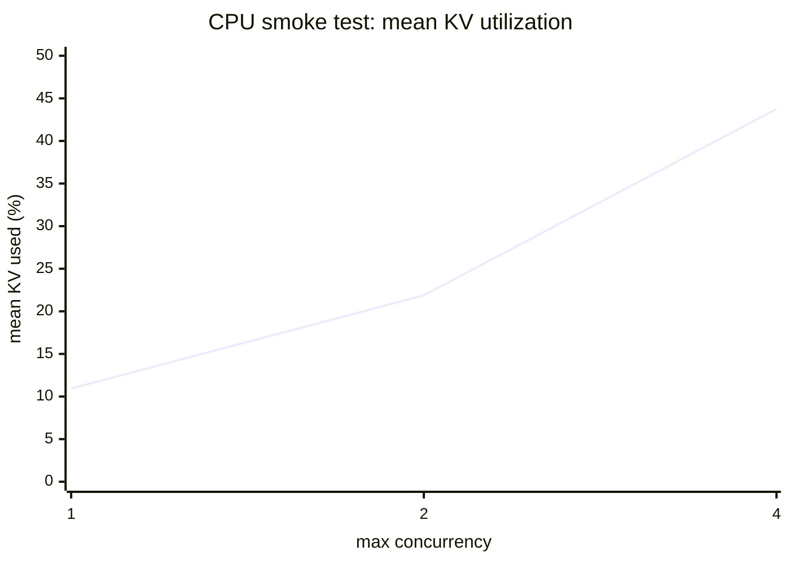
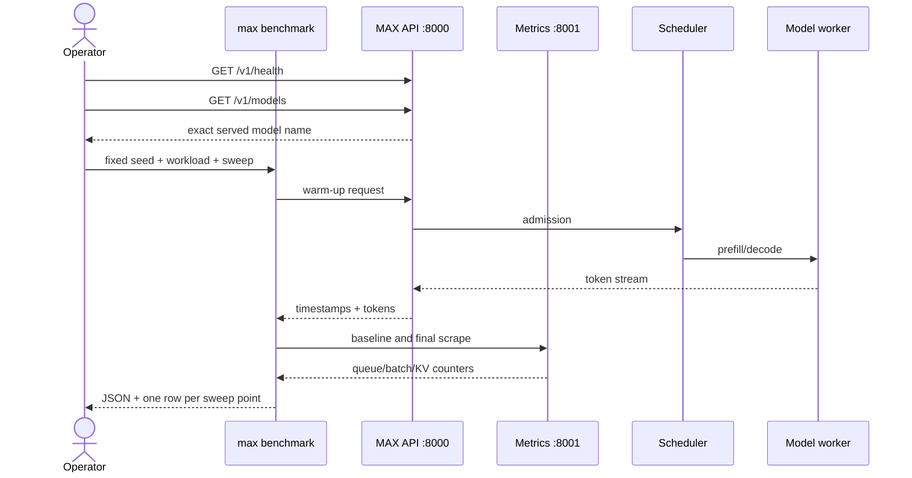
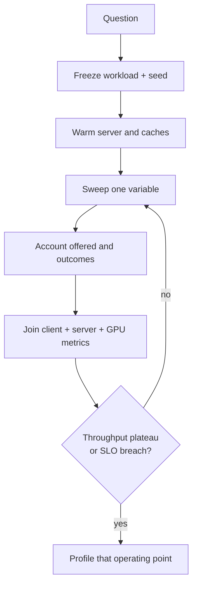
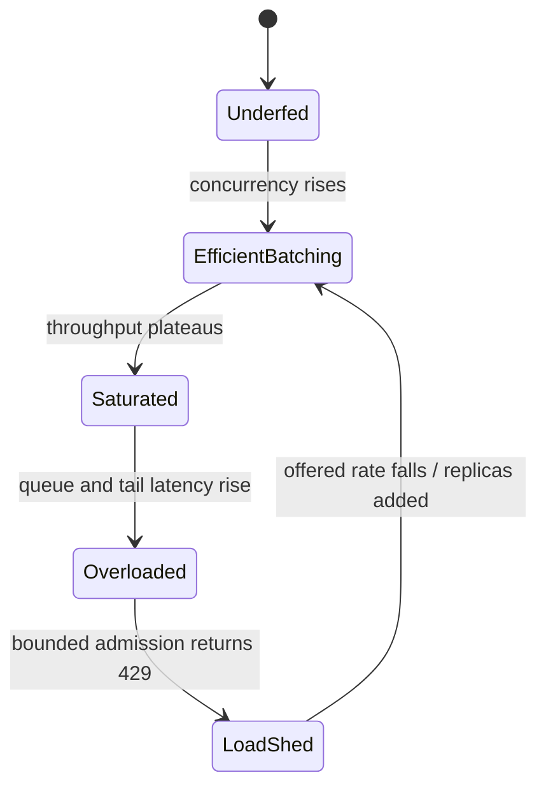
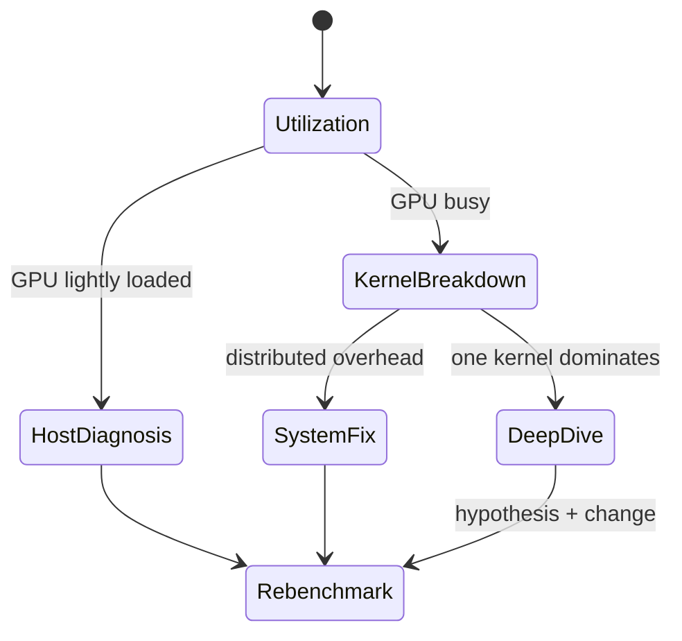

# Phase 12: Measure, Then Profile

`CPU-RUN` + `SOURCE` + `GPU-LAB`

## Measurement Planes

```text
external client       API / admission       scheduler / KV        engine / GPU
      |                      |                     |                    |
      | offered load         | 200 / 429           | CE/TG batches      | utilization
      | completed load       | queue time          | pending depth      | kernel time
      | TTFT / TPOT / ITL    | running requests    | KV use/hits        | HBM traffic
      | timeouts/cancels     | response buffers    | preemptions        | collectives
```



One number cannot identify the bottleneck.

## Latency Timeline

`SOURCE`

```text
t0 request sent
 |-- network + API + IPC queue --|
 |-- scheduler wait --|-- prefill --| t1 first token
                                      |-- decode gaps --| tN done

TTFT = t1 - t0
ITL  = each adjacent streamed-token gap
TPOT = (tN - t1) / (output tokens - 1)
E2E  = tN - t0
```



## Load Accounting

`CPU-RUN + SOURCE`

```text
offered
  = completed
  + rejected before admission (HTTP 429)
  + timed out
  + cancelled
  + other failed

accepted != completed when requests later cancel, time out, or fail
```



Never plot throughput from `offered` requests. Use completed tokens and show
every loss bucket beside them.

## CPU Semantic Sweep

`CPU-RUN`

```text
Model A / CPU / FP32 / max batch 4
40 prompts per point / random ~32 input / 8 requested output
client + server share this host

concurrency  1 -------- 2 ---------------- 4
CE batch     1          2                  4
TG batch     1          2                  4
```

| Concurrency | Offered / accepted / completed | 429 / timeout / cancel | Request/s | Output tok/s |
|------------:|-------------------------------:|-----------------------:|----------:|-------------:|
|           1 |                   40 / 40 / 40 |              0 / 0 / 0 |      5.25 |         42.0 |
|           2 |                   40 / 40 / 40 |              0 / 0 / 0 |     13.72 |        109.7 |
|           4 |                   40 / 40 / 40 |              0 / 0 / 0 |     24.84 |        198.7 |

| Concurrency | TTFT p50 / p95 / p99 ms | TPOT p50 / p95 / p99 ms | ITL p50 / p95 / p99 ms |
|------------:|------------------------:|------------------------:|-----------------------:|
|           1 |  24.70 / 81.46 / 226.84 |  15.13 / 33.41 / 152.06 | 14.95 / 36.73 / 244.53 |
|           2 |   33.39 / 41.23 / 69.42 |   15.49 / 21.60 / 22.02 |  15.34 / 16.52 / 18.20 |
|           4 |   43.49 / 48.08 / 48.36 |   16.38 / 19.90 / 22.80 |  16.28 / 18.31 / 28.12 |

| Concurrency | Mean CE/TG batch | Mean CE/TG pending | Mean admission wait | Mean KV used |
|------------:|-----------------:|-------------------:|--------------------:|-------------:|
|           1 |          `1 / 1` |            `0 / 0` |                 0.0 |       10.94% |
|           2 |          `2 / 2` |            `0 / 0` |                 0.0 |       21.88% |
|           4 |          `4 / 4` |            `0 / 0` |                 0.0 |       43.75% |

[Machine-readable summary](12_cpu_benchmark_summary.json)



```text
queue pressure    0 -------- 0 -------- 0
mean KV use    10.94% ---- 21.88% ---- 43.75%
concurrency        1          2          4
```



```text
Valid conclusion: benchmark -> server -> Prometheus wiring works;
                  scheduler formed batches of 1, 2, and 4.

Invalid conclusion: these CPU numbers predict GPU capacity or production SLOs.
```

The p99 values are descriptive only: each point has 40 requests, and the
concurrency-1 run contains a visible tail outlier. This sweep did not reach a
queueing or rejection knee.

Raw run files remain outside Git:

```text
/tmp/phase12_cpu_benchmark_v3/
  logs/results-1-median.json
  logs/results-2-median.json
  logs/results-4-median.json
  logs/results.csv
```

## Benchmark Sequence

`SOURCE`



```text
preflight -> warmup -> fixed workload -> sweep -> scrape -> reconcile -> save
```

## Sweep Matrix

`GPU-LAB`

| Question            | Fixed           | Sweep                | Read               |
|---------------------|-----------------|----------------------|--------------------|
| Best latency        | shape, model    | concurrency `1`      | TTFT, TPOT, ITL    |
| Throughput knee     | shape, model    | concurrency `1..N`   | output tok/s + p99 |
| Target arrival load | concurrency cap | request rate         | queue + rejection  |
| Prefill pressure    | output length   | input length         | TTFT + CE kernels  |
| Decode pressure     | input length    | output length        | TPOT + GEMV/MHA    |
| Prefix value        | same prompts    | unique/shared prefix | hit tokens + TTFT  |



Use [`gpu_sweep.yaml`](../labs/performance/gpu_sweep.yaml) on the future GPU
host. The server batch-size cap must cover the largest concurrency point.

## Saturation Reading

`GPU-LAB`

```text
concurrency --->

throughput     /-------- plateau
              /

TTFT p99      ________/ steep queueing rise
                       ^ choose highest point inside SLO
```



## Metric-to-Cause Map

`SOURCE`

| Signal moves                    | Inspect next                      | Likely layer             |
|---------------------------------|-----------------------------------|--------------------------|
| TTFT up, CE queue up            | pending requests, CE batch tokens | admission/scheduler      |
| TPOT/ITL up, GPU busy           | TG batch, kernel mix, HBM         | decode/hardware          |
| TTFT up, cache hits down        | prefix coverage, cache misses     | KV/prefill               |
| preemptions up, KV near 100%    | page budget, sequence lengths     | KV capacity              |
| GPU idle, queue nonzero         | host gaps, IPC, tokenization      | CPU/control path         |
| throughput flat below batch cap | batch occupancy, request shape    | scheduler/workload       |
| 429 up                          | accepted versus offered rate      | admission/fleet capacity |


## Profiling Ladder

`GPU-LAB`

```text
1. utilization snapshot
      | GPU busy?
      +-- no  -> inspect host, queue, transfer, batch size; stop
      +-- yes ->
2. short kernel breakdown (prefill/decode NVTX ranges)
      | one family dominates?
      +-- no  -> system-level fix
      +-- yes ->
3. one-kernel deep dive (ncu, filtered, <=3 launches)
```



### 1. Utilization

```bash
# Same NVIDIA host as MAX Serve
max benchmark --config-file murali_docs/labs/performance/gpu_sweep.yaml \
  --section-name benchmark_config \
  --base-url http://127.0.0.1:8000 \
  --model "$(curl -s http://127.0.0.1:8000/v1/models | jq -r '.data[0].id')" \
  --result-filename results/gpu-sweep.json
```

Read GPU utilization, memory, clocks, and throttle reasons before tracing.

### 2. Kernel Breakdown

```bash
MODULAR_ENABLE_PROFILING=detailed \
nsys launch --trace=cuda,nvtx,osrt --cuda-memory-usage=true \
  --trace-fork-before-exec=true \
  max serve --model meta-llama/Llama-3.1-8B-Instruct \
  --no-device-graph-capture

nsys start --force-overwrite=true --output=server_profile \
  --session="$(nsys sessions list -p false | awk '{print $1}')"

max benchmark --config-file murali_docs/labs/performance/gpu_sweep.yaml \
  --section-name benchmark_config \
  --model meta-llama/Llama-3.1-8B-Instruct \
  --max-concurrency 1 --max-benchmark-duration-s 12

nsys stop --session="$(nsys sessions list -p false | awk '{print $1}')"
nsys stats --report nvtx_pushpop_sum server_profile.nsys-rep
nsys stats --report cuda_gpu_kern_sum:base --timeunit msec \
  server_profile.nsys-rep
```

Expected families, not promised names:

```text
prefill: larger GEMM + attention + RoPE/norm
decode : GEMV/small GEMM + paged MHA + norm + sampling
```

### 3. One Kernel

```bash
ncu --target-processes all \
  -k 'regex:gemv_split_k' -c 3 --set full \
  -o gemv_profile \
  max generate --model meta-llama/Llama-3.1-8B-Instruct \
  --prompt hello --num-warmups 1 --max-new-tokens 8
```

```text
Nsight Systems answers: where did time go?
Nsight Compute answers: why is this kernel slow?
```

## CPU Completion Gate

```text
[x] fixed workload and model identity
[x] offered / accepted / completed / 429 / timeout / cancel accounting
[x] p50 / p95 / p99 TTFT, TPOT, and ITL
[x] CE/TG batch, pending queue, admission, and KV metrics
[x] machine-readable summary
[x] fresh end-to-end rerun during final audit
```

## GPU Acceptance Gate

```text
[ ] exact model revision + encoding + MAX revision
[ ] hardware, clocks, power, topology, driver
[ ] warmup excluded
[ ] workload seed and length distribution frozen
[ ] offered / accepted / completed / 429 / timeout / cancel
[ ] p50 / p95 / p99 TTFT, TPOT, ITL
[ ] queue, batch, KV, preemption metrics joined by time window
[ ] GPU utilization and memory
[ ] kernel profile only at the chosen operating point
[ ] repeated runs + variance
```

## Reproduce CPU Evidence

Start the CPU server from the root [README](../README.md), then:

```bash
OUT_DIR=/tmp/murali_max_cpu_benchmark \
  murali_docs/labs/performance/run_cpu_benchmark.sh
```

Summarize any saved sweep:

```bash
python3 murali_docs/labs/performance/summarize_benchmark.py \
  /tmp/murali_max_cpu_benchmark/logs/results-*-median.json
```

## Source Pins

- `max/python/max/benchmark/`: workload generation, request timing, result JSON,
  sweeps, and server-metric collection.
- `max/python/max/serve/telemetry/metrics.py`: HTTP, request, token, latency,
  queue, scheduler, KV, and data-parallel metric definitions.
- `max/python/max/serve/scheduler/utils.py`: per-batch metric calculation and
  publication.
- `docs/max/serve/benchmark.mdx`: benchmark workflow and interpretation.
- `docs/max/serve/metrics.mdx`: Prometheus metric contract.
- `docs/max/gpu-system-profiling.mdx`: Nsight Systems capture workflow.
