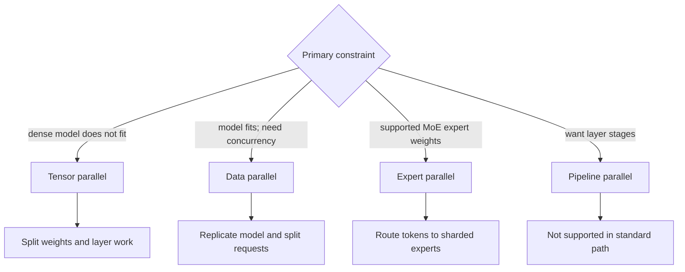
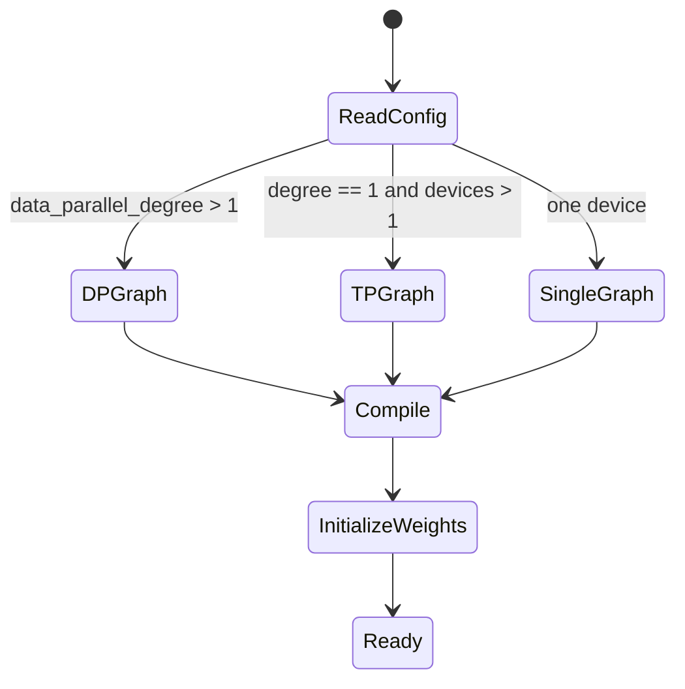
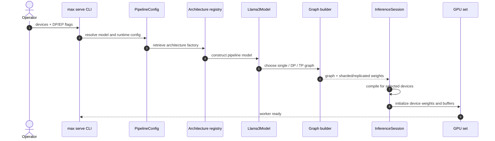
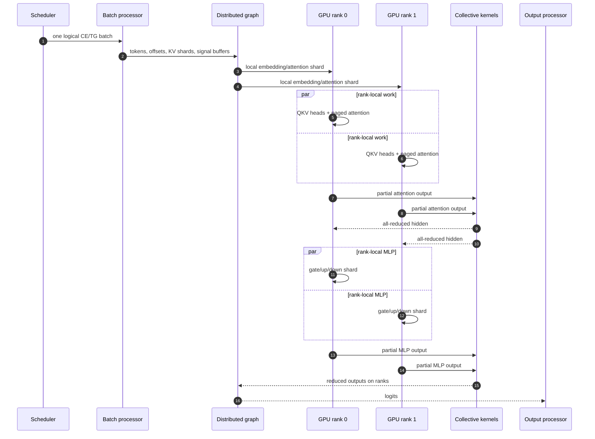
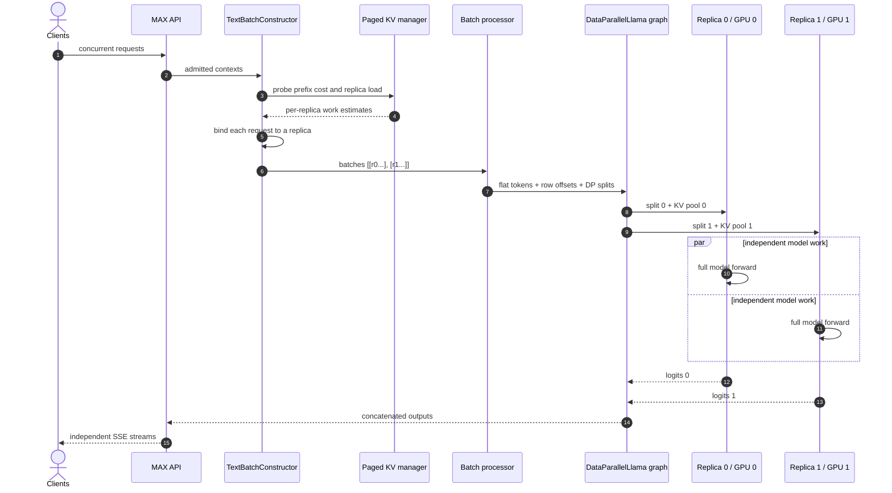
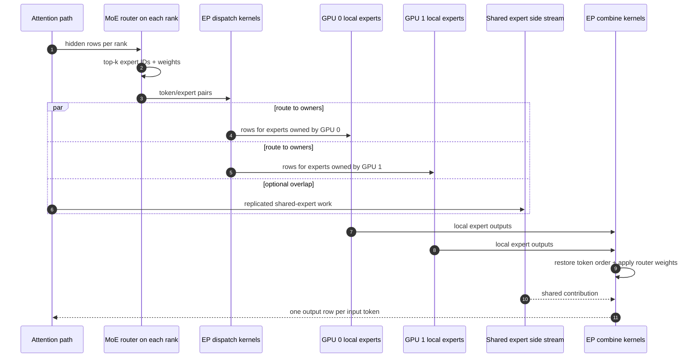
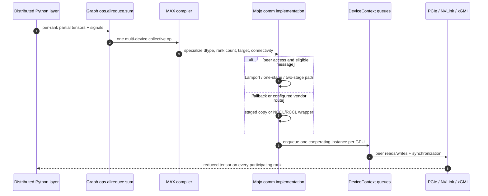
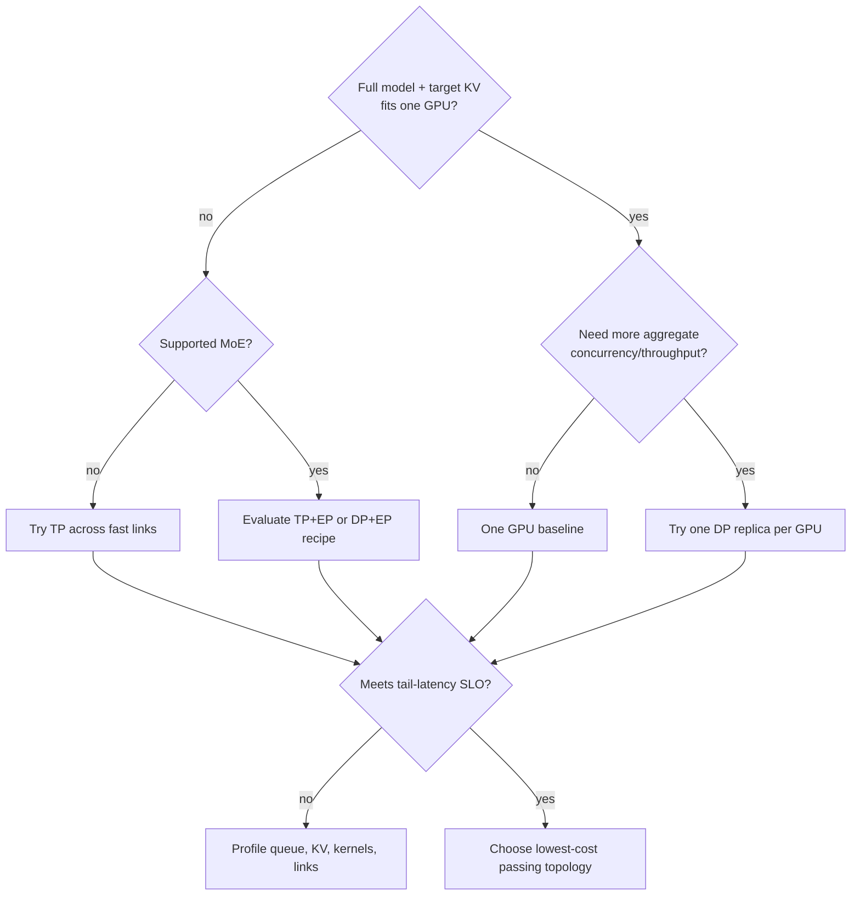
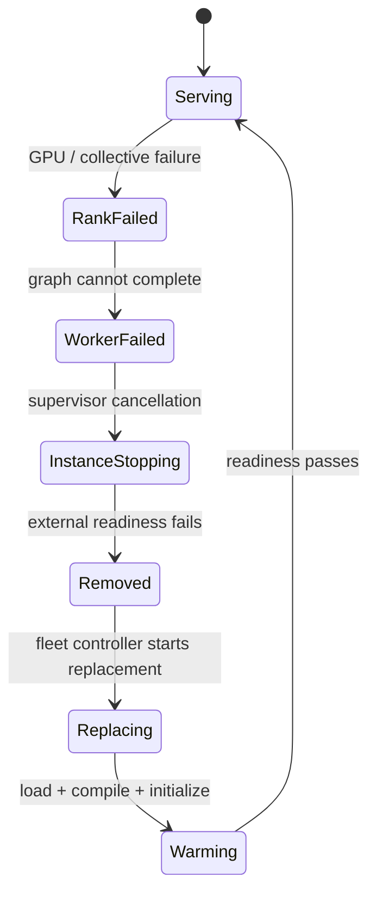

# Phase 13: Single-Node Parallelism

`SOURCE + COMPILE-ONLY + GPU-LAB`

```text
This host                    Future accelerator host
---------                    -----------------------
source paths                 TP / DP / EP runtime
graph contracts              latency + throughput
Mojo kernels                 VRAM + link traffic
      |                               |
      +----------- compare -----------+

No GPU runtime result is claimed in this artifact.
```

## Choose What To Split

`SOURCE`

```text
                         4 GPUs in one MAX Serve instance

TP: one request stream   [ W0 | W1 | W2 | W3 ]  weights + compute split
                         [------ one logical model ------]

DP: request stream       [ W ][ W ][ W ][ W ]  complete model replicas
                           R0   R1   R2   R3      requests split

EP: MoE tokens           [E0..][E.. ][E.. ][..E] routed experts split
                         dense path = TP or DP, model dependent

PP: layer stages         [L0..7] -> [L8..15] -> [L16..23] -> [L24..]
                         not supported by standard MAX Serve today
```



| Topology    | CLI shape                                            | Main unit split         | Hot-path communication              |
|-------------|------------------------------------------------------|-------------------------|-------------------------------------|
| One GPU     | `--devices gpu:0`                                    | none                    | none across GPUs                    |
| Dense TP=4  | `--devices gpu:0,1,2,3`                              | tensor/head dimensions  | collectives in layers               |
| Dense DP=4  | `--devices gpu:0,1,2,3 --data-parallel-degree 4`     | requests                | no layer collectives; output gather |
| MoE TP+EP=4 | four devices, `--data-parallel-degree 1 --ep-size 4` | dense tensors + experts | dense and expert collectives        |
| MoE DP+EP=4 | four devices, `--data-parallel-degree 4 --ep-size 4` | requests + experts      | expert dispatch/combine             |
| PP          | no standard flag                                     | layer stages            | unsupported                         |

Single-node constraints in the current guide:

```text
DP degree = 1 or number of selected GPUs
EP size   = 1 or number of selected GPUs
TP degree = inferred from devices + model-specific DP/EP mode
```

Model support is architecture-specific. A valid flag combination is not proof
that a selected architecture implements that combination.

## Graph Selection

`SOURCE`; Llama 3 path.

```text
PipelineConfig
  devices = [d0 ... dN]
  data_parallel_degree = D
             |
             v
Llama3Model._build_graph_for_compile
  D > 1 ? -------- yes ------> DataParallelLlama graph
     |
     no
     v
  N > 1 ? -------- yes ------> DistributedLlama3 TP graph
     |
     no
     v
  single-device Llama graph
```





## Tensor Parallel

`SOURCE + GPU-LAB`

```text
one scheduler batch: tokens + row offsets
                    |
                    v broadcast
       +------------+-------------+
       |            |             |
     GPU 0        GPU 1         GPU 2 ...
   Q/K/V heads  Q/K/V heads   Q/K/V heads     <- sharded
   KV heads     KV heads      KV heads         <- sharded
   local attn   local attn    local attn
       +------------+-------------+
                    | all-reduce
                    v
              full hidden state on ranks
                    |
             sharded MLP work
                    |
                 all-reduce
                    v
              next transformer block
```



### TP Ownership

| Object               | Ownership                  | Source-visible action               |
|----------------------|----------------------------|-------------------------------------|
| Request batch        | one logical batch          | offsets broadcast to all ranks      |
| QKV weights          | head/output-channel shards | `AttentionWithRope.shard()`         |
| Output projection    | input/head shards          | partial outputs are reduced         |
| MLP weights          | tensor shards              | MLP outputs are reduced             |
| RMSNorm weights      | replicated                 | one norm shard per device           |
| Vocabulary embedding | vocabulary shards          | lookup then all-reduce              |
| KV cache             | per-device head shards     | one `PagedCacheValues` per rank     |
| Signal/workspace     | one buffer per rank        | GPU barriers and collective scratch |

### One TP Block

```text
x replicated on ranks
   |
   +-> replicated RMSNorm
   +-> sharded attention -> ALLREDUCE -> residual add
   +-> replicated RMSNorm
   +-> sharded MLP       -> ALLREDUCE -> residual add
   |
next block

communication repeats inside every transformer block
```

Latency is therefore sensitive to message size, collective algorithm, topology,
and slowest-rank behavior. Quantify those only in `GPU-LAB`.

## Data Parallel

`SOURCE`; placement policy was exercised on CPU in Phase 5.

```text
                         one MAX scheduler
                                |
                   load/prefix-aware assignment
              +-----------------+-----------------+
              |                 |                 |
        replica 0 queue   replica 1 queue   replica 2 queue
              |                 |                 |
          full model        full model        full model
          KV pool 0         KV pool 1         KV pool 2
              |                 |                 |
            GPU 0             GPU 1             GPU 2

one process + one graph owns the group; replicas are not fleet replicas
```



### DP Buffers

```text
flat request order      [ A A A | B | C C | D ]
row offsets             [ 0 3 4 6 7 ]
data_parallel_splits    [ 0 2 4 ]
                          |   |
replica 0 requests      [ A, B ]  -> GPU 0 KV pool
replica 1 requests      [ C, D ]  -> GPU 1 KV pool
```

When device graph capture is active, TG replica sizes are equalized:

```text
before: GPU 0 [A B C]       GPU 1 [D]
after : GPU 0 [A B C]       GPU 1 [D PAD PAD]
                                  |_______|
                                  temporary dummy contexts + dummy KV
```

`--max-batch-size` is **per replica**. With DP=4 and batch size 32, the
instance-level ceiling is 128 requests, subject to token and KV limits.

### Cross-Replica Prefix Hit

```text
request binds to GPU 1
       |
       +-- local prefix hit? yes -> use GPU 1 pages
       |
       `-- hit only on GPU 0
              -> device-to-device copy
              -> materialize pages in GPU 1 pool
              -> continue prefill/decode on GPU 1
```

Cross-replica prefix copy is enabled by default. Measure copy bytes, TTFT, and
load skew before choosing sticky routing.

## Expert Parallel

`SOURCE + GPU-LAB`; only supported MoE architectures.

```text
tokens on source ranks
        |
        v
router: top-k expert IDs + weights
        |
        v
multi-device dispatch / allreduce-backed variant
   +----+-------------------+----+
   |                        |    |
GPU 0 experts           GPU 1 experts ... GPU N experts
   | local expert FFN       |             |
   +----+-------------------+----+
        |
        v
combine by original token + router weight
        |
        +-> optional replicated shared expert result
        v
next residual path
```



### DeepSeek Mode Map

| Mode    | Attention           | MoE                  | Residual-path collectives                            |
|---------|---------------------|----------------------|------------------------------------------------------|
| `DP_EP` | request/batch split | routed experts split | no dense residual collective                         |
| `TP_EP` | tensor split        | routed experts split | reduce-scatter after attention, all-gather after MoE |
| `TP_TP` | tensor split        | tensor-sharded MoE   | attention and MoE all-reduces                        |

Expert load imbalance is data-dependent:

```text
uniform routing             hot expert
GPU0 ████████               GPU0 ████████████████ <- step waits here
GPU1 ████████               GPU1 ███
GPU2 ████████               GPU2 ██
GPU3 ████████               GPU3 ███
```

EPLB profiling and redundant expert replicas are experimental. Validate model
support and compare the routing histogram before and after changing placement.

## Python Graph Op To Mojo Collective

`SOURCE + GPU-LAB`

```text
Distributed layer
  -> max.nn.comm.Allreduce
  -> ops.allreduce.sum
  -> one graph collective over device values + signal buffers
  -> Mojo max/kernels/src/comm/allreduce.mojo
       |
       +-> P2P available: tuned Lamport / 1-stage / 2-stage kernel
       |
       `-> no P2P: naive staged device copies
       |
       +-> vendor CCL wrappers also exist: NCCL / RCCL
  -> DeviceContext.enqueue_function
  -> GPU interconnect + memory system
```



The exact selected algorithm, bandwidth, and latency are `GPU-LAB`, not
deducible from compilation alone.

## Ownership Matrix

`SOURCE`

| Resource        | Single GPU   | TP                                     | DP                                     | EP hybrid                             |
|-----------------|--------------|----------------------------------------|----------------------------------------|---------------------------------------|
| Dense weights   | one copy     | sharded, with small replicated tensors | full copy per replica                  | TP or replicated by mode              |
| Expert weights  | local        | model-dependent TP                     | full copy per replica                  | partitioned by expert                 |
| Request         | local        | shared by all TP ranks                 | bound to one replica                   | batch shard depends on attention mode |
| KV pages        | local pool   | head shards across TP group            | separate physical replica pools        | follows attention partition           |
| Prefix hit      | local        | all ranks need corresponding shards    | local or D2D copied to bound replica   | follows attention/KV ownership        |
| Synchronization | device queue | frequent layer collectives             | common graph step; padding for capture | dispatch/combine per MoE layer        |
| Failure unit    | instance     | whole TP group                         | whole process/device group             | whole EP group                        |

## Memory And Capacity

`SOURCE + GPU-LAB`

```text
Let:
  W = model weight bytes
  K = KV bytes per live token for one unsharded model
  P = GPU count
  M = usable bytes per GPU after runtime/workspace reserve

rough feasibility checks, before allocator/layout overhead:

single: W + live_tokens*K                         <= M
TP=P  : W/P + live_tokens*K/P + per-rank overhead <= M
DP=P  : W + live_tokens_on_replica*K               <= M, for every replica
EP=P  : dense placement + expert_weights/P + KV by attention mode <= M
```



The inequalities only reject impossible layouts. Runtime choice requires the
same workload, SLO, repetition count, and memory limits.

## Failure Domains

`SOURCE + BOUNDARY`

```text
GPU/rank fault
    |
    v
multi-device graph cannot complete
    |
    v
model worker exits or stops heartbeating
    |
    v
API process tears down this MAX Serve instance
    |
    v
external load balancer must route new requests elsewhere
```



DP inside one process is not a replica-level availability boundary. Independent
MAX Serve processes behind a load balancer provide that boundary.

## GPU Comparison Card

`GPU-LAB`

```text
freeze model revision + encoding + max length + workload seed
                         |
        +----------------+----------------+
        |                |                |
      1 GPU             TP=N             DP=N
        |                |                |
        +----------------+----------------+
                         |
 compare completed load, p95/p99 TTFT + TPOT, VRAM/rank,
 utilization/rank, batch occupancy, KV pressure, link traffic,
 collective time, failures, 429/timeouts/cancellations
```

```bash
# Dense TP: one model sharded across four GPUs.
max serve --model meta-llama/Llama-3.1-8B-Instruct \
  --devices gpu:0,1,2,3

# Dense DP: four complete replicas in one process/device graph.
max serve --model meta-llama/Llama-3.1-8B-Instruct \
  --devices gpu:0,1,2,3 --data-parallel-degree 4

# Supported MoE example: TP attention + EP experts.
max serve --model nvidia/DeepSeek-V3.1-NVFP4 \
  --devices gpu:0,1,2,3,4,5,6,7 \
  --data-parallel-degree 1 --ep-size 8

# Supported MoE example: DP attention + EP experts.
max serve --model nvidia/DeepSeek-V3.1-NVFP4 \
  --devices gpu:0,1,2,3,4,5,6,7 \
  --data-parallel-degree 8 --ep-size 8
```

| Question            | Evidence to collect               | Reject topology when                    |
|---------------------|-----------------------------------|-----------------------------------------|
| Does it fit?        | peak VRAM on every rank           | any rank OOMs                           |
| Is batching useful? | CE/TG batch and DP occupancy      | ranks are persistently empty/padded     |
| Are links limiting? | collective time + link throughput | TP/EP tail dominates step               |
| Is KV balanced?     | per-rank KV pressure + preemption | one replica reaches pressure early      |
| Does it meet SLO?   | completed-load p95/p99 TTFT/TPOT  | tail fails at target arrival rate       |
| Is it resilient?    | fault injection at idle and load  | failure is not removed/replaced cleanly |

## Decision Table

| Condition                                   | First candidate                        | Why                                 | Verify                         |
|---------------------------------------------|----------------------------------------|-------------------------------------|--------------------------------|
| Dense model cannot fit one GPU              | TP                                     | shards weights and KV heads         | link cost and p99 latency      |
| Dense model fits; throughput target is high | DP                                     | independent request/KV capacity     | load balance and per-rank KV   |
| One-request latency dominates               | one GPU, then TP only if needed        | avoids unnecessary collectives      | TTFT/TPOT at concurrency 1     |
| Supported MoE expert weights do not fit     | EP hybrid                              | partitions routed experts           | dispatch skew and link cost    |
| Shared prefixes dominate                    | measure DP with cross-copy and routing | reuse can conflict with balance     | hit rate, D2D bytes, hotspots  |
| Weak interconnect                           | DP when model fits                     | avoids per-layer collectives        | PCIe/link saturation           |
| Need process-level fault isolation          | multiple MAX Serve instances           | in-process DP shares failure domain | kill and drain tests           |
| Need pipeline stages                        | external alternative                   | standard MAX Serve has no PP        | do not assume unsupported mode |

## Completion Gate

```text
[x] identify the graph-selection fork
[x] explain request, weight, and KV ownership
[x] trace TP collectives into Mojo kernels
[x] trace MoE route -> dispatch -> expert -> combine
[x] distinguish in-process DP from fleet replicas
[x] state current single-node DP/EP and PP constraints
[x] prepare a controlled GPU comparison
[ ] run GPU comparison                         [GPU-LAB]
[ ] attribute collective and interconnect cost [GPU-LAB]
```

## Source Pins

- `docs/max/serve/parallelism.mdx`: supported strategies, flags, constraints,
  hybrid examples, and current pipeline-parallel boundary.
- `max/python/max/pipelines/architectures/llama3/model.py`: single/DP/TP graph
  selection.
- `max/python/max/pipelines/architectures/llama3/data_parallel_llama.py`: model
  replication, split tensor, per-device forward, and output concatenation.
- `max/python/max/pipelines/architectures/llama3/distributed_llama.py`: TP model
  construction, signal buffers, and distributed graph inputs.
- `max/python/max/nn/attention/attention_with_rope.py`: head-aware QKV/output
  sharding and attention all-reduce.
- `max/python/max/nn/transformer/distributed_transformer.py`: replicated norms,
  MLP sharding, offset broadcast, and per-block all-reduce.
- `max/python/max/serve/scheduler/batch_constructor/text_batch_constructor.py`:
  DP placement, per-replica queues, prefix-aware CE balancing, and KV pressure.
- `max/python/max/serve/scheduler/dp_padding.py`: captured TG batch padding.
- `max/python/max/nn/moe/expert_parallel.py`: EP routing, dispatch, local expert
  compute, combine, and shared-expert overlap.
- `max/python/max/pipelines/architectures/deepseekV3/deepseekV3.py`: DP+EP,
  TP+EP, and TP+TP mode selection.
- `max/python/max/graph/ops/allreduce.py`: graph-level collective contract.
- `max/kernels/src/graph_compiler/builtin_kernels/distributed.mojo`: registered
  collective lowering and custom versus configured vendor route.
- `max/kernels/src/comm/`: Mojo all-reduce, all-gather, reduce-scatter,
  synchronization, and vendor collective implementations.
