# Phase 14: Production MAX Serve

`SOURCE + BOUNDARY + GPU-LAB`

## Boundary First

```text
                         production service

  OUTSIDE MAX SERVE                         ONE MAX SERVE INSTANCE
  -----------------                         ----------------------
  TLS / WAF / authentication                OpenAI HTTP + SSE
  tenant quota + global rate limit          request validation/tokenization
  model/version/capability routing    --->  bounded IPC admission
  fleet load balancing                      continuous batching
  replica autoscaling                       graph execution + sampling
  rollout / rollback                        paged KV + prefix cache
  regional failover                         local metrics/traces
  durable billing/audit                     worker supervision
```

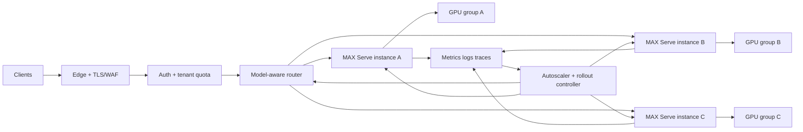

| Concern                            | MAX Serve instance   | Fleet/platform             |
|------------------------------------|----------------------|----------------------------|
| OpenAI-compatible request/SSE      | owns                 | forwards                   |
| Tokenization and detokenization    | owns                 | no                         |
| Local queue cap and HTTP 429       | owns when configured | sets policy and global cap |
| Continuous batching and KV         | owns                 | observes and sizes         |
| TP/DP/EP inside device group       | owns                 | selects topology           |
| TLS, identity, tenant quota        | no                   | owns                       |
| Model/version routing              | no                   | owns                       |
| Cross-instance retry/deduplication | no                   | owns                       |
| Replica lifecycle and replacement  | no                   | owns                       |
| Fleet SLO and durable accounting   | exports signals      | owns                       |

## Heavy-Traffic Topology

`BOUNDARY`; instance internals are `SOURCE`.

```text
┌────────────── clients / SDKs ──────────────┐
│ short chat │ long prompt │ shared prefix   │
└────────────────────┬───────────────────────┘
                     v
┌──────── edge: TLS, WAF, auth, quota, request cap ────────┐
└────────────────────┬──────────────────────────────────────┘
                     v
┌──── router: model + version + region + capability + load ─┐
└───────────────┬───────────────────────┬────────────────────┘
                |                       |
      deployment A/v1         deployment A/v2 canary
      +----------------+       +----------------+
      | MAX API proc   |       | MAX API proc   |
      | bounded ZMQ    |       | bounded ZMQ    |
      | model worker   |       | model worker   |
      | scheduler/KV   |       | scheduler/KV   |
      | graph/GPUs     |       | graph/GPUs     |
      +-------+--------+       +-------+--------+
              |                        |
              +----------+-------------+
                         v
              metrics / logs / traces
                         |
        alerts + autoscaler + rollout controller
```

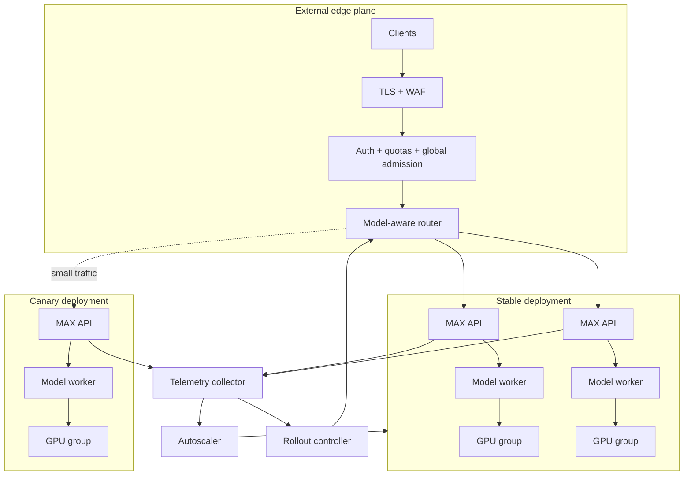

One deployment pool must have one immutable identity:

```text
model id + model revision + weight revision + architecture
+ quantization + MAX image/commit + topology + max length
+ scheduler/KV settings + graph-capture policy
```

Never mix materially different capacities behind one unlabeled pool.

## SLO Card

`BOUNDARY`; freeze targets before load testing.

```text
scope: model + version + region + request class

availability             <monthly target>
TTFT p50 / p95 / p99     <short>  <long>  <shared-prefix>
TPOT p50 / p95 / p99     <interactive stream target>
completed request rate   <steady> <burst duration>
server error ratio       <target>
steady-state 429 ratio   <target>
drain deadline           <target>
recovery time            <target>
```

```mermaid
requirementDiagram
    requirement latency {
        id: SLO-1
        text: TTFT and TPOT by request class
        risk: high
        verifymethod: test
    }
    requirement overload {
        id: SLO-2
        text: Bounded queues and explicit rejection
        risk: high
        verifymethod: test
    }
    requirement recovery {
        id: SLO-3
        text: One instance may fail without fleet outage
        risk: high
        verifymethod: test
    }
```

## One Request At Load

`SOURCE + BOUNDARY`

```text
client -> edge -> quota -> router -> MAX API -> bounded ZMQ -> scheduler
                                                           |
                    SSE <--- detokenize <--- sampler <--- graph/GPU
                                                           |
                                             metrics/traces at every plane
```

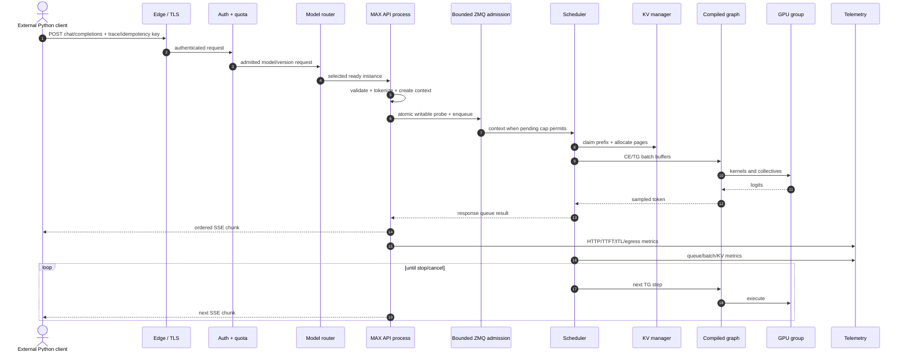

## Admission Ladder

`SOURCE + BOUNDARY`

```text
request bytes
    |
    +-- edge body/rate/quota cap ---------------- reject outside MAX
    |
    +-- MAX max_request_bytes ------------------- HTTP 413
    |
    +-- API parse/tokenize
    |
    +-- bounded IPC queue: max_queue_size = N --- HTTP 429 + Retry-After: 1
    |
    +-- scheduler pending cap = M --------------- stop draining IPC
    |
    +-- per-replica batch/token/KV limits ------- defer/preempt/progress
    |
    `-- hardware execution
```

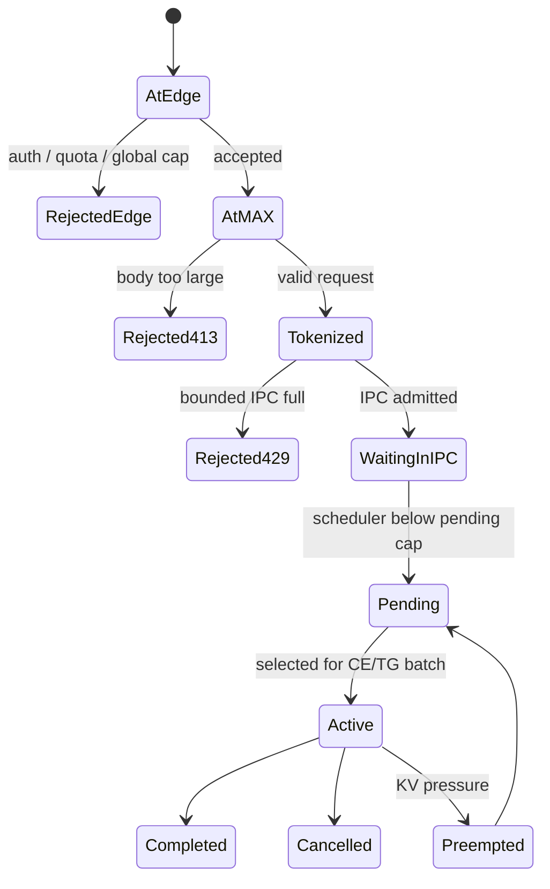

Production rule:

```text
set BOTH caps

MAX_SERVE_MAX_QUEUE_SIZE=N       bounds API -> worker backlog
MAX_SERVE_MAX_PENDING_REQUESTS=M makes worker stop draining at M

without M: worker can absorb an unbounded pending pool
without N: API -> worker backlog is unbounded
```

Choose `M >= max_batch_size`. Derive both from the measured SLO operating point,
not from available host RAM.

## Overload Sequence

`SOURCE + BOUNDARY`

```mermaid
sequenceDiagram
    autonumber
    actor C1 as Existing clients
    actor C2 as New client
    participant G as Gateway
    participant A as MAX API
    participant Z as IPC queue cap N
    participant S as Scheduler cap M
    participant K as KV cache
    participant H as GPU group
    C1->>G: sustained accepted traffic
    G->>A: requests
    A->>Z: enqueue
    Z->>S: drain until pending=M
    S->>K: batches consume KV pages
    S->>H: CE/TG iterations
    K-->>S: high pressure / allocation limits
    S->>S: prioritize TG; preempt if required
    Note over Z,S: scheduler stops pulling; IPC fills
    C2->>G: later request
    G->>A: still inside global allowance
    A->>Z: writability probe
    Z-->>A: full
    A-->>C2: HTTP 429 + Retry-After
    G->>G: reduce admission / route to healthy spare
```

```text
stable overload: bounded queue -> fast 429 -> client backoff
bad overload   : growing queue -> long timeout -> retry storm -> memory growth
```

## Retry Contract

`BOUNDARY`; MAX supplies the 429 response, not fleet-wide idempotency.

```text
                     did any response byte reach the client?
                               /                \
                             no                  yes
                             |                   |
                  explicit 429/503?         streaming began
                       /        \               |
                    yes          unknown         v
                    |              |       never transparent retry
          bounded jittered retry   |       expose partial/failure
          another ready replica    |
                                   v
                       retry only when application
                       can tolerate duplicate work
```

| Event                          | Automatic retry? | Required guard                            |
|--------------------------------|-----------------:|-------------------------------------------|
| `429` before headers/body      |     yes, bounded | honor `Retry-After`; jitter; retry budget |
| connection refusal             |     yes, bounded | route only to ready deployment identity   |
| transport loss before response |      conditional | external idempotency key/deduplication    |
| `5xx` before stream starts     |      conditional | retry budget and same model version       |
| SSE data already received      |               no | return partial/error to caller            |
| client timeout/cancel          |    no by default | propagate cancellation to free KV         |

The OpenAI-style POST is not made idempotent by MAX Serve. Any deduplication
store and replay policy belongs outside the instance.

## Routing Policy

`BOUNDARY + GPU-LAB`

```text
hard filters first                         score second
------------------                         ------------
region                                     queue/pending depth
model + exact version                      KV pressure
task/capability                            recent p95 TTFT/TPOT
encoding/topology                          active streams
tenant isolation                           prefix locality hint
readiness                                  recent failures
```

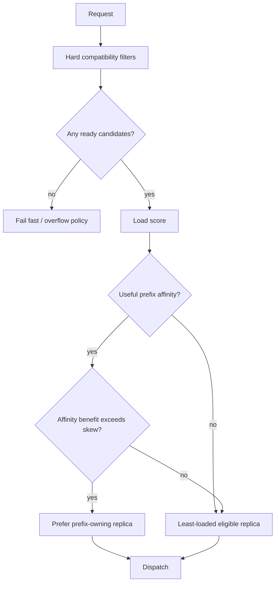

Sticky prefix routing can reduce prefill work and still damage p99 latency by
creating a hot replica. Compare cache-hit savings with queue and KV skew.

## Capacity Model

`GPU-LAB`; CPU Phase 12 numbers are wiring evidence only.

```text
measured at the target p99 SLO for one chosen GPU topology:

lambda          = peak accepted requests/s
P               = mean prompt tokens/request
O               = mean generated tokens/request
prefill_cap      = sustainable prompt tokens/s per instance
decode_cap       = sustainable output tokens/s per instance
C_live          = peak concurrent live requests
T_ctx           = conservative live context tokens/request
KV_safe          = safe live KV token slots per instance
H               = headroom factor (> 1)

R_prefill = ceil(lambda * P / prefill_cap)
R_decode  = ceil(lambda * O / decode_cap)
R_kv      = ceil(C_live * T_ctx / KV_safe)
R_ha      = minimum replicas needed after one failure

replicas = ceil(max(R_prefill, R_decode, R_kv, R_ha) * H)
```

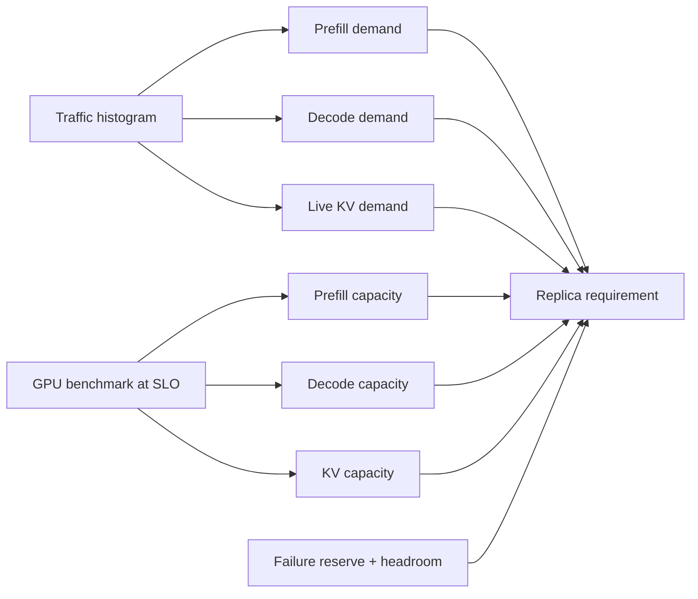

Use distributions, not only means:

```text
prompt-length histogram x arrival rate -> prefill load
output-length histogram x arrival rate -> decode load
live context-age distribution          -> KV occupancy
burst duration                         -> queue budget
cold-start duration                    -> spare capacity requirement
```

## Autoscaling State Machine

`BOUNDARY + GPU-LAB`

```text
leading signals                         lagging signals
---------------                         ---------------
arrival-rate forecast                   p95/p99 TTFT
admission backlog                       p95/p99 TPOT
scheduler pending depth                 429 / timeout rate
KV pressure trend                       completed tok/s
```

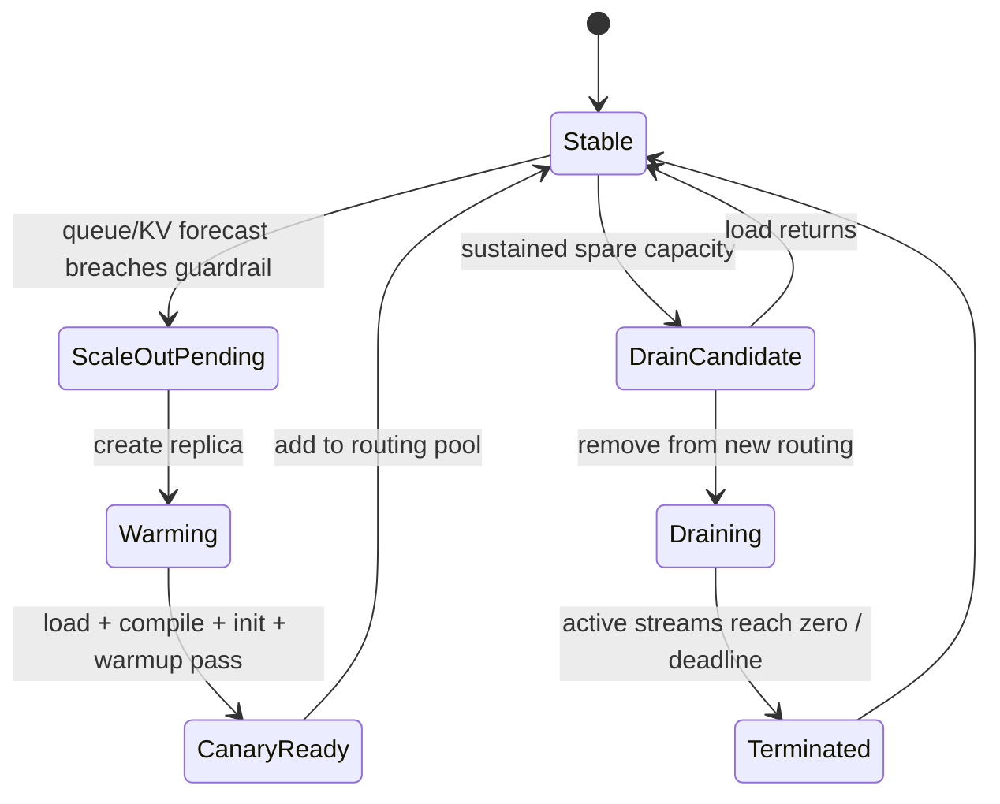

Do not scale solely on GPU utilization. A lightly utilized GPU can coexist with
host tokenization, IPC, queue, or slow-client bottlenecks.

## Readiness, Liveness, Drain

`SOURCE + BOUNDARY`

```text
process spawn
  -> driver/pinned memory
  -> model build + compile + initialize
  -> optional graph-capture warmup
  -> scheduler + IPC queues
  -> worker readiness event
  -> API proxy waits for ZMQ connection
  -> serving context yields
  -> uvicorn starts accepting traffic
```

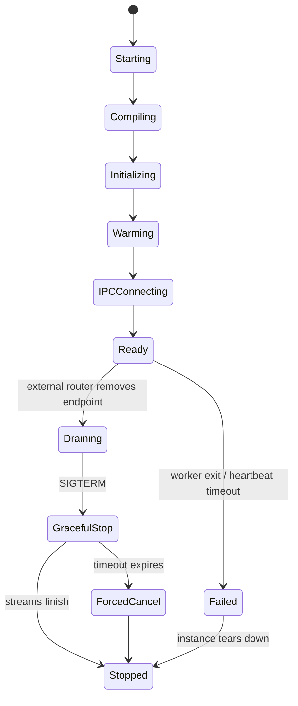

| Probe/transition   | Current behavior                              | Production interpretation                       |
|--------------------|-----------------------------------------------|-------------------------------------------------|
| startup gate       | worker ready and IPC connected before serving | safe to add only after HTTP responds            |
| `/health`          | shallow `200`                                 | process/readiness signal, not model correctness |
| `/v2/health/live`  | shallow response                              | process liveness only                           |
| `/v2/health/ready` | shallow response                              | listener readiness only                         |
| worker crash       | cancels API serving task                      | external supervisor replaces instance           |
| optional heartbeat | detects missed worker progress                | timeout must tolerate long batches              |
| SIGTERM            | uvicorn waits up to graceful timeout          | remove from routing before signal               |
| drain endpoint     | not present in traced standard path           | fleet must stop new routing first               |

### Drain Sequence

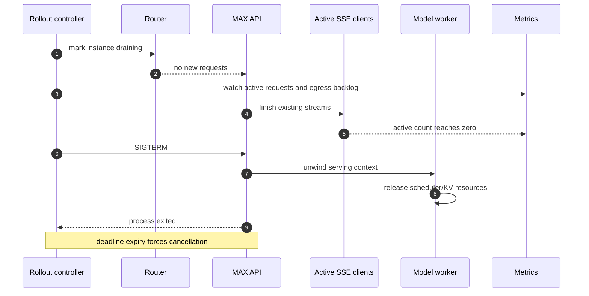

## Rollout And Rollback

`SOURCE + BOUNDARY + GPU-LAB`

```text
build immutable image
   -> start zero-traffic replica
   -> load weights
   -> build/compile graph
   -> initialize buffers
   -> graph-capture warmup
   -> readiness + correctness smoke
   -> tiny canary
   -> SLO/error comparison
   -> progressive traffic
   -> drain old version
```

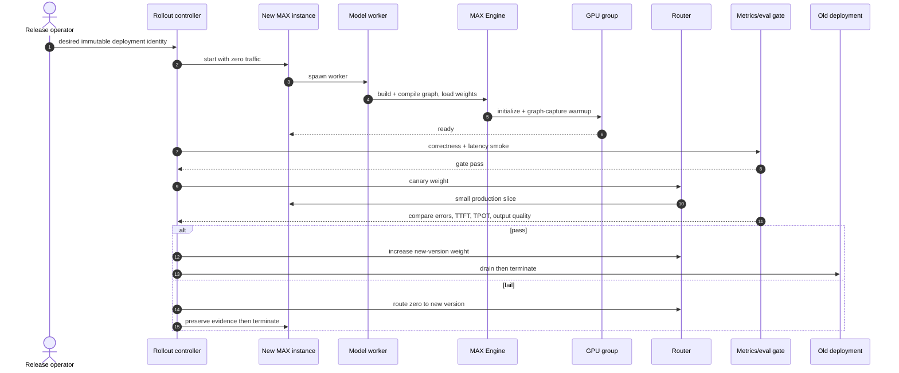

Rollback changes routing first. Deleting a bad replica before collecting logs,
traces, compile diagnostics, and the exact deployment identity destroys the
most useful evidence.

## Failure And Recovery

`SOURCE + BOUNDARY`

```text
detect -> stop new work -> preserve evidence -> fail/finish streams
       -> replace capacity -> warm -> verify -> restore routing
```

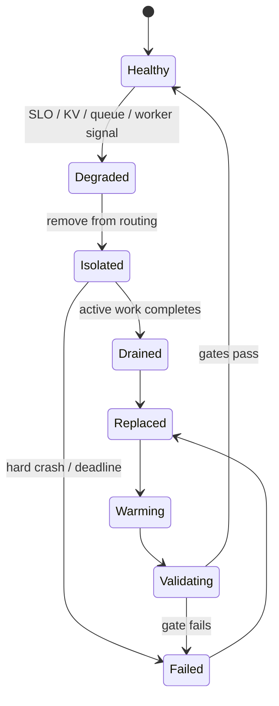

| Failure                   | Visible signal                     | Instance behavior                  | Fleet action                              |
|---------------------------|------------------------------------|------------------------------------|-------------------------------------------|
| load exceeds service rate | pending/awaiting rise; 429         | bounded rejection if both caps set | global shed, retry budget, scale out      |
| KV exhaustion/pressure    | KV %, preemptions, TTFT tail       | prioritize TG; may preempt         | route away, shorten limits, add capacity  |
| model worker crash        | process exit/logs                  | API serving task tears down        | remove endpoint; replace whole instance   |
| one TP/EP rank fails      | graph/collective failure           | device group cannot finish         | replace whole instance                    |
| heartbeat false positive  | heartbeat timeout                  | instance exits                     | lengthen timeout; inspect long prefill    |
| compile/init failure      | no readiness; startup metrics/logs | never serves                       | halt rollout; keep old pool               |
| slow SSE consumer         | egress backlog/queue time          | output buffers accumulate          | edge/client timeout policy; cancel        |
| client disconnect         | cancellation count                 | cancellation sent to worker        | no retry unless caller starts new request |
| prefix-affinity hotspot   | high hits plus queue/KV skew       | one replica saturates              | weaken affinity; load-aware route         |
| telemetry outage          | scrape/export gap                  | serving may be opaque              | alert from collector and process probes   |

## Observability Board

`SOURCE + BOUNDARY`

```text
CLIENT             API / IPC             SCHEDULER / KV        HARDWARE
------             ---------             --------------        --------
offered rate       HTTP codes            CE/TG batch           GPU busy
completed rate     awaiting admission    pending/running        VRAM
TTFT/TPOT/ITL      response backlog      KV used/pressure       link traffic
disconnects        queue wait            hits/preemptions       kernel timeline
```

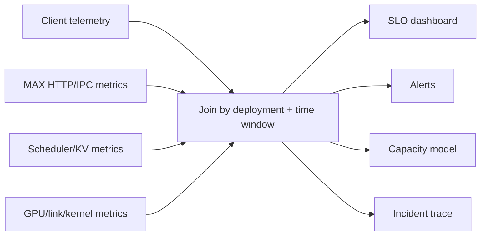

Minimum alert set:

| Alert                    | Correlate before acting                                |
|--------------------------|--------------------------------------------------------|
| p99 TTFT over SLO        | API backlog, CE queue, prefix hits, prefill batch time |
| p99 TPOT/ITL over SLO    | TG batch, GPU/link utilization, kernel time            |
| sustained 429 ratio      | offered versus completed rate, ready spare capacity    |
| KV pressure/preemption   | live contexts, max length, replica skew                |
| low DP occupancy         | per-rank active/context token occupancy, padding       |
| egress backlog           | client read rate, network, stream chunking             |
| worker restart/heartbeat | long batch duration, OOM, collective failure           |
| startup time regression  | build, compile, init, graph capture components         |

## Security And Tenancy

`SOURCE + BOUNDARY`

```text
internet
  -> TLS + WAF + IP policy                     [fleet]
  -> authentication + authorization            [fleet]
  -> tenant quota + token/request accounting   [fleet]
  -> request/media byte caps                   [fleet + MAX]
  -> model/capability allowlist                 [fleet]
  -> MAX request validation                    [MAX]
  -> isolated deployment pool                  [fleet]
  -> redacted logs/traces                      [fleet policy]
```

| Asset                      | Required control                                    |
|----------------------------|-----------------------------------------------------|
| prompts and generated text | encryption, retention policy, log redaction         |
| model/adapter weights      | authenticated storage, checksum, immutable revision |
| API keys and HF tokens     | secret manager; never command history or image      |
| tenant budgets             | external authoritative quota/accounting             |
| prefix/KV reuse            | isolation policy before sharing across tenants      |
| admin/internal endpoints   | private network and authorization                   |
| media URLs                 | egress policy plus MAX size/SSRF validation         |

Use separate deployment pools when tenants require hard memory, cache, model,
or failure isolation. Scheduler fairness is not an authorization boundary.

## Experimental P/D Extension

`SOURCE + GPU-LAB`; experimental, not the baseline design.

```text
client -> router -> DECODE MAX Serve
                    | dispatch prompt
                    v
                 PREFILL MAX Serve -> prefill GPU
                    |
                    | NIXL KV transfer (UCX/libfabric/UCCL)
                    v
                 decode GPU -> SSE to client
```

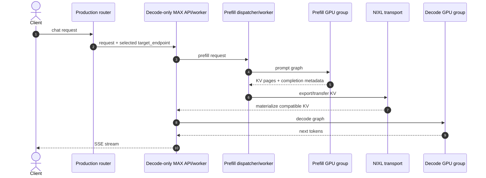

Required gates:

```text
[ ] supported model and identical model/KV configuration
[ ] reachable dispatcher endpoint injected by trusted router
[ ] transfer backend validated on actual fabric
[ ] unique HTTP and metrics ports per process
[ ] prefill and decode pools sized independently
[ ] transfer failure and stale-endpoint behavior tested
[ ] co-located baseline wins/loses by measured SLO and cost
```

## Production Experiment Ladder

`GPU-LAB`

```text
1 one request correctness
  -> 2 steady load below SLO
  -> 3 open-loop saturation
  -> 4 bounded 429 overload
  -> 5 skewed prompt/output/tenant mix
  -> 6 KV pressure + cancellation
  -> 7 idle and active replica kill
  -> 8 graceful drain with SSE
  -> 9 cold-to-warm canary rollout
  -> 10 rollback under traffic
```

| Experiment       | Pass condition                                                 |
|------------------|----------------------------------------------------------------|
| sustainable load | completed rate is stable and p99 meets SLO                     |
| overload         | memory bounded; rejection is explicit; recovery is fast        |
| worker death     | endpoint removed; other replicas preserve service              |
| active drain     | no new work; streams finish or hit declared deadline           |
| rollout          | new revision warms before traffic and passes quality/SLO gates |
| rollback         | routing returns to old pool before failed pool teardown        |
| skew test        | no tenant or long-prompt class silently starves                |
| observability    | every injected failure creates an actionable signal            |

## Deployment Checklist

```text
[ ] immutable deployment identity and checksums
[ ] topology chosen with Phase 13 GPU evidence
[ ] max request bytes set at edge and MAX
[ ] MAX queue cap N and scheduler pending cap M set
[ ] explicit client/server timeouts and retry budget
[ ] startup/readiness deadline covers compile + warmup
[ ] heartbeat decision tested with longest prefill
[ ] external drain before SIGTERM
[ ] graceful timeout matches stream policy
[ ] minimum warm replicas cover one failure
[ ] canary includes output-quality evaluation
[ ] four-plane dashboard and SLO alerts
[ ] secrets, logs, prefix reuse, and tenant isolation reviewed
```

## Completion Gate

```text
[x] separate instance and fleet responsibilities
[x] define bounded overload and retry behavior
[x] define model-aware routing and prefix-affinity tradeoff
[x] provide capacity and autoscaling model
[x] define startup, readiness, drain, and shutdown contracts
[x] define canary rollout and rollback
[x] map failures to detection, containment, and recovery
[x] map observability and security boundaries
[x] place P/D disaggregation behind an experimental gate
[ ] execute production fault/load experiments [GPU-LAB]
```

## Source Pins

- `max/python/max/_entrypoints/cli/serve/serve_api_and_model_worker.py`: startup
  ordering, API/worker shared lifetime, worker-crash teardown, and SIGTERM path.
- `max/python/max/serve/api_server.py`: worker startup, HTTP routes, queue-full
  mapping to 429, request-size middleware, metrics mount, and uvicorn timeout.
- `max/python/max/serve/config.py`: queue caps, pending cap, heartbeat, request
  size, keepalive, and graceful-shutdown settings.
- `max/python/max/serve/worker_interface/zmq_interface.py`: atomic admission,
  response routing, cancellation, and ingress/egress backlog measurement.
- `max/python/max/serve/process_control.py`: readiness event, heartbeat watcher,
  subprocess failure propagation, SIGTERM, and SIGKILL fallback.
- `max/python/max/serve/pipelines/model_worker.py`: compile/init/warmup timing,
  scheduler loop, readiness, and KV shutdown.
- `max/python/max/serve/scheduler/batch_constructor/text_batch_constructor.py`:
  CE/TG queues, DP placement, KV-pressure priority, and preemption.
- `docs/max/serve/metrics.mdx`: request, queue, scheduler, KV, DP, startup, and
  disaggregated-inference metrics.
- `docs/max/serve/prefill-decode-disaggregation.mdx`: experimental roles,
  routing contract, KV compatibility, and NIXL backends.
