# Capstone: One Request, One Fleet, The Whole Stack

`CPU-RUN + SOURCE + TEST + COMPILE-ONLY + GPU-LAB + BOUNDARY`

Source baseline: `8bba6b588c`, 2026-10-04.

## Scenario

```text
model A / executed here                 model B / production study
-----------------------                 --------------------------
SmolLM-135M-Instruct-FP32               Llama-3.1-8B-Instruct
CPU correctness + traces                GPU topology + profiling
real MAX Serve process                  source/compile proof here
                                        runtime proof on GPU host
```

```text
traffic mix
  70% short interactive    input 64..512       output 32..256
  20% long document        input 4K..32K        output 64..512
  10% shared prefix        common 2K + user     output 64..256

plus: cancellations + a 2x burst + streaming and non-streaming calls
```

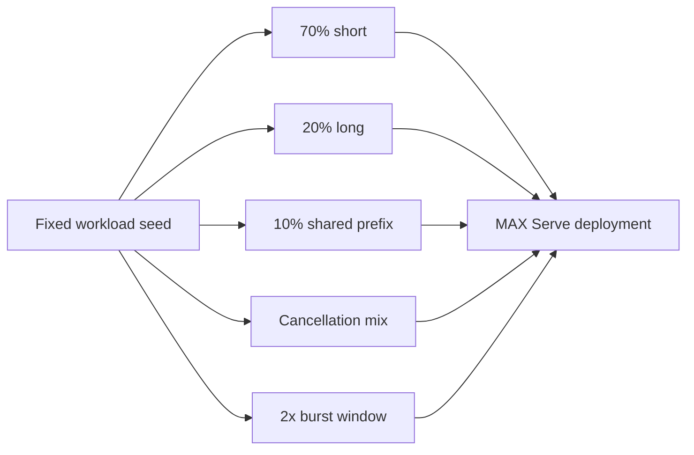

The ranges above define the learning workload, not measured capacity.

## Evidence Lanes

```text
CPU-RUN                         COMPILE-ONLY                  GPU-LAB
-------                         ------------                  -------
real HTTP/SSE                   CUDA sm_80 MEFs               real accelerator latency
real API + worker processes     HIP gfx942 MEFs               HBM/link utilization
real scheduler decisions        signatures + hashes           kernel timeline
real KV policy objects          target-specific bytes         TP/DP/EP comparison
real CPU throughput             no device execution           production capacity
```

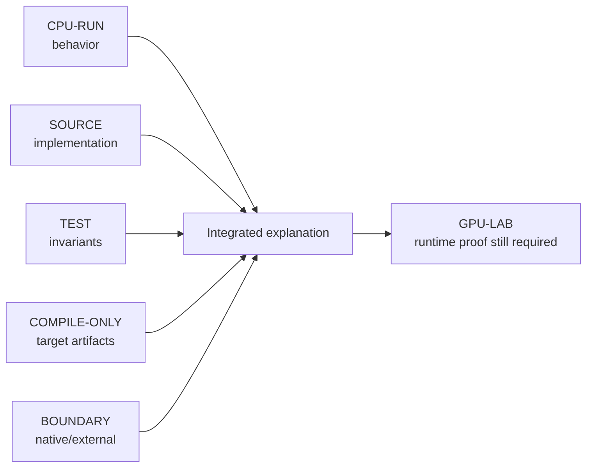

| Proof           | Completed result                                          |
|-----------------|-----------------------------------------------------------|
| CPU server      | real OpenAI requests and streaming on Model A             |
| startup         | 59.3 s from re-exec to ready on recorded CPU run          |
| request mapping | JSON -> 22 prompt IDs -> `TextContext` traced             |
| IPC overload    | bounded fault injection produced 105 HTTP 429 responses   |
| scheduler       | mixed CE/TG, chunking, preemption, DP placement traced    |
| graph           | CUDA/HIP MEFs exported; CPU MEFs re-imported successfully |
| KV              | 46,080 B/token; lifecycle and prefix invariants exercised |
| benchmark       | 40/40 completions at concurrency 1, 2, and 4 on CPU       |
| GPU runtime     | intentionally not run: this host has no accelerator       |

## Complete Architecture

`SOURCE + BOUNDARY`

```text
external Python app
  |
  | OpenAI JSON / SSE
  v
edge + auth + quota + model router                         [fleet boundary]
  |
  v
MAX API process
  route -> schema -> message parser -> tokenizer -> TextContext
  |
  | msgpack/numpy over bounded ZeroMQ
  v
MAX model-worker process
  request queue -> scheduler -> CE/TG batch -> batch processor
                                      |
                                      v
                   ragged tokens + row offsets + KV metadata
                                      |
                                      v
                         compiled model + sampler graphs
                                      |
                     +----------------+----------------+
                     |                                 |
              graph-native ops                 named custom ops
              e.g. matmul                       e.g. paged MHA
                     |                                 |
                     +------------+--------------------+
                                  v
                       compiler/runtime native boundary
                                  |
                                  v
                     Mojo specialization + dispatch
                                  |
                                  v
                   DeviceContext queue -> CPU/GPU hardware
                                  |
                                  v
                 logits -> sampled token -> host visibility
                                  |
                                  v
                worker response -> detokenize -> SSE -> client
```

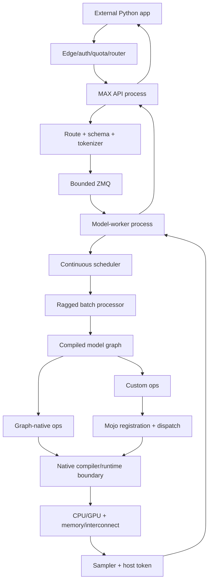

## Startup Trace

`CPU-RUN + SOURCE + BOUNDARY`

```text
CLI config -> registry -> tokenizer/factory/memory plan -> API lifespan
  -> spawn model worker -> load/adapt weights -> build graph
  -> compile -> initialize -> optional capture warmup -> scheduler
  -> IPC handshake -> ready -> start accepting HTTP
```

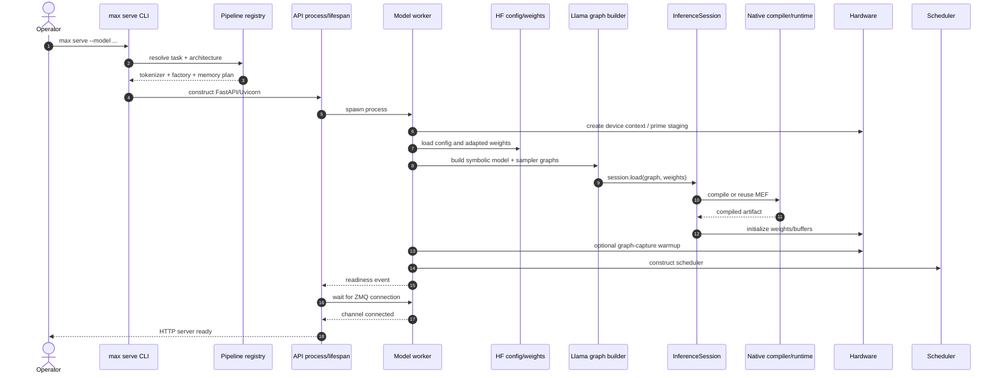

### Recorded CPU Startup

```text
re-exec  0.0s
task     6.1s
worker   9.6s
compile 20.7s ........ 48.8s
ready   59.3s

compile dominated this cold process start; model download cache was warm
```

| Startup component | Recorded Model A CPU time |
|-------------------|--------------------------:|
| process spawn     |                3,603.9 ms |
| graph build       |                  911.7 ms |
| graph compile     |               44,386.9 ms |
| initialize        |                   29.5 ms |
| graph capture     |      0.0 ms, CPU disabled |
| worker total      |               49,541.6 ms |

Drill-down: [Phase 2](02_startup_topology.md) and
[Phase 8](08_graph_compilation.md).

## One Streaming Request

`CPU-RUN + SOURCE`

Canonical ID: `murali-cap-001`.

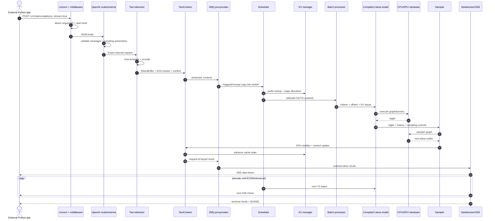

```text
JSON
  -> validated request
  -> normalized messages
  -> rendered prompt text
  -> int64 token IDs
  -> mutable TextContext
  -> serialized worker-side TextContext
  -> scheduled CE/TG context
  -> ragged tensors + KV page table
  -> logits
  -> sampled int64 token
  -> decoded text delta
  -> SSE frame
```

Drill-down: [Phase 1](01_external_contract.md),
[Phase 3](03_request_object_trace.md), and
[Phase 4](04_ipc_backpressure.md).

## Buffer Passport

`CPU-RUN + SOURCE + COMPILE-ONLY`

```text
three contexts                    one ragged input buffer

prefill  [10 11 12 13] --+       [10 11 12 13 | 120 | 130]
decode A [120] -----------+----->  ^             ^     ^
decode B [130] -----------+       0             4     5  6

row offsets: [0, 4, 5, 6]
```

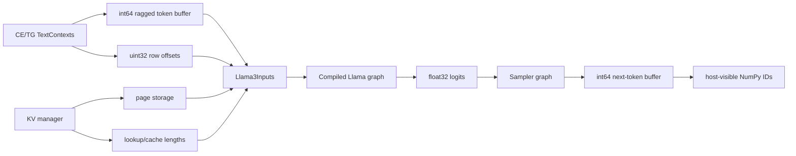

CUDA `sm_80` compile-only Model A signature:

| Buffer               | Shape                               | Location |
|----------------------|-------------------------------------|----------|
| tokens               | `[total_seq_len]`                   | `gpu:0`  |
| row offsets          | `[input_row_offsets_len]`           | `gpu:0`  |
| return-logit control | symbolic                            | `cpu:0`  |
| KV pages             | `[pages,2,30,128,3,64]`             | `gpu:0`  |
| logits               | `[input_row_offsets_len - 1,49152]` | `gpu:0`  |

Drill-down: [Phase 6](06_batch_to_token.md).

## Scheduler Under Mixed Load

`CPU-RUN + SOURCE`

```text
iteration    1             2                 3             4
          +---------+  +-------------+  +-----------+  +-------+
A         | CE 4    |->| TG 1        |->| TG 1      |->| TG 1  | done
B         | CE 3    |->| TG 1        |->| TG 1 done |
C                       | CE 5 joins |->| TG 1      |->| TG 1  | done
          +---------+  +-------------+  +-----------+  +-------+
tokens        7             7                3            2
```

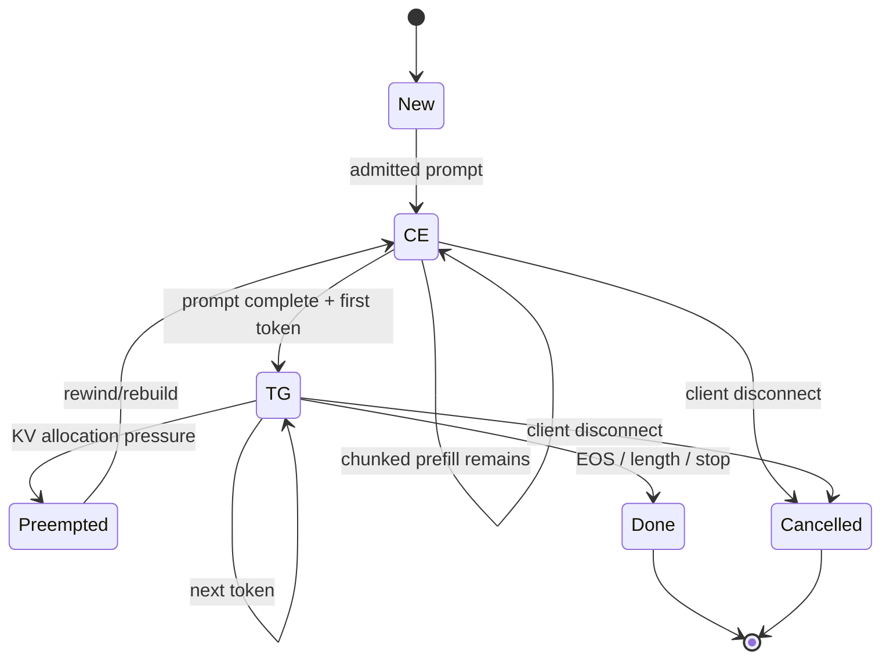

Selection gates:

```text
request count cap
    AND active-token budget
    AND optional total-context budget
    AND KV page availability
    AND CE/TG priority
    AND replica placement
    -> executable batch
```

Drill-down: [Phase 5](05_scheduler_trace.md).

## The Pressure Incident

`SOURCE + BOUNDARY`; GPU utilization in this scenario is `GPU-LAB`.

```text
time --->

short A/B/C    TG TG TG TG TG TG TG
long L            wait CE1 CE2 CE3 ... first token
KV use         78 84 91 94 97 preempt/release
pending         2  5  9  M  M  M
IPC queue       0  1  4  8  N  N
new clients     ok ok ok wait 429 429
TTFT                  rising for new prefills
GPU busy        high in the future measured scenario
```

```mermaid
sequenceDiagram
    autonumber
    actor D as Short-request clients decoding
    actor L as Long-prompt client
    actor N as Later clients
    participant LB as Fleet router
    participant A as MAX API
    participant Z as Bounded IPC queue N
    participant S as Scheduler pending cap M
    participant K as KV manager
    participant G as Compiled graph
    participant H as GPU group
    D->>A: active SSE streams
    S->>G: TG batch for short requests
    G->>H: decode kernels
    L->>LB: long prompt
    LB->>A: route to instance
    A->>Z: admitted context
    Z->>S: pending CE
    S->>K: prefix lookup + page demand
    Note over S,K: chunk prefill around token/KV budgets
    K-->>S: pressure crosses TG-priority threshold
    S->>G: prioritize TG to drain live sequences
    G->>H: sustained decode + CE work
    Note over L,S: long request waits/chunks; TTFT rises
    alt KV allocation cannot fit selected TG set
        S->>K: preempt newest candidate and free pages
        K-->>S: victim returns to CE for rebuild
    end
    Note over Z,S: pending=M stops worker drain; IPC reaches N
    N->>LB: new request
    LB->>A: no spare selected
    A->>Z: atomic writability probe
    Z-->>A: full
    A-->>N: HTTP 429 + Retry-After
    LB->>LB: shed, back off, or route to warmed spare
```

### Causal Chain

```text
long prompt
  -> large CE token demand
  -> chunked or deferred prefill
  -> longer wait to first sampled token
  -> TTFT rises

many live decodes
  -> one KV history per request
  -> page pressure rises
  -> TG priority / possible preemption

arrival rate > completed rate
  -> scheduler pending reaches M
  -> worker stops draining IPC
  -> IPC reaches N
  -> API rejects later requests with 429

high GPU utilization
  -> confirms hardware is busy only when measured
  -> does not alone prove the root cause
```

### Signals To Correlate

| Observation         | Required companion signal                            |
|---------------------|------------------------------------------------------|
| TTFT rises          | CE wait, batch tokens, prompt shape                  |
| TPOT rises          | TG step time, batch size, kernel/link time           |
| KV near full        | preemptions, live contexts, page demand              |
| pending reaches cap | IPC awaiting admission and 429 count                 |
| GPU busy            | completed token rate and kernel breakdown            |
| 429 rises           | offered, accepted, completed, timeout, cancel counts |

## Graph Setup And Reuse

`SOURCE + COMPILE-ONLY + BOUNDARY`

```text
HF config + adapted state dict
             |
             v
        Llama3Config
             |
             v
       Llama3 module
             |
             v
Graph(input types) -> symbolic forward -> graph outputs
             |
             v
InferenceSession.load
  -> compile/reuse MEF
  -> initialize with weights
  -> executable Model
             |
             +---------- execute changing ragged buffers ----------+
```

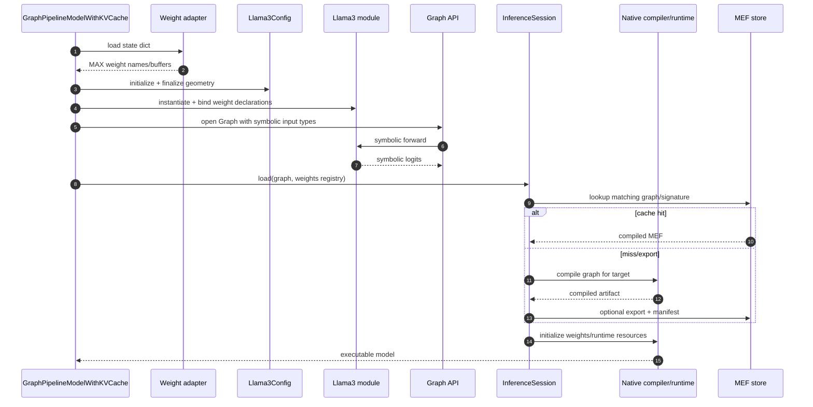

```text
compile once at startup
execute once per scheduler iteration
do not confuse compile latency with token latency
```

Cross-compile evidence:

| Target       |  Model | Sampler | Future token | MEFs |     Bytes | Runtime |
|--------------|-------:|--------:|-------------:|-----:|----------:|---------|
| CUDA `sm_80` | 53.6 s |  10.4 s |        8.0 s |    4 | 3,564,123 | not run |
| HIP `gfx942` | 70.2 s |  14.5 s |        7.9 s |    4 | 6,375,651 | not run |

CPU reuse evidence:

```text
export process: model compile 20.8 s | sampler compile 0.9 s
import process: model compile  0.0 s | sampler compile 0.0 s

accelerator MEF initialization still requires a real matching GPU
```

Drill-down: [Phase 7](07_model_resolution.md),
[Phase 8](08_graph_compilation.md), and
[Phase 9](09_graph_api_vs_modulev3.md).

## Python To Mojo To Hardware

`SOURCE + COMPILE-ONLY + GPU-LAB`

```text
AttentionWithRope.__call__                         Python
  -> max.nn.kernels.flash_attention_ragged
  -> ops.inplace_custom("mo.mha.ragged.paged")    graph op
  -> @extensibility.register(...)                  Mojo boundary
  -> rebuild paged-cache view
  -> select CPU or GPU path
  -> specialize target/dtype/head depth/mask
  -> choose prefill/decode implementation
  -> DeviceContext.enqueue_function                launch API
  -> grid / blocks / warps / memory                 hardware
```

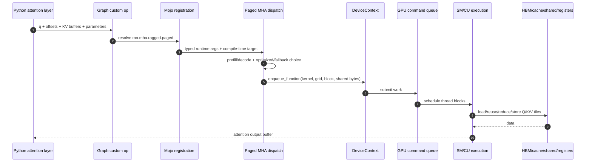

### GPU Optimization Loop

```text
correctness oracle
  -> end-to-end utilization
  -> timeline: prefill vs decode vs gaps vs collectives
  -> dominant kernel only
  -> inspect occupancy / memory / instructions
  -> one change
  -> parity test
  -> same benchmark and variance
  -> keep only SLO/cost win
```

| Workload       | Likely kernel question                         | Required proof                 |
|----------------|------------------------------------------------|--------------------------------|
| long prefill   | GEMM/attention compute or HBM bound?           | timeline + hardware counters   |
| batch-1 decode | launch, GEMV, paged-attention reads?           | gaps + memory throughput       |
| batched decode | occupancy improves until where?                | throughput and p99 sweep       |
| TP             | do all-reduces dominate small decode messages? | collective/link trace          |
| EP             | are hot experts or dispatch/combine limiting?  | routing histogram + link trace |

Drill-down: [Phase 10](10_python_to_mojo_to_hardware.md) and
[Phase 13](13_parallelism.md).

## KV Memory Card

`CPU-RUN + SOURCE + TEST`

```text
Model A FP32

bytes/token = 2 x layers x KV_heads x head_dim x dtype_bytes
            = 2 x 30 x 3 x 64 x 4
            = 46,080 B

128-token page = 5,898,240 B = 5.625 MiB
ideal 1 GiB    = 182 pages = 23,296 token slots
```

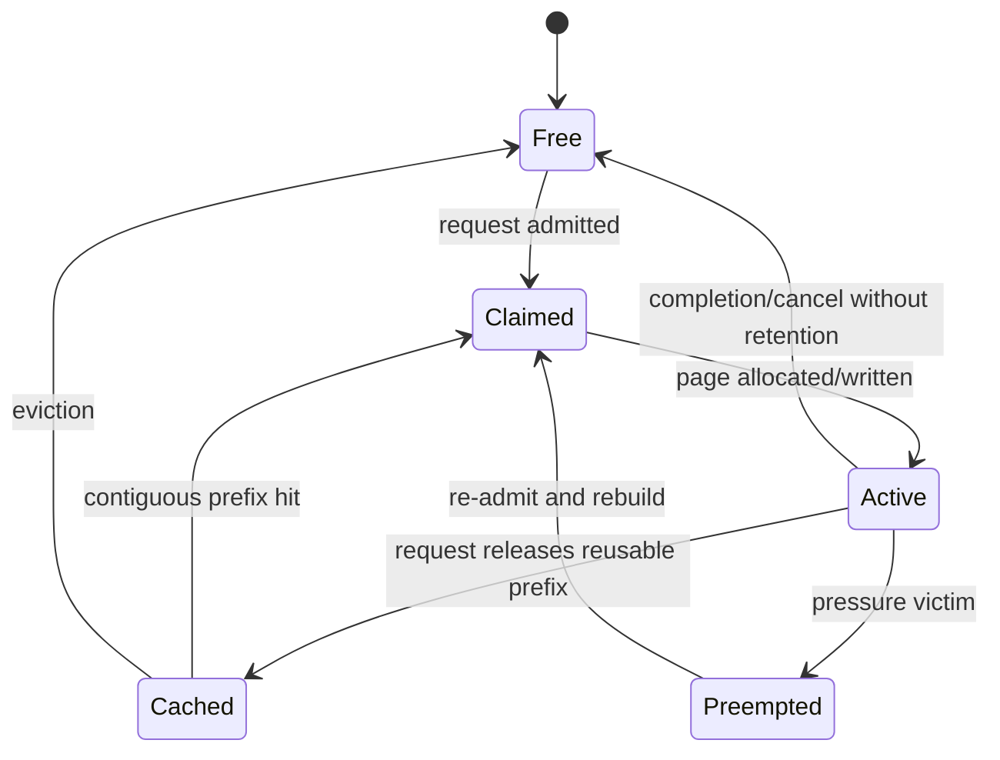

```text
logical request pages [p0 p1 p2]
                         | hash-chain lookup
physical pool          [17][03][91][44]...
                         |
prefix hit              contiguous pages only
                         |
DP remote hit           optional D2D materialization into bound replica
```

Observed prefix probe:

```text
contiguous matching chain -> 3 hits
gap in matching chain     -> 1 hit
16-token cached prefix    -> skipped 16, left 1 active token
```

Drill-down: [Phase 11](11_kv_cache.md).

## Benchmark Truth Table

`CPU-RUN`; semantic smoke test, not GPU capacity.

| Concurrency | Completed | Request/s | Output tok/s |    TTFT p50/p95/p99 ms |    TPOT p50/p95/p99 ms |
|------------:|----------:|----------:|-------------:|-----------------------:|-----------------------:|
|           1 |     40/40 |      5.25 |         42.0 | 24.70 / 81.46 / 226.84 | 15.13 / 33.41 / 152.06 |
|           2 |     40/40 |     13.72 |        109.7 |  33.39 / 41.23 / 69.42 |  15.49 / 21.60 / 22.02 |
|           4 |     40/40 |     24.84 |        198.7 |  43.49 / 48.08 / 48.36 |  16.38 / 19.90 / 22.80 |

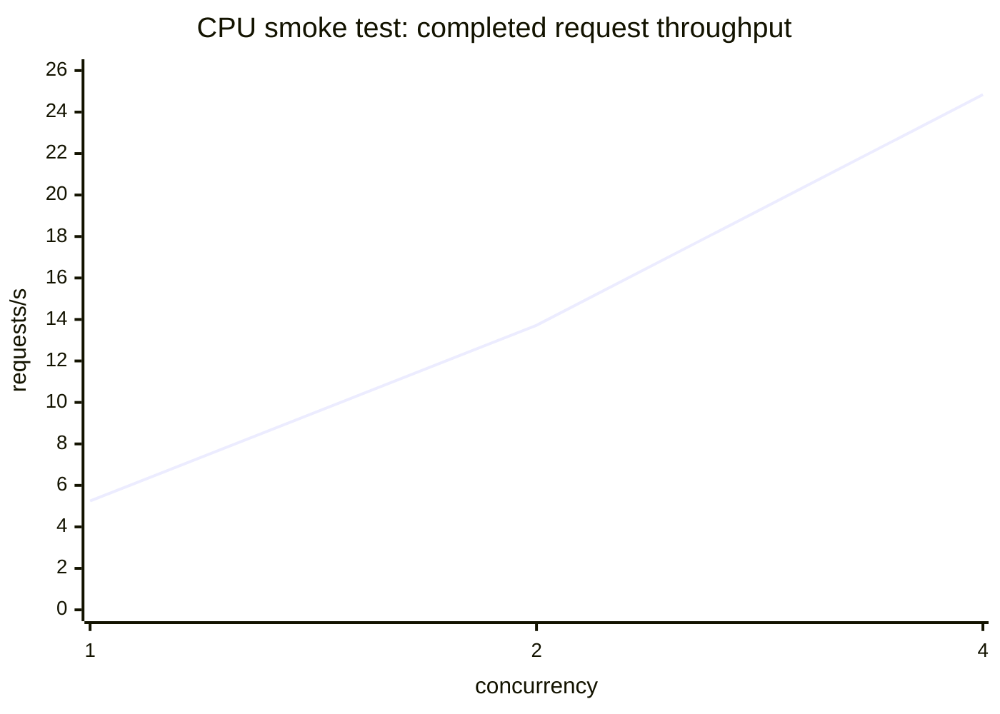

```text
proved                              not proved
------                              ----------
benchmark client works              GPU throughput
metrics join works                  production capacity
batches 1/2/4 form                  Model B latency
all requests accounted              saturation knee beyond 4
```

Mean scheduler pending and admission queue values were zero at all three
points. The p99 values are descriptive for 40-request CPU runs, not SLO data.

GPU benchmark order:

```text
warmup -> concurrency sweep -> open-loop request-rate sweep
       -> prompt/output length sweep -> prefix comparison
       -> choose SLO knee -> profile that point
```

Drill-down: [Phase 12](12_performance_report.md).

## Parallelism Decision

`SOURCE + GPU-LAB`

```text
does model + safe KV fit one GPU?
  |
  +-- no, dense --------> TP across fastest available links
  |
  +-- no, supported MoE -> EP hybrid; choose TP or DP attention by recipe
  |
  `-- yes
       |
       +-- one-request latency focus -> one GPU baseline
       |
       `-- aggregate concurrency ----> DP replicas

then benchmark p99 + memory + link cost; choose cheapest passing topology
```

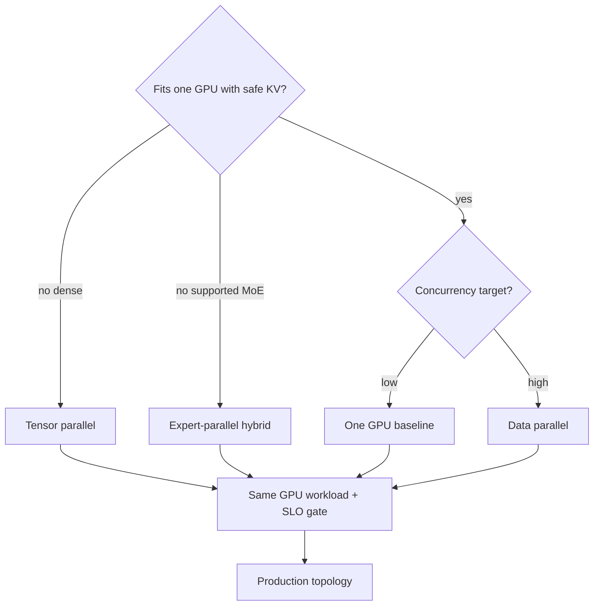

```text
TP: shard weights/heads; one request batch; per-layer collectives
DP: full model per GPU; split requests; per-replica KV pools
EP: route tokens; shard experts; dispatch + local FFN + combine
PP: unsupported in current standard MAX Serve path
```

## Production Blueprint

`SOURCE + BOUNDARY + GPU-LAB`

```text
clients
  -> edge TLS/WAF
  -> auth + tenant quota + global rate cap
  -> model/version/capability router
  -> ready MAX Serve pool
       -> bounded API/IPC/scheduler queues
       -> model worker + graph + GPU group
  -> metrics/logs/traces
  -> autoscaler + rollout controller
```

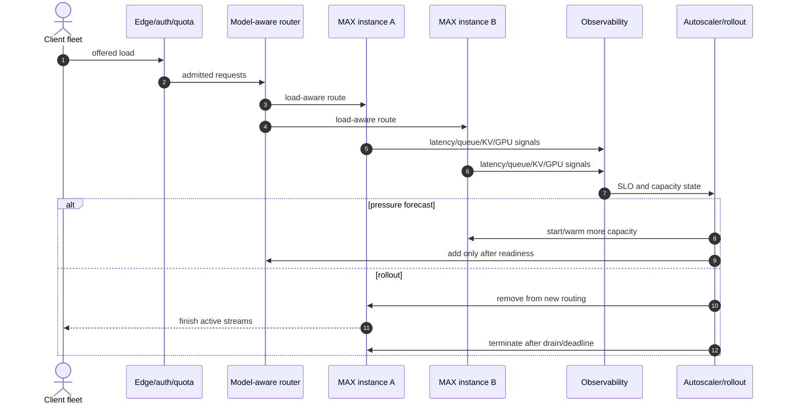

### Capacity Worksheet

`GPU-LAB`

```text
SLO scope: Model B + exact revision/encoding/topology + request class

lambda_peak     = ______ accepted req/s
prompt_mean     = ______ tokens/request
output_mean     = ______ tokens/request
prefill_cap     = ______ prompt tok/s/instance at p99 SLO
decode_cap      = ______ output tok/s/instance at p99 SLO
live_requests   = ______ peak
live_ctx_p95    = ______ tokens/request
KV_safe         = ______ live token slots/instance
failure_floor   = ______ replicas after one instance loss
headroom        = ______

R_prefill = ceil(lambda_peak * prompt_mean / prefill_cap)
R_decode  = ceil(lambda_peak * output_mean / decode_cap)
R_kv      = ceil(live_requests * live_ctx_p95 / KV_safe)
R_final   = ceil(max(R_prefill, R_decode, R_kv, failure_floor) * headroom)
```

### Example SLO Contract

`BOUNDARY`; targets, not measured claims.

| Request class     | Target to freeze before GPU test                 |
|-------------------|--------------------------------------------------|
| short interactive | p95/p99 TTFT and TPOT                            |
| long document     | separate p95/p99 TTFT                            |
| shared prefix     | TTFT plus cache-coverage target                  |
| steady load       | completed rate and maximum 429 ratio             |
| burst             | duration, bounded queue, recovery time           |
| failure           | capacity after one instance loss                 |
| rollout           | correctness, latency, and error regression gates |

Drill-down: [Phase 14](14_production_design.md).

## Retry And Drain In One Picture

`SOURCE + BOUNDARY`

```text
before first response byte                 after first SSE byte
--------------------------                 --------------------
429 -> Retry-After + jitter                no transparent replay
connect refusal -> ready replica           expose partial failure
unknown POST outcome -> dedupe required     caller starts new request explicitly

rollout: remove from router -> wait streams -> SIGTERM -> timeout -> cancel
```

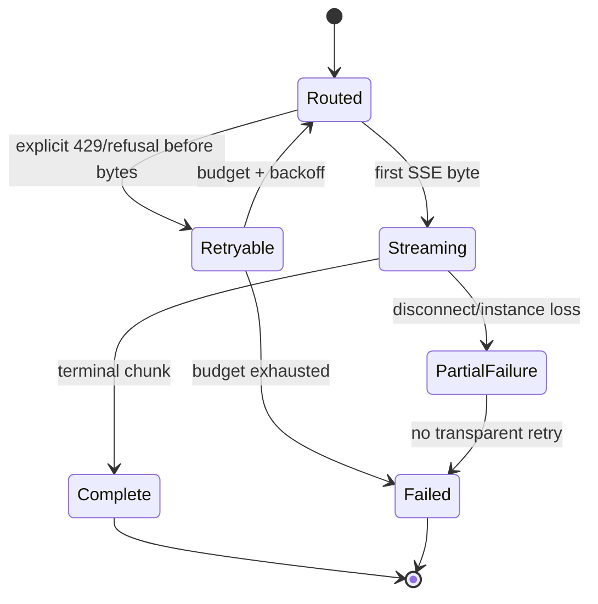

## Learning Route

```text
HTTP contract
  01 -> 03 -> 04
             |
             v
scheduling  05 -> 06 -> 11 -> 12
             |
             v
model       07 -> 08 -> 09
                         |
                         v
kernel                    10 -> 13
                                |
                                v
production                       14 -> capstone
```

| Stage | Artifact                                             | Question answered                                    |
|------:|------------------------------------------------------|------------------------------------------------------|
|     0 | [Environment](00_environment.md)                     | What can this host prove?                            |
|     1 | [External contract](01_external_contract.md)         | What does the client send and receive?               |
|     2 | [Startup topology](02_startup_topology.md)           | Which processes exist and when is ready?             |
|     3 | [Request objects](03_request_object_trace.md)        | How does JSON become a scheduler context?            |
|     4 | [IPC/backpressure](04_ipc_backpressure.md)           | How do process crossing, cancellation, and 429 work? |
|     5 | [Scheduler](05_scheduler_trace.md)                   | How are CE/TG requests batched?                      |
|     6 | [Batch to token](06_batch_to_token.md)               | Which buffers reach model and sampler?               |
|     7 | [Model resolution](07_model_resolution.md)           | How are architecture/config/weights selected?        |
|     8 | [Graph compilation](08_graph_compilation.md)         | How is the executable built and reused?              |
|     9 | [Graph API vs ModuleV3](09_graph_api_vs_modulev3.md) | Which authoring paths reach the same runtime?        |
|    10 | [Python to Mojo](10_python_to_mojo_to_hardware.md)   | How does a custom op reach a kernel launch?          |
|    11 | [KV cache](11_kv_cache.md)                           | How are pages allocated, reused, and pressured?      |
|    12 | [Performance](12_performance_report.md)              | How are load, latency, and bottlenecks measured?     |
|    13 | [Parallelism](13_parallelism.md)                     | What is split across GPUs?                           |
|    14 | [Production](14_production_design.md)                | What surrounds one MAX Serve instance?               |

## Reproduction Lanes

### CPU Lane: Complete On This Host

```bash
# Start the source-built server using the root README command, then:
python3 murali_docs/labs/client/max_serve_client.py --mode all
murali_docs/labs/tracing/run_request_object_trace.sh
murali_docs/labs/tracing/run_ipc_backpressure_trace.sh
murali_docs/labs/scheduler/run_scheduler_trace.sh --compact
murali_docs/labs/graph/run_ragged_batch_probe.sh
murali_docs/labs/graph/run_model_resolution_probe.sh
murali_docs/labs/kv_cache/run_kv_cache_trace.sh --compact
murali_docs/labs/performance/run_cpu_benchmark.sh
```

### Compile Lane: Complete Without A GPU

```text
Model A graph -> CUDA sm_80 MEFs -> hash/signature manifest
              -> HIP gfx942 MEFs -> hash/signature manifest

artifact: 08_graph/accelerator_compile_manifest.md
```

### GPU Lane: Prepared, Not Executed

```text
1 pin exact Model B revision + encoding
2 record GPU model/count/topology/driver/power/clocks
3 run one-GPU correctness and warmup
4 run concurrency + open-loop rate + length sweeps
5 compare one GPU / TP / DP / supported EP hybrid
6 capture utilization, then system timeline
7 deep-dive only a dominant kernel
8 run overload, cancellation, fault, drain, rollout tests
9 fill capacity worksheet and retain raw results outside Git
```

```bash
max benchmark \
  --config-file murali_docs/labs/performance/gpu_sweep.yaml \
  --section-name benchmark_config \
  --base-url http://127.0.0.1:8000 \
  --model "$(curl -s http://127.0.0.1:8000/v1/models | jq -r '.data[0].id')" \
  --result-filename results/gpu-sweep.json
```

## Final Oral Test

Question:

> A long-prompt request arrives while many short requests are decoding, the KV
> cache is nearly full, the admission queue begins filling, GPU utilization is
> high, TTFT rises, and some later clients receive HTTP 429.

Answer map:

```text
1 long request enters API and is tokenized
2 bounded IPC accepts it while space remains
3 scheduler sees CE work beside active TG work
4 CE/TG priority + token budget may defer or chunk its prefill
5 existing decodes keep one new token/step and retain KV histories
6 KV pressure crosses threshold -> TG is prioritized to drain sequences
7 allocation failure can preempt a candidate and force later CE rebuild
8 long request waits across iterations -> TTFT grows
9 if arrivals keep exceeding completions, pending reaches M
10 worker stops draining IPC -> IPC reaches N
11 atomic API admission probe fails -> HTTP 429 + Retry-After
12 external router sheds load, backs off retries, or uses warmed spare capacity
13 GPU utilization is supporting evidence only; kernel/link traces identify why
```

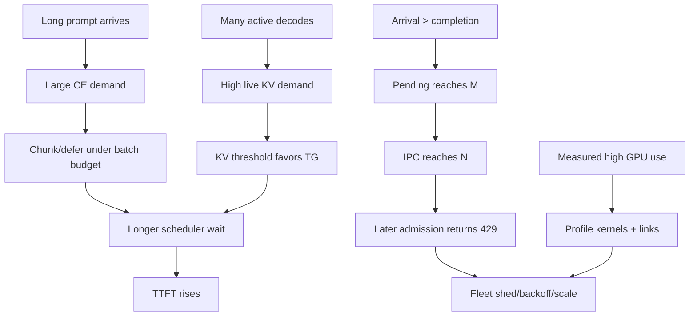

## Final Completion Gate

```text
[x] external Python -> HTTP/SSE
[x] MAX Serve Python APIs and request objects
[x] API/model-worker IPC, backpressure, cancellation
[x] continuous scheduler and ragged batches
[x] model registry, config, weights, and memory plan
[x] graph construction, compilation, and initialization
[x] CPU MEF export/reuse; accelerator import boundary documented
[x] Graph API versus ModuleV3 mental model
[x] Python custom op -> Mojo dispatch -> launch API
[x] paged KV allocation, prefix reuse, pressure, and preemption
[x] benchmark semantics and four-plane observability
[x] TP, DP, EP, collectives, ownership, and failure domains
[x] production routing, admission, autoscaling, rollout, and recovery
[x] CPU/source/compile-only capstone
[x] GPU experiment and profiling runbook prepared
[ ] GPU runtime appendix executed on matching hardware [GPU-LAB]
```

The missing GPU appendix is an explicit hardware boundary, not an inferred
result. All executable work available on this CPU-only host is complete.
